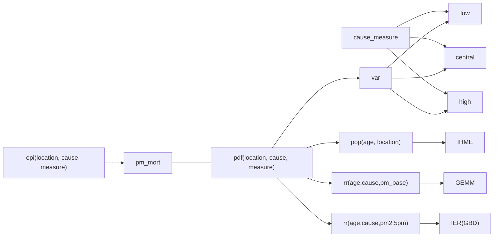

```mermaid

graph LR
    L["rr(age,cause,pm2.5pm)"] --> M["IER(GBD)"]
    J["rr(age,cause,pm_base)"] --> K["GEMM"]
    H["pop(age, location)"] --> I["IHME"]
    G["cause_measure"] --> D["low"]
    G --> E["central"]
    G --> F["high"]
    C["var"] --> D
    C --> E
    C --> F
    B["pdf(location, cause, measure)"] --> C
    A["pm_mort"] <--- B
    N["epi(location, cause, measure)"] -.-> A
    B --> H
    B --> J
    B --> L

```