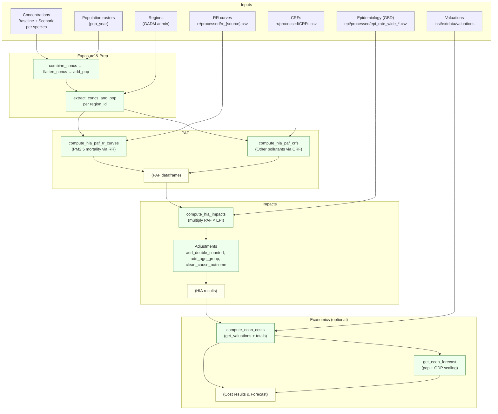
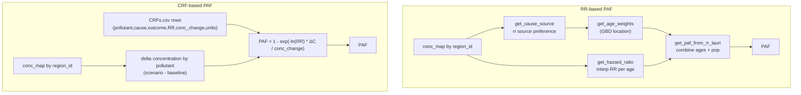
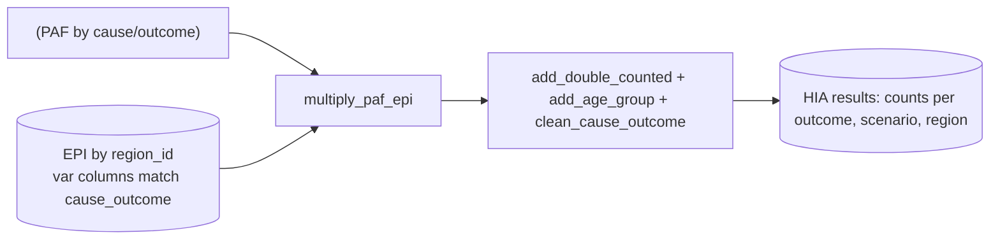
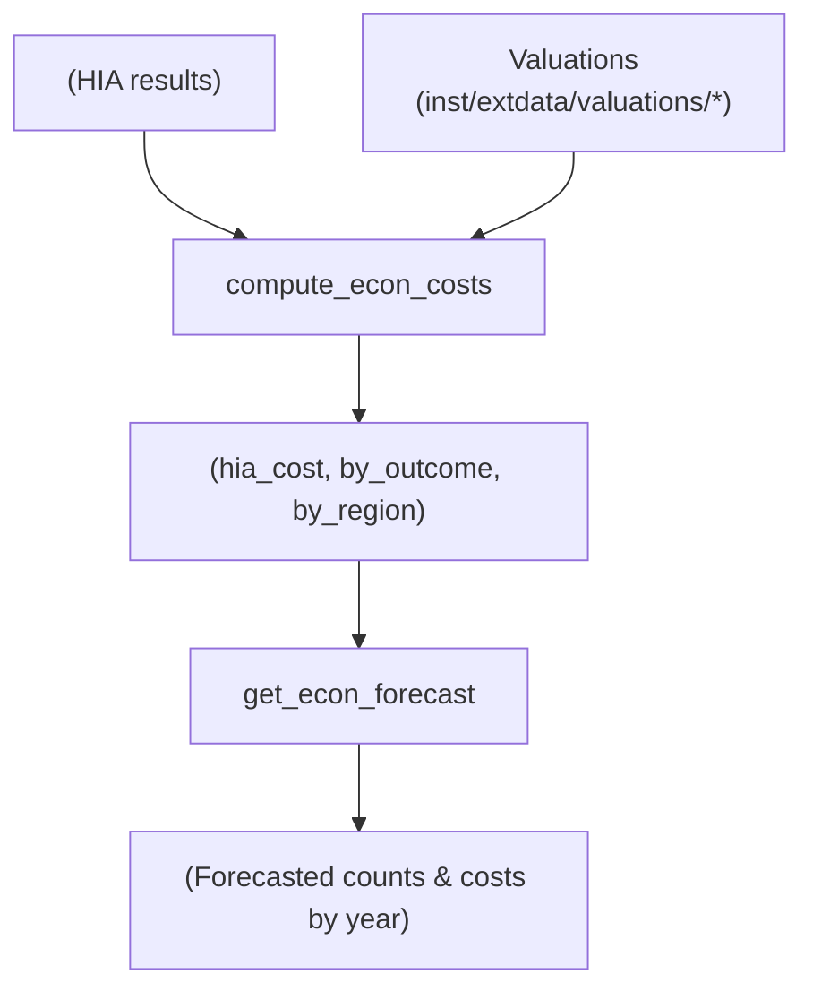

# Health Impact Assessment (HIA) Workflow Overview

This document summarizes how creahia computes Health Impact Assessments (HIA), from exposure to health outcomes and the optional economic valuation + projections. It complements the uncertainty notes in `doc/paf_uncertainty.md` and `doc/paf_epi_uncertainty.md`.

- Core APIs: `compute_hia_paf()`, `compute_hia_impacts()`, `compute_hia()`
- Wrappers: `wrappers.compute_hia_two_images.*`
- Data helpers: `get_rr()`, `get_crfs()`, `get_epi()`, `get_age_weights()`
- Economics: `compute_econ_costs()`, `get_econ_forecast()`

## Compute PAF
creahia computes population attributable fraction (PAF) through two complementary paths and merges them.

- RR-based (PM2.5 mortality outcomes): age- and cause-specific RR curves (e.g., GEMM, GBD) are interpolated to exposure, then aggregated with population age weights.
- CRF-based (other pollutants/outcomes): apply concentration–response functions as log-linear effects of concentration changes.

Key references:
- RR curves loaded with `get_rr(<source>)` from `inst/extdata/rr/processed/rr_<source>.csv`
- CRFs loaded with `get_crfs()` from `inst/extdata/rr/processed/CRFs*.csv`
- Age weights via `get_age_weights()` and GBD EPI files in `inst/extdata/epi/processed/epi_rate_wide_*.csv`
- Uncertainty propagation is detailed in `doc/paf_uncertainty.md`

## Compute Impacts (PAF × EPI)
`compute_hia_impacts()` multiplies PAF with the corresponding epidemiological metric for each cause–outcome and region.

- Joins PAF rows on `var = paste(cause, outcome, sep="_")` with EPI columns that carry the same key.
- Uses a delta-method variance for uncertainty joining PAF and EPI (see `doc/paf_epi_uncertainty.md`).
- Applies guardrails that zero out CI bounds crossing opposite signs relative to the central estimate.
- Normalizes and tidies results with age groups and double-counting handling.

## Economic Valuation and Projections (optional)
You can convert HIA counts to costs and project across future years.

- Valuation: `compute_econ_costs()` joins HIA with country-specific valuations (transfer to target year/country with income scaling) using `get_valuations()` and returns totals by outcome and region.
- Projections: `get_econ_forecast()` scales counts by population/deaths projections and optionally applies per-capita GDP PPP scaling with discounting to produce cost forecasts.

## Typical Usage
- End-to-end: `compute_hia(conc_map, species, regions, rr_sources, epi_version, crfs_version, pop_year)`
- Or manually:
  - `paf <- compute_hia_paf(conc_map, species, regions, rr_sources, epi_version)`
  - `hia <- compute_hia_impacts(species, paf, conc_map, regions, epi = get_epi(epi_version))`
  - `econ <- compute_econ_costs(hia, valuation_version = "viscusi", projection_years = c(2025,2030))`

# Advanced: Adding New Causes/Outcomes
You can extend creahia via two routes. In all cases, ensure matching epidemiological metrics exist for the cause–outcome in the EPI tables so impacts can be computed.

- Cause/outcome key convention: `build_metric_key(cause, outcome)` produces `"<cause>_<outcome>"`.
- EPI files must contain columns with this exact key. creahia standardizes asthma names internally; for other additions, ensure EPI columns follow the key.

## A) Add via CRFs (non-PM2.5 pollutants or non-mortality outcomes)
1) Add or edit a row in `inst/extdata/rr/processed/CRFs.csv` (or a versioned file you pass to `get_crfs(version=...)`). Required columns:
   - `pollutant` (e.g., `NO2`, `O3_8h`, `PM25`)
   - `cause` (e.g., `Asthma.1to18`, `PTB`, `LBW`)
   - `outcome` (e.g., `AsthmaIncidence`, `AsthmaPrevalence`, `AsthmaERV`)
   - `rr_central`, `rr_low`, `rr_high` (per `conc_change` units)
   - `conc_change` (increment that RR applies to)
   - `counterfact` (counterfactual level when applicable)
   - `units_multiplier` (convert input conc units to CRF units)
   - `double_counted` (TRUE/FALSE) to control downstream double-count handling

2) Make sure your EPI table has a column named exactly `"<cause>_<outcome>"` with `low/central/high` rows in the `estimate` column. For example, `Asthma.1to18_AsthmaIncidence`.

3) Run as usual. `compute_hia_paf_crfs()` will compute PAF as `1 - exp(-ln(RR) * deltaC / conc_change)` and include it in the merged PAF used by `compute_hia_impacts()`.

Tips:
- If you introduce a new file, pass it via `get_crfs(version = "MyVersion")` after adding an entry in `get_crfs_versions()` in `R/hia_data.R`.

## B) Add via RR Curves (PM2.5 mortality outcomes)
1) Create or update `inst/extdata/rr/processed/rr_<mysource>.csv`. Required structure per cause and age bin:
   - Columns: `cause`, `age`, `exposure`, `low`, `central`, `high`
   - One row per exposure grid point; rows cover the exposure range you intend to interpolate across.

2) Reference your source in calls to PAF computation, e.g. `rr_sources = c("<mysource>", RR_GEMM)` to set preference order. creahia loads via `get_rr("<mysource>")` which resolves `rr_<mysource>.csv`.

3) Ensure age coverage matches EPI age bins after `recode_age()` and `deduplicate_adult_ages()` logic; if ages are incomplete or overlapping the checks in `get_age_weights()` will fail.

4) Update measure mapping if needed: `get_cause_measure()` controls which `measure` (Deaths, YLLs, YLDs) is associated with each cause. If you add a new `cause` code, add it there and (optionally) in `R/constants.R` for consistency.

5) Ensure EPI provides columns `"<cause>_<measure>"` for your cause (e.g., `IHD_Deaths`, `COPD_YLLs`).

Notes:
- Preference handling across multiple RR sources for the same cause is done by `parse_rr_sources()`; the first source listed wins.
- PAF is computed per region by interpolating hazard ratios to baseline and scenario PM2.5 and aggregating with population age weights.

## Required Epidemiological Data
For any new cause/outcome to participate in impacts:
- The EPI table (e.g., `inst/extdata/epi/processed/epi_rate_wide_gbd2019.csv`) must have matching columns by `var = "<cause>_<outcome>"`.
- There must be rows for `estimate ∈ {low, central, high}` for each `region_id` participating in the run. Missing matches are warned and dropped in `multiply_paf_epi()`.
- For RR-based mortality, GBD measure names must exist for `get_age_weights()` to build age weights (Deaths/YLLs/YLDs per cause).

## Where Things Live (quick map)
- RR curves: `inst/extdata/rr/processed/rr_*.csv` (e.g., `rr_gemm.csv`, `rr_gbd2019.csv`)
- CRFs: `inst/extdata/rr/processed/CRFs*.csv`
- EPI (GBD): `inst/extdata/epi/processed/epi_rate_wide_*.csv`
- Valuations: `inst/extdata/valuations/*.csv`
- Helpers: `R/compute_hia_paf.R`, `R/compute_hia_impacts.R`, `R/hia_data.R`, `R/valuation.R`, `R/econ_computation.R`

## Related Notes
- Uncertainty from RR → PAF: see `doc/paf_uncertainty.md`
- Uncertainty from PAF × EPI: see `doc/paf_epi_uncertainty.md`
- Wrappers and examples: `R/wrappers.R`, `examples/`
