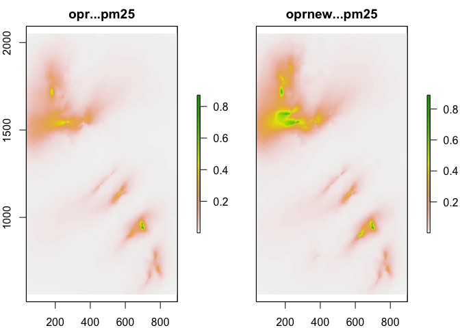

CREAHIA: Philippines example
================

# Installation

``` r
library(remotes)
remotes::install_github("energyandcleanair/creahia")
```

``` r
library(creahia)
#> Warning in fun(libname, pkgname): rgeos: versions of GEOS runtime 3.9.1-CAPI-1.14.2
#> and GEOS at installation 3.8.1-CAPI-1.13.3differ
#> [1] "Initiating environment"
```

Configuration:

``` r
calpuff_dir <- "../examples/example_ph"
gis_dir <- "/Volumes/ext1/gis/" # Where to find baseline concentration etc. Contact-us to have access to the required data
```

# Create concentration fields

To perform an health impact assessment, `creahia` requires: -
`conc_scenario`: the concentration field of one or several species in
one or several scenarios for which we want to evaluate the health impact
- `conc_baseline`: the baseline concentration of the selected species.

We also define `conc_perturbation` such that `conc_scenario =
conc_baseline + conc_perturbation`.

## Read CALPUFF results

``` r
conc_perturbation <- creahia::get_conc_calpuff(calpuff_dir=calpuff_dir, utm_zone=51, utm_hem='N', map_res=1)

species <- unique(conc_perturbation$species)
scenarios <- unique(conc_perturbation$scenario)
grid_raster <- conc_perturbation$conc_perturbation[[1]] %>% raster::raster()
grid_raster
#> class      : RasterLayer 
#> dimensions : 1493, 863, 1288459  (nrow, ncol, ncell)
#> resolution : 1, 1  (x, y)
#> extent     : 34.57735, 897.5773, 558.8777, 2051.878  (xmin, xmax, ymin, ymax)
#> crs        : +proj=utm +zone=51 +datum=WGS84 +units=km +no_defs
```

Plot pm25 perturbation:

``` r
conc_pm25 <- conc_perturbation[conc_perturbation$species=="pm25",]
rs <- raster::stack(conc_pm25$conc_perturbation)
names(rs) <- paste(conc_pm25$scenario, conc_pm25$species, sep=" - ")
raster::plot(rs)
```



## Read baseline concentrations

``` r
conc_baseline <- creahia::get_conc_baseline(species=species, grid_raster=grid_raster)
#> Warning in showSRID(uprojargs, format = "PROJ", multiline = "NO", prefer_proj =
#> prefer_proj): Discarded ellps unknown in Proj4 definition: +proj=goode +lon_0=0
#> +x_0=0 +y_0=0 +R=6371007 +units=km +no_defs +type=crs
#> Warning in showSRID(uprojargs, format = "PROJ", multiline = "NO", prefer_proj =
#> prefer_proj): Discarded datum unknown in Proj4 definition
#> Warning in showSRID(uprojargs, format = "PROJ", multiline = "NO", prefer_proj =
#> prefer_proj): Discarded ellps unknown in Proj4 definition: +proj=goode +lon_0=0
#> +x_0=0 +y_0=0 +R=6371007 +units=km +no_defs +type=crs
#> Warning in showSRID(uprojargs, format = "PROJ", multiline = "NO", prefer_proj =
#> prefer_proj): Discarded datum unknown in Proj4 definition
conc_baseline
#> # A tibble: 3 x 2
#>   species conc_baseline     
#>   <chr>   <named list>      
#> 1 pm25    <RastrLyr[,863,1]>
#> 2 no2     <RastrLyr[,863,1]>
#> 3 so2     <RastrLyr[,863,1]>
```

## Combine both

``` r
concs <- creahia::combine_concs(conc_perturbation, conc_baseline) %>%
  flatten_concs() %>% # Make it one row per scenario
  add_pop() # Add popilation data
#> Warning in .local(x, ...): This function is only useful for Raster* objects with
#> a longitude/latitude coordinates
```

## Select regions of interest

We select regions of interest from GADM dataset, at the administrative
level 1.

``` r
regions <- creahia::get_adm(grid_raster, admin_level=1, res='coarse')
#> Warning in wkt(pto): CRS object has no comment
#> Warning in rgdal::rawTransform(projfrom, projto, nrow(xy), xy[, 1], xy[, : Using
#> PROJ not WKT2 strings
#> Warning in readRDS(f): input string 'Ciego de Ávila' cannot be translated to
#> UTF-8, is it valid in 'CP1252'?
#> Warning in readRDS(f): input string 'Ðakovica' cannot be translated to UTF-8, is
#> it valid in 'CP1252'?
#> Warning in readRDS(f): input string 'Lower Austria|Baixa-Áustria|Baja Austria|
#> Niederdonau|Österreich unter der Enns' cannot be translated to UTF-8, is it
#> valid in 'CP1252'?
#> Warning in readRDS(f): input string 'Upper Austria|Alta-Áustria|Alta Austria|
#> Österreich ober der Enns|Oberösterreich' cannot be translated to UTF-8, is it
#> valid in 'CP1252'?
#> Warning in readRDS(f): input string 'Baile Átha Cliath' cannot be translated to
#> UTF-8, is it valid in 'CP1252'?
#> Warning in readRDS(f): input string 'Tiobraid Árann' cannot be translated to
#> UTF-8, is it valid in 'CP1252'?
#> Warning in readRDS(f): input string 'Timbouctou|Tombouctou|Timbuct|Timbuctu|
#> Tombuktu|Tombuctú|Tomboucto' cannot be translated to UTF-8, is it valid in
#> 'CP1252'?
#> Warning in rgeos::gBuffer(adm_4326, byid = TRUE, width = 0): Spatial object is
#> not projected; GEOS expects planar coordinates
# regions <- regions[1:5,] # For example purposes, we only keep a subset
```

and extract concentrations there:

``` r
conc_regions <- creahia::extract_concs_at_regions(concs, regions)
```

# Health Impact Assessment

``` r
hia <- compute_hia(conc_map=conc_regions,
                   species=species,
                   regions=regions)
#> [1] "Computing paf"
#> [1] "Getting adult_ages"
#> [1] "Getting IHME"
#> Warning in age_name %>% gsub(" .*", "", .) %>% as.numeric: NAs introduced by
#> coercion
#> Warning: executing %dopar% sequentially: no parallel backend registered
#> [1] "Getting calc_causes"
#> [1] "Getting GBD"
#> [1] "Getting GEMM"
#> [1] "Computing epi"
#> [1] "Getting EPI"
#> [1] "Getting CRFS"
#> [1] "opr"
#> [1] "oprnew"
hia
#>     scenario region_id estimate NCD.LRI_YLLs_PM25 LRI.child_YLLs_PM25
#> 1        opr   PHL.1_1  central      9.431276e+00        4.701460e-01
#> 2        opr   PHL.2_1  central      2.436981e+01        2.563965e+00
#> 3        opr   PHL.3_1  central      1.296099e+01        1.443327e+00
#> 4        opr   PHL.4_1  central      2.178295e+00        1.895588e-01
#> 5        opr   PHL.5_1  central      8.537704e+00        8.420762e-01
#> 6        opr   PHL.6_1  central      7.585520e+00        4.922988e-01
#> 7        opr   PHL.7_1  central      2.181108e+00        4.402659e-02
#> 8        opr   PHL.8_1  central      4.382502e+00        4.432279e-01
#> 9        opr   PHL.9_1  central      1.099623e+00        1.058314e-01
#> 10       opr  PHL.10_1  central      9.298860e+01        1.016825e+01
#> 11       opr  PHL.12_1  central      7.419521e+02        7.919600e+01
#> 12       opr  PHL.13_1  central      7.487479e+01        8.097395e+00
#> 13       opr  PHL.14_1  central      3.464879e+00        1.751942e-01
#> 14       opr  PHL.15_1  central      1.174205e+01        1.171065e+00
#> 15       opr  PHL.16_1  central      1.189536e+02        1.264813e+01
#> 16       opr  PHL.17_1  central      2.354896e+02        2.306803e+01
#> 17       opr  PHL.18_1  central      9.150598e+00        3.520614e-01
#> 18       opr  PHL.19_1  central      2.173426e+01        2.303160e+00
#> 19       opr  PHL.20_1  central      2.109600e+01        2.253293e+00
#> 20       opr  PHL.21_1  central      7.203403e+00        7.955381e-01
#> 21       opr  PHL.22_1  central      8.166567e+00        7.756004e-01
#> 22       opr  PHL.23_1  central      1.687974e+00        8.527337e-02
#> 23       opr  PHL.24_1  central      4.312860e+02        4.379950e+01
#> 24       opr  PHL.25_1  central      7.261084e+02        6.990554e+01
#> 25       opr  PHL.26_1  central      1.628278e+01        1.698461e+00
#> 26       opr  PHL.27_1  central      5.882557e+01        6.320998e+00
#> 27       opr  PHL.28_1  central      3.122955e+02        3.224283e+01
#> 28       opr  PHL.29_1  central      8.323611e+00        7.357821e-01
#> 29       opr  PHL.30_1  central      1.484926e+00        1.288113e-01
#> 30       opr  PHL.31_1  central      3.602619e+00        9.700692e-02
#> 31       opr  PHL.32_1  central      7.761801e+00        7.906849e-01
#> 32       opr  PHL.33_1  central      5.206264e+00        3.873014e-01
#> 33       opr  PHL.34_1  central      1.441210e+01        6.510379e-01
#> 34       opr  PHL.35_1  central      3.941883e+01        3.166545e+00
#> 35       opr  PHL.36_1  central      1.319151e+02        1.289379e+01
#> 36       opr  PHL.37_1  central      1.662009e+01        1.005247e+00
#> 37       opr  PHL.38_1  central      3.693218e+00        1.802378e-01
#> 38       opr  PHL.39_1  central      8.732955e+01        9.477017e+00
#> 39       opr  PHL.40_1  central      5.747853e+02        5.952449e+01
#> 40       opr  PHL.41_1  central      2.432412e+02        2.622788e+01
#> 41       opr  PHL.42_1  central      6.085074e+01        6.802687e+00
#> 42       opr  PHL.43_1  central      3.003958e+01        1.564581e+00
#> 43       opr  PHL.44_1  central      8.691912e+00        9.520922e-01
#> 44       opr  PHL.45_1  central      3.438801e+00        3.655231e-01
#> 45       opr  PHL.46_1  central      6.644526e+00        4.923213e-01
#> 46       opr  PHL.47_1  central      7.964013e+02        7.608404e+01
#> 47       opr  PHL.48_1  central      2.134582e+01        2.279863e+00
#> 48       opr  PHL.49_1  central      5.679455e+02        6.083437e+01
#> 49       opr  PHL.50_1  central      6.886865e+00        3.763291e-01
#> 50       opr  PHL.51_1  central      8.894241e+01        7.964039e+00
#> 51       opr  PHL.52_1  central      8.247198e+01        7.521202e+00
#> 52       opr  PHL.53_1  central      2.503629e+01        2.680205e+00
#> 53       opr  PHL.54_1  central      4.781326e+00        1.348934e-01
#> 54       opr  PHL.55_1  central      9.238856e+01        9.398160e+00
#> 55       opr  PHL.56_1  central      9.599858e+00        1.009726e+00
#> 56       opr  PHL.57_1  central      1.496961e+01        1.559832e+00
#> 57       opr  PHL.58_1  central      3.236905e+01        3.361080e+00
#> 58       opr  PHL.59_1  central      6.064526e+00        2.712044e-01
#> 59       opr  PHL.60_1  central      1.765251e+02        1.763891e+01
#> 60       opr  PHL.61_1  central      3.999618e+02        4.077811e+01
#> 61       opr  PHL.62_1  central      2.895675e+02        2.819017e+01
#> 62       opr  PHL.63_1  central      2.847545e+00        2.804606e-01
#> 63       opr  PHL.64_1  central      1.731091e+02        1.757853e+01
#> 64       opr  PHL.65_1  central      8.449237e-01        9.414521e-02
#> 65       opr  PHL.66_1  central      8.584595e+00        2.935893e-01
#> 66       opr  PHL.67_1  central      3.443200e+01        3.332881e+00
#> 67       opr  PHL.68_1  central      5.720406e-01        6.220589e-02
#> 68       opr  PHL.69_1  central      3.796759e+00        2.624463e-01
#> 69       opr  PHL.70_1  central      1.012771e+02        9.878581e+00
#> 70       opr  PHL.71_1  central      2.738626e+00        2.347348e-01
#> 71       opr  PHL.72_1  central      1.443625e+01        1.597376e+00
#> 72       opr  PHL.73_1  central      1.330214e+00        1.486890e-01
#> 73       opr  PHL.74_1  central      1.197384e+01        1.039571e+00
#> 74       opr  PHL.75_1  central      6.620471e+00        6.512940e-01
#> 75       opr  PHL.76_1  central      1.035128e+02        1.075551e+01
#> 76       opr  PHL.77_1  central      7.515470e-02        8.384172e-03
#> 77       opr  PHL.78_1  central      1.404403e+02        1.434684e+01
#> 78       opr  PHL.79_1  central      8.366562e+00        9.075703e-01
#> 79       opr  PHL.80_1  central      2.046039e+01        2.191283e+00
#> 80       opr  PHL.81_1  central      5.476231e+00        6.080061e-01
#> 81       opr  MYS.13_1  central      1.122105e-01        8.613915e-04
#> 82       opr   PHL.1_1     high      1.335069e+01        2.466003e+00
#> 83       opr   PHL.2_1     high      3.449722e+01        4.005045e+00
#> 84       opr   PHL.3_1     high      1.834687e+01        2.798988e+00
#> 85       opr   PHL.4_1     high      3.083442e+00        4.078574e-01
#> 86       opr   PHL.5_1     high      1.208541e+01        1.558692e+00
#> 87       opr   PHL.6_1     high      1.073764e+01        2.123479e+00
#> 88       opr   PHL.7_1     high      3.087466e+00        3.252619e-01
#> 89       opr   PHL.8_1     high      6.203640e+00        6.747853e-01
#> 90       opr   PHL.9_1     high      1.556551e+00        2.080506e-01
#> 91       opr  PHL.10_1     high      1.316434e+02        1.363677e+01
#> 92       opr  PHL.12_1     high      1.050508e+03        1.045340e+02
#> 93       opr  PHL.13_1     high      1.059958e+02        1.535941e+01
#> 94       opr  PHL.14_1     high      4.904709e+00        9.242499e-01
#> 95       opr  PHL.15_1     high      1.662132e+01        2.259279e+00
#> 96       opr  PHL.16_1     high      1.684192e+02        2.128077e+01
#> 97       opr  PHL.17_1     high      3.333641e+02        3.191060e+01
#> 98       opr  PHL.18_1     high      1.295299e+01        1.532242e+00
#> 99       opr  PHL.19_1     high      3.076673e+01        3.330666e+00
#> 100      opr  PHL.20_1     high      2.986217e+01        3.700838e+00
#> 101      opr  PHL.21_1     high      1.019767e+01        1.388274e+00
#> 102      opr  PHL.22_1     high      1.156011e+01        1.444399e+00
#> 103      opr  PHL.23_1     high      2.389381e+00        4.498660e-01
#> 104      opr  PHL.24_1     high      6.105617e+02        5.944266e+01
#> 105      opr  PHL.25_1     high      1.028064e+03        1.258153e+02
#> 106      opr  PHL.26_1     high      2.304915e+01        3.081857e+00
#> 107      opr  PHL.27_1     high      8.327332e+01        1.058659e+01
#> 108      opr  PHL.28_1     high      4.421348e+02        5.000162e+01
#> 109      opr  PHL.29_1     high      1.178248e+01        1.560492e+00
#> 110      opr  PHL.30_1     high      2.101973e+00        2.771297e-01
#> 111      opr  PHL.31_1     high      5.099632e+00        6.325550e-01
#> 112      opr  PHL.32_1     high      1.098742e+01        1.294889e+00
#> 113      opr  PHL.33_1     high      7.369805e+00        1.168260e+00
#> 114      opr  PHL.34_1     high      2.040117e+01        3.436093e+00
#> 115      opr  PHL.35_1     high      5.580122e+01        9.117420e+00
#> 116      opr  PHL.36_1     high      1.867407e+02        2.212004e+01
#> 117      opr  PHL.37_1     high      2.352634e+01        4.095662e+00
#> 118      opr  PHL.38_1     high      5.227922e+00        9.453900e-01
#> 119      opr  PHL.39_1     high      1.236302e+02        1.484540e+01
#> 120      opr  PHL.40_1     high      8.137381e+02        8.046133e+01
#> 121      opr  PHL.41_1     high      3.443926e+02        3.872151e+01
#> 122      opr  PHL.42_1     high      8.614341e+01        1.321120e+01
#> 123      opr  PHL.43_1     high      4.252258e+01        7.939552e+00
#> 124      opr  PHL.44_1     high      1.230375e+01        1.704030e+00
#> 125      opr  PHL.45_1     high      4.867790e+00        5.397396e-01
#> 126      opr  PHL.46_1     high      9.405561e+00        1.549241e+00
#> 127      opr  PHL.47_1     high      1.127393e+03        1.019851e+02
#> 128      opr  PHL.48_1     high      3.021647e+01        3.420425e+00
#> 129      opr  PHL.49_1     high      8.042610e+02        8.452903e+01
#> 130      opr  PHL.50_1     high      9.748953e+00        1.805083e+00
#> 131      opr  PHL.51_1     high      1.259044e+02        1.636385e+01
#> 132      opr  PHL.52_1     high      1.167516e+02        1.523881e+01
#> 133      opr  PHL.53_1     high      3.544018e+01        4.946955e+00
#> 134      opr  PHL.54_1     high      6.768129e+00        8.545785e-01
#> 135      opr  PHL.55_1     high      1.307835e+02        1.299616e+01
#> 136      opr  PHL.56_1     high      1.358912e+01        1.701314e+00
#> 137      opr  PHL.57_1     high      2.119164e+01        2.140155e+00
#> 138      opr  PHL.58_1     high      4.582170e+01        4.793979e+00
#> 139      opr  PHL.59_1     high      8.584591e+00        1.067930e+00
#> 140      opr  PHL.60_1     high      2.498916e+02        2.439999e+01
#> 141      opr  PHL.61_1     high      5.662265e+02        5.752796e+01
#> 142      opr  PHL.62_1     high      4.099580e+02        4.065788e+01
#> 143      opr  PHL.63_1     high      4.030819e+00        5.331283e-01
#> 144      opr  PHL.64_1     high      2.450535e+02        2.378129e+01
#> 145      opr  PHL.65_1     high      1.196014e+00        1.822935e-01
#> 146      opr  PHL.66_1     high      1.215182e+01        1.751601e+00
#> 147      opr  PHL.67_1     high      4.874296e+01        6.169306e+00
#> 148      opr  PHL.68_1     high      8.097427e-01        9.842746e-02
#> 149      opr  PHL.69_1     high      5.374430e+00        9.005114e-01
#> 150      opr  PHL.70_1     high      1.433735e+02        1.558158e+01
#> 151      opr  PHL.71_1     high      3.876618e+00        5.216226e-01
#> 152      opr  PHL.72_1     high      2.043520e+01        2.982267e+00
#> 153      opr  PHL.73_1     high      1.882956e+00        2.817778e-01
#> 154      opr  PHL.74_1     high      1.694968e+01        2.236571e+00
#> 155      opr  PHL.75_1     high      9.371556e+00        1.301682e+00
#> 156      opr  PHL.76_1     high      1.465358e+02        1.452443e+01
#> 157      opr  PHL.77_1     high      1.063835e-01        1.652706e-02
#> 158      opr  PHL.78_1     high      1.988342e+02        1.970035e+01
#> 159      opr  PHL.79_1     high      1.184316e+01        1.524978e+00
#> 160      opr  PHL.80_1     high      2.896257e+01        3.380428e+00
#> 161      opr  PHL.81_1     high      7.751801e+00        1.140561e+00
#> 162      opr  MYS.13_1     high      1.662863e-01        1.840952e-03
#> 163      opr   PHL.1_1      low      6.299940e+00        0.000000e+00
#> 164      opr   PHL.2_1      low      1.627868e+01        1.317213e+00
#> 165      opr   PHL.3_1      low      8.657915e+00        8.372275e-01
#> 166      opr   PHL.4_1      low      1.455114e+00        0.000000e+00
#> 167      opr   PHL.5_1      low      5.703220e+00        1.722698e-01
#> 168      opr   PHL.6_1      low      5.067118e+00        4.082597e-04
#> 169      opr   PHL.7_1      low      1.456972e+00        0.000000e+00
#> 170      opr   PHL.8_1      low      2.927499e+00        2.301978e-01
#> 171      opr   PHL.9_1      low      7.345528e-01        2.143001e-02
#> 172      opr  PHL.10_1      low      6.210969e+01        6.668017e+00
#> 173      opr  PHL.12_1      low      4.955089e+02        4.769504e+01
#> 174      opr  PHL.13_1      low      5.001287e+01        4.146515e+00
#> 175      opr  PHL.14_1      low      2.314526e+00        0.000000e+00
#> 176      opr  PHL.15_1      low      7.843710e+00        2.972945e-01
#> 177      opr  PHL.16_1      low      7.944436e+01        5.938913e+00
#> 178      opr  PHL.17_1      low      1.572982e+02        1.558245e+01
#> 179      opr  PHL.18_1      low      6.112628e+00        6.130809e-02
#> 180      opr  PHL.19_1      low      1.451802e+01        1.242215e+00
#> 181      opr  PHL.20_1      low      1.409217e+01        1.107366e+00
#> 182      opr  PHL.21_1      low      4.811425e+00        4.644782e-01
#> 183      opr  PHL.22_1      low      5.455270e+00        1.201408e-01
#> 184      opr  PHL.23_1      low      1.127574e+00        0.000000e+00
#> 185      opr  PHL.24_1      low      2.880715e+02        2.807873e+01
#> 186      opr  PHL.25_1      low      4.849333e+02        1.583765e+01
#> 187      opr  PHL.26_1      low      1.087680e+01        6.805980e-01
#> 188      opr  PHL.27_1      low      3.929393e+01        3.524662e+00
#> 189      opr  PHL.28_1      low      2.085816e+02        1.350335e+01
#> 190      opr  PHL.29_1      low      5.560145e+00        2.871028e-02
#> 191      opr  PHL.30_1      low      9.919311e-01        0.000000e+00
#> 192      opr  PHL.31_1      low      2.406561e+00        0.000000e+00
#> 193      opr  PHL.32_1      low      5.184755e+00        3.097546e-01
#> 194      opr  PHL.33_1      low      3.477727e+00        0.000000e+00
#> 195      opr  PHL.34_1      low      9.627167e+00        0.000000e+00
#> 196      opr  PHL.35_1      low      2.633073e+01        1.685101e-01
#> 197      opr  PHL.36_1      low      8.811491e+01        4.969019e+00
#> 198      opr  PHL.37_1      low      1.110226e+01        0.000000e+00
#> 199      opr  PHL.38_1      low      2.467061e+00        0.000000e+00
#> 200      opr  PHL.39_1      low      5.833069e+01        4.844611e+00
#> 201      opr  PHL.40_1      low      3.839068e+02        3.788861e+01
#> 202      opr  PHL.41_1      low      1.624499e+02        1.299388e+01
#> 203      opr  PHL.42_1      low      4.064515e+01        4.100909e+00
#> 204      opr  PHL.43_1      low      2.006630e+01        0.000000e+00
#> 205      opr  PHL.44_1      low      5.806202e+00        5.756431e-01
#> 206      opr  PHL.45_1      low      2.297108e+00        1.802464e-01
#> 207      opr  PHL.46_1      low      4.438564e+00        2.126342e-02
#> 208      opr  PHL.47_1      low      5.319707e+02        4.914441e+01
#> 209      opr  PHL.48_1      low      1.425874e+01        1.123527e+00
#> 210      opr  PHL.49_1      low      3.792412e+02        3.277199e+01
#> 211      opr  PHL.50_1      low      4.600281e+00        0.000000e+00
#> 212      opr  PHL.51_1      low      5.941226e+01        3.623464e-01
#> 213      opr  PHL.52_1      low      5.508701e+01        4.581156e-01
#> 214      opr  PHL.53_1      low      1.672412e+01        1.091183e+00
#> 215      opr  PHL.54_1      low      3.193943e+00        0.000000e+00
#> 216      opr  PHL.55_1      low      6.171385e+01        5.953713e+00
#> 217      opr  PHL.56_1      low      6.412649e+00        3.524451e-01
#> 218      opr  PHL.57_1      low      9.998972e+00        9.389633e-01
#> 219      opr  PHL.58_1      low      2.162160e+01        1.943147e+00
#> 220      opr  PHL.59_1      low      4.051103e+00        4.448660e-02
#> 221      opr  PHL.60_1      low      1.179127e+02        1.135694e+01
#> 222      opr  PHL.61_1      low      2.671444e+02        2.398021e+01
#> 223      opr  PHL.62_1      low      1.934013e+02        1.776047e+01
#> 224      opr  PHL.63_1      low      1.902159e+00        7.432488e-02
#> 225      opr  PHL.64_1      low      1.156320e+02        1.151571e+01
#> 226      opr  PHL.65_1      low      5.644142e-01        5.660598e-02
#> 227      opr  PHL.66_1      low      5.734522e+00        0.000000e+00
#> 228      opr  PHL.67_1      low      2.299915e+01        3.879884e-01
#> 229      opr  PHL.68_1      low      3.821253e-01        3.424197e-02
#> 230      opr  PHL.69_1      low      2.536254e+00        0.000000e+00
#> 231      opr  PHL.70_1      low      6.764766e+01        4.434041e+00
#> 232      opr  PHL.71_1      low      1.829412e+00        0.000000e+00
#> 233      opr  PHL.72_1      low      9.643374e+00        8.751416e-01
#> 234      opr  PHL.73_1      low      8.885907e-01        8.434857e-02
#> 235      opr  PHL.74_1      low      7.998429e+00        0.000000e+00
#> 236      opr  PHL.75_1      low      4.422473e+00        1.847088e-01
#> 237      opr  PHL.76_1      low      6.914221e+01        6.744355e+00
#> 238      opr  PHL.77_1      low      5.020386e-02        5.121265e-03
#> 239      opr  PHL.78_1      low      9.379754e+01        9.009707e+00
#> 240      opr  PHL.79_1      low      5.588892e+00        4.789072e-01
#> 241      opr  PHL.80_1      low      1.366752e+01        1.153984e+00
#> 242      opr  PHL.81_1      low      3.658138e+00        3.624626e-01
#> 243      opr  MYS.13_1      low      7.064618e-02        3.180809e-04
#> 244   oprnew   PHL.1_1  central      3.007256e+01        1.517515e+00
#> 245   oprnew   PHL.2_1  central      2.675720e+01        2.815145e+00
#> 246   oprnew   PHL.3_1  central      1.383871e+01        1.540968e+00
#> 247   oprnew   PHL.4_1  central      3.384024e+00        2.945077e-01
#> 248   oprnew   PHL.5_1  central      1.338807e+01        1.319892e+00
#> 249   oprnew   PHL.6_1  central      1.064379e+01        6.935479e-01
#> 250   oprnew   PHL.7_1  central      4.991713e+00        1.022450e-01
#> 251   oprnew   PHL.8_1  central      7.445540e+00        7.549956e-01
#> 252   oprnew   PHL.9_1  central      2.962613e+00        2.795443e-01
#> 253   oprnew  PHL.10_1  central      1.829347e+02        2.001259e+01
#> 254   oprnew  PHL.12_1  central      1.017503e+03        1.084200e+02
#> 255   oprnew  PHL.13_1  central      2.115863e+02        2.272413e+01
#> 256   oprnew  PHL.14_1  central      3.761140e+00        1.901913e-01
#> 257   oprnew  PHL.15_1  central      1.299546e+01        1.298278e+00
#> 258   oprnew  PHL.16_1  central      1.291186e+02        1.372036e+01
#> 259   oprnew  PHL.17_1  central      5.227999e+02        5.127055e+01
#> 260   oprnew  PHL.18_1  central      1.967237e+01        7.740405e-01
#> 261   oprnew  PHL.19_1  central      4.864182e+01        5.151382e+00
#> 262   oprnew  PHL.20_1  central      3.551538e+01        3.789225e+00
#> 263   oprnew  PHL.21_1  central      8.052965e+00        8.896345e-01
#> 264   oprnew  PHL.22_1  central      1.174193e+01        1.113798e+00
#> 265   oprnew  PHL.23_1  central      2.828353e+00        1.429212e-01
#> 266   oprnew  PHL.24_1  central      6.967768e+02        7.091023e+01
#> 267   oprnew  PHL.25_1  central      7.293512e+02        7.019771e+01
#> 268   oprnew  PHL.26_1  central      1.650833e+01        1.722207e+00
#> 269   oprnew  PHL.27_1  central      5.914839e+01        6.355256e+00
#> 270   oprnew  PHL.28_1  central      3.132118e+02        3.233748e+01
#> 271   oprnew  PHL.29_1  central      8.422715e+00        7.448040e-01
#> 272   oprnew  PHL.30_1  central      1.747593e+00        1.516158e-01
#> 273   oprnew  PHL.31_1  central      4.276750e+00        1.143839e-01
#> 274   oprnew  PHL.32_1  central      9.616891e+00        9.830638e-01
#> 275   oprnew  PHL.33_1  central      1.301075e+01        9.732636e-01
#> 276   oprnew  PHL.34_1  central      3.049006e+01        1.382202e+00
#> 277   oprnew  PHL.35_1  central      1.446781e+02        1.231419e+01
#> 278   oprnew  PHL.36_1  central      1.666447e+02        1.630007e+01
#> 279   oprnew  PHL.37_1  central      3.386046e+01        2.049553e+00
#> 280   oprnew  PHL.38_1  central      9.142275e+00        4.471098e-01
#> 281   oprnew  PHL.39_1  central      2.650053e+02        2.879966e+01
#> 282   oprnew  PHL.40_1  central      7.744240e+02        8.052139e+01
#> 283   oprnew  PHL.41_1  central      4.224648e+02        4.560886e+01
#> 284   oprnew  PHL.42_1  central      9.526488e+01        1.063518e+01
#> 285   oprnew  PHL.43_1  central      3.174029e+01        1.654515e+00
#> 286   oprnew  PHL.44_1  central      1.077905e+01        1.177515e+00
#> 287   oprnew  PHL.45_1  central      1.301771e+01        1.383524e+00
#> 288   oprnew  PHL.46_1  central      9.967266e+00        7.415499e-01
#> 289   oprnew  PHL.47_1  central      1.793235e+03        1.714032e+02
#> 290   oprnew  PHL.48_1  central      2.671176e+01        2.854047e+00
#> 291   oprnew  PHL.49_1  central      6.304349e+02        6.749811e+01
#> 292   oprnew  PHL.50_1  central      2.060373e+01        1.146564e+00
#> 293   oprnew  PHL.51_1  central      9.620761e+01        8.607239e+00
#> 294   oprnew  PHL.52_1  central      8.396033e+01        7.663878e+00
#> 295   oprnew  PHL.53_1  central      2.764613e+01        2.967251e+00
#> 296   oprnew  PHL.54_1  central      6.592334e+00        1.875003e-01
#> 297   oprnew  PHL.55_1  central      1.655523e+02        1.683078e+01
#> 298   oprnew  PHL.56_1  central      2.040463e+01        2.144206e+00
#> 299   oprnew  PHL.57_1  central      2.223328e+01        2.319746e+00
#> 300   oprnew  PHL.58_1  central      5.619387e+01        5.862729e+00
#> 301   oprnew  PHL.59_1  central      1.041062e+01        4.604790e-01
#> 302   oprnew  PHL.60_1  central      2.934213e+02        2.941168e+01
#> 303   oprnew  PHL.61_1  central      7.495505e+02        7.590598e+01
#> 304   oprnew  PHL.62_1  central      4.545990e+02        4.489898e+01
#> 305   oprnew  PHL.63_1  central      5.575997e+00        5.459683e-01
#> 306   oprnew  PHL.64_1  central      3.436833e+02        3.477804e+01
#> 307   oprnew  PHL.65_1  central      1.587740e+00        1.767529e-01
#> 308   oprnew  PHL.66_1  central      1.032218e+01        3.549672e-01
#> 309   oprnew  PHL.67_1  central      3.467937e+01        3.356697e+00
#> 310   oprnew  PHL.68_1  central      6.301926e-01        6.852462e-02
#> 311   oprnew  PHL.69_1  central      5.667189e+00        3.925998e-01
#> 312   oprnew  PHL.70_1  central      1.020773e+02        9.958681e+00
#> 313   oprnew  PHL.71_1  central      3.193914e+00        2.738925e-01
#> 314   oprnew  PHL.72_1  central      1.561330e+01        1.728524e+00
#> 315   oprnew  PHL.73_1  central      3.336258e+00        3.730101e-01
#> 316   oprnew  PHL.74_1  central      1.383806e+01        1.201704e+00
#> 317   oprnew  PHL.75_1  central      7.203616e+00        7.065982e-01
#> 318   oprnew  PHL.76_1  central      1.652517e+02        1.704590e+01
#> 319   oprnew  PHL.77_1  central      1.295234e-01        1.445051e-02
#> 320   oprnew  PHL.78_1  central      2.276524e+02        2.325580e+01
#> 321   oprnew  PHL.79_1  central      1.103012e+01        1.187694e+00
#> 322   oprnew  PHL.80_1  central      3.578662e+01        3.823533e+00
#> 323   oprnew  PHL.81_1  central      7.240588e+00        8.037448e-01
#> 324   oprnew  MYS.13_1  central      1.342997e-01        1.031604e-03
#> 325   oprnew   PHL.1_1     high      4.257360e+01        7.883368e+00
#> 326   oprnew   PHL.2_1     high      3.787686e+01        4.395027e+00
#> 327   oprnew   PHL.3_1     high      1.958934e+01        2.987504e+00
#> 328   oprnew   PHL.4_1     high      4.790195e+00        6.335935e-01
#> 329   oprnew   PHL.5_1     high      1.895133e+01        2.445447e+00
#> 330   oprnew   PHL.6_1     high      1.506682e+01        2.957862e+00
#> 331   oprnew   PHL.7_1     high      7.066183e+00        7.509324e-01
#> 332   oprnew   PHL.8_1     high      1.053964e+01        1.142893e+00
#> 333   oprnew   PHL.9_1     high      4.193714e+00        5.575398e-01
#> 334   oprnew  PHL.10_1     high      2.590108e+02        2.675577e+01
#> 335   oprnew  PHL.12_1     high      1.440786e+03        1.448929e+02
#> 336   oprnew  PHL.13_1     high      2.995750e+02        4.222633e+01
#> 337   oprnew  PHL.14_1     high      5.324087e+00        1.003368e+00
#> 338   oprnew  PHL.15_1     high      1.839559e+01        2.504352e+00
#> 339   oprnew  PHL.16_1     high      1.828124e+02        2.310739e+01
#> 340   oprnew  PHL.17_1     high      7.401478e+02        7.063664e+01
#> 341   oprnew  PHL.18_1     high      2.784716e+01        3.342387e+00
#> 342   oprnew  PHL.19_1     high      6.886104e+01        7.394140e+00
#> 343   oprnew  PHL.20_1     high      5.027367e+01        6.219200e+00
#> 344   oprnew  PHL.21_1     high      1.140050e+01        1.553939e+00
#> 345   oprnew  PHL.22_1     high      1.662127e+01        2.079456e+00
#> 346   oprnew  PHL.23_1     high      4.003639e+00        7.539912e-01
#> 347   oprnew  PHL.24_1     high      9.864659e+02        9.582117e+01
#> 348   oprnew  PHL.25_1     high      1.032655e+03        1.264493e+02
#> 349   oprnew  PHL.26_1     high      2.336843e+01        3.126513e+00
#> 350   oprnew  PHL.27_1     high      8.373033e+01        1.064445e+01
#> 351   oprnew  PHL.28_1     high      4.434321e+02        5.015199e+01
#> 352   oprnew  PHL.29_1     high      1.192276e+01        1.579206e+00
#> 353   oprnew  PHL.30_1     high      2.473794e+00        3.261923e-01
#> 354   oprnew  PHL.31_1     high      6.053896e+00        7.480700e-01
#> 355   oprnew  PHL.32_1     high      1.361354e+01        1.600061e+00
#> 356   oprnew  PHL.33_1     high      1.841840e+01        2.917495e+00
#> 357   oprnew  PHL.34_1     high      4.316167e+01        7.291781e+00
#> 358   oprnew  PHL.35_1     high      2.048413e+02        3.183352e+01
#> 359   oprnew  PHL.36_1     high      2.359066e+02        2.827503e+01
#> 360   oprnew  PHL.37_1     high      4.793115e+01        8.354685e+00
#> 361   oprnew  PHL.38_1     high      1.294163e+01        2.346394e+00
#> 362   oprnew  PHL.39_1     high      3.752402e+02        4.408487e+01
#> 363   oprnew  PHL.40_1     high      1.096417e+03        1.083137e+02
#> 364   oprnew  PHL.41_1     high      5.982511e+02        6.531110e+01
#> 365   oprnew  PHL.42_1     high      1.348694e+02        2.040600e+01
#> 366   oprnew  PHL.43_1     high      4.493004e+01        8.387168e+00
#> 367   oprnew  PHL.44_1     high      1.525820e+01        2.077248e+00
#> 368   oprnew  PHL.45_1     high      1.842811e+01        2.028118e+00
#> 369   oprnew  PHL.46_1     high      1.410907e+01        2.310844e+00
#> 370   oprnew  PHL.47_1     high      2.538714e+03        2.266853e+02
#> 371   oprnew  PHL.48_1     high      3.781265e+01        4.282035e+00
#> 372   oprnew  PHL.49_1     high      8.927680e+02        9.321890e+01
#> 373   oprnew  PHL.50_1     high      2.916904e+01        5.522238e+00
#> 374   oprnew  PHL.51_1     high      1.361889e+02        1.770999e+01
#> 375   oprnew  PHL.52_1     high      1.188586e+02        1.551082e+01
#> 376   oprnew  PHL.53_1     high      3.913457e+01        5.474715e+00
#> 377   oprnew  PHL.54_1     high      9.331696e+00        1.183829e+00
#> 378   oprnew  PHL.55_1     high      2.343598e+02        2.326595e+01
#> 379   oprnew  PHL.56_1     high      2.888452e+01        3.625619e+00
#> 380   oprnew  PHL.57_1     high      3.147532e+01        3.198266e+00
#> 381   oprnew  PHL.58_1     high      7.955045e+01        8.342391e+00
#> 382   oprnew  PHL.59_1     high      1.473678e+01        1.815383e+00
#> 383   oprnew  PHL.60_1     high      4.153890e+02        4.050427e+01
#> 384   oprnew  PHL.61_1     high      1.061255e+03        1.062704e+02
#> 385   oprnew  PHL.62_1     high      6.436453e+02        6.443807e+01
#> 386   oprnew  PHL.63_1     high      7.893148e+00        1.044239e+00
#> 387   oprnew  PHL.64_1     high      4.865436e+02        4.708051e+01
#> 388   oprnew  PHL.65_1     high      2.247498e+00        3.410249e-01
#> 389   oprnew  PHL.66_1     high      1.461148e+01        2.114726e+00
#> 390   oprnew  PHL.67_1     high      4.909316e+01        6.214277e+00
#> 391   oprnew  PHL.68_1     high      8.920593e-01        1.083492e-01
#> 392   oprnew  PHL.69_1     high      8.022100e+00        1.342633e+00
#> 393   oprnew  PHL.70_1     high      1.445064e+02        1.571534e+01
#> 394   oprnew  PHL.71_1     high      4.521098e+00        6.079963e-01
#> 395   oprnew  PHL.72_1     high      2.210138e+01        3.233730e+00
#> 396   oprnew  PHL.73_1     high      4.722592e+00        7.060051e-01
#> 397   oprnew  PHL.74_1     high      1.958867e+01        2.585389e+00
#> 398   oprnew  PHL.75_1     high      1.019704e+01        1.414294e+00
#> 399   oprnew  PHL.76_1     high      2.339459e+02        2.312983e+01
#> 400   oprnew  PHL.77_1     high      1.833441e-01        2.848515e-02
#> 401   oprnew  PHL.78_1     high      3.223395e+02        3.193079e+01
#> 402   oprnew  PHL.79_1     high      1.561357e+01        2.030896e+00
#> 403   oprnew  PHL.80_1     high      5.065786e+01        5.878985e+00
#> 404   oprnew  PHL.81_1     high      1.024934e+01        1.503440e+00
#> 405   oprnew  MYS.13_1     high      1.990207e-01        2.204942e-03
#> 406   oprnew   PHL.1_1      low      2.008628e+01        0.000000e+00
#> 407   oprnew   PHL.2_1      low      1.787337e+01        1.441586e+00
#> 408   oprnew   PHL.3_1      low      9.244219e+00        8.927838e-01
#> 409   oprnew   PHL.4_1      low      2.260542e+00        0.000000e+00
#> 410   oprnew   PHL.5_1      low      8.943249e+00        2.684131e-01
#> 411   oprnew   PHL.6_1      low      7.110002e+00        8.166405e-04
#> 412   oprnew   PHL.7_1      low      3.334368e+00        0.000000e+00
#> 413   oprnew   PHL.8_1      low      4.973543e+00        3.931468e-01
#> 414   oprnew   PHL.9_1      low      1.979020e+00        4.418312e-02
#> 415   oprnew  PHL.10_1      low      1.221725e+02        1.315983e+01
#> 416   oprnew  PHL.12_1      low      6.794717e+02        6.571151e+01
#> 417   oprnew  PHL.13_1      low      1.413086e+02        1.076799e+01
#> 418   oprnew  PHL.14_1      low      2.512424e+00        0.000000e+00
#> 419   oprnew  PHL.15_1      low      8.680984e+00        3.362509e-01
#> 420   oprnew  PHL.16_1      low      8.623256e+01        6.409571e+00
#> 421   oprnew  PHL.17_1      low      3.491818e+02        3.443242e+01
#> 422   oprnew  PHL.18_1      low      1.314110e+01        1.345338e-01
#> 423   oprnew  PHL.19_1      low      3.248966e+01        2.795128e+00
#> 424   oprnew  PHL.20_1      low      2.372420e+01        1.858371e+00
#> 425   oprnew  PHL.21_1      low      5.378820e+00        5.188044e-01
#> 426   oprnew  PHL.22_1      low      7.843575e+00        1.680491e-01
#> 427   oprnew  PHL.23_1      low      1.889345e+00        0.000000e+00
#> 428   oprnew  PHL.24_1      low      4.653764e+02        4.507855e+01
#> 429   oprnew  PHL.25_1      low      4.870990e+02        1.590207e+01
#> 430   oprnew  PHL.26_1      low      1.102746e+01        6.908583e-01
#> 431   oprnew  PHL.27_1      low      3.950956e+01        3.542589e+00
#> 432   oprnew  PHL.28_1      low      2.091935e+02        1.353666e+01
#> 433   oprnew  PHL.29_1      low      5.626346e+00        2.959991e-02
#> 434   oprnew  PHL.30_1      low      1.167391e+00        0.000000e+00
#> 435   oprnew  PHL.31_1      low      2.856879e+00        0.000000e+00
#> 436   oprnew  PHL.32_1      low      6.423880e+00        3.949966e-01
#> 437   oprnew  PHL.33_1      low      8.690640e+00        0.000000e+00
#> 438   oprnew  PHL.34_1      low      2.036654e+01        0.000000e+00
#> 439   oprnew  PHL.35_1      low      9.662447e+01        1.082387e+00
#> 440   oprnew  PHL.36_1      low      1.113119e+02        5.861235e+00
#> 441   oprnew  PHL.37_1      low      2.261866e+01        0.000000e+00
#> 442   oprnew  PHL.38_1      low      6.106872e+00        0.000000e+00
#> 443   oprnew  PHL.39_1      low      1.769697e+02        1.456651e+01
#> 444   oprnew  PHL.40_1      low      5.172268e+02        5.108441e+01
#> 445   oprnew  PHL.41_1      low      2.820959e+02        2.258004e+01
#> 446   oprnew  PHL.42_1      low      6.362844e+01        6.298947e+00
#> 447   oprnew  PHL.43_1      low      2.120235e+01        0.000000e+00
#> 448   oprnew  PHL.44_1      low      7.200400e+00        7.113647e-01
#> 449   oprnew  PHL.45_1      low      8.695359e+00        6.867460e-01
#> 450   oprnew  PHL.46_1      low      6.658139e+00        3.307842e-02
#> 451   oprnew  PHL.47_1      low      1.197732e+03        1.107922e+02
#> 452   oprnew  PHL.48_1      low      1.784296e+01        1.406190e+00
#> 453   oprnew  PHL.49_1      low      4.209602e+02        3.641859e+01
#> 454   oprnew  PHL.50_1      low      1.376159e+01        0.000000e+00
#> 455   oprnew  PHL.51_1      low      6.426524e+01        3.772219e-01
#> 456   oprnew  PHL.52_1      low      5.608112e+01        4.813627e-01
#> 457   oprnew  PHL.53_1      low      1.846746e+01        1.243207e+00
#> 458   oprnew  PHL.54_1      low      4.403692e+00        0.000000e+00
#> 459   oprnew  PHL.55_1      low      1.105825e+02        1.067410e+01
#> 460   oprnew  PHL.56_1      low      1.362986e+01        7.268035e-01
#> 461   oprnew  PHL.57_1      low      1.485032e+01        1.387939e+00
#> 462   oprnew  PHL.58_1      low      3.753482e+01        3.352877e+00
#> 463   oprnew  PHL.59_1      low      6.954237e+00        7.570561e-02
#> 464   oprnew  PHL.60_1      low      1.959870e+02        1.882915e+01
#> 465   oprnew  PHL.61_1      low      5.005890e+02        4.495730e+01
#> 466   oprnew  PHL.62_1      low      3.036053e+02        2.783279e+01
#> 467   oprnew  PHL.63_1      low      3.724722e+00        1.378557e-01
#> 468   oprnew  PHL.64_1      low      2.295590e+02        2.294002e+01
#> 469   oprnew  PHL.65_1      low      1.060617e+00        1.059853e-01
#> 470   oprnew  PHL.66_1      low      6.895222e+00        0.000000e+00
#> 471   oprnew  PHL.67_1      low      2.316437e+01        3.908022e-01
#> 472   oprnew  PHL.68_1      low      4.209708e-01        3.770189e-02
#> 473   oprnew  PHL.69_1      low      3.785702e+00        0.000000e+00
#> 474   oprnew  PHL.70_1      low      6.818217e+01        4.463313e+00
#> 475   oprnew  PHL.71_1      low      2.133544e+00        0.000000e+00
#> 476   oprnew  PHL.72_1      low      1.042963e+01        9.519862e-01
#> 477   oprnew  PHL.73_1      low      2.228630e+00        2.109017e-01
#> 478   oprnew  PHL.74_1      low      9.243676e+00        0.000000e+00
#> 479   oprnew  PHL.75_1      low      4.812007e+00        1.956730e-01
#> 480   oprnew  PHL.76_1      low      1.103763e+02        1.068621e+01
#> 481   oprnew  PHL.77_1      low      8.652241e-02        8.826737e-03
#> 482   oprnew  PHL.78_1      low      1.520303e+02        1.462442e+01
#> 483   oprnew  PHL.79_1      low      7.368136e+00        5.959373e-01
#> 484   oprnew  PHL.80_1      low      2.390527e+01        1.907926e+00
#> 485   oprnew  PHL.81_1      low      4.836721e+00        4.787239e-01
#> 486   oprnew  MYS.13_1      low      8.455319e-02        3.825445e-04
#>     Stroke_YLDs_PM25 Diabetes_YLDs_PM25 COPD_YLDs_PM25 NCD.LRI_Deaths_PM25
#> 1       1.283745e-01       4.999893e-01   1.530264e-01         0.368441699
#> 2       4.777300e-01       1.953581e+00   5.335905e-01         0.952030260
#> 3       2.346370e-01       1.323868e+00   2.682438e-01         0.506336133
#> 4       3.514861e-02       2.111268e-01   4.102437e-02         0.085097914
#> 5       1.452696e-01       7.936100e-01   1.678712e-01         0.333536184
#> 6       1.123390e-01       5.410272e-01   1.325813e-01         0.296337294
#> 7       2.395751e-02       6.656357e-02   2.902954e-02         0.085207456
#> 8       9.360452e-02       2.846591e-01   1.018251e-01         0.171207499
#> 9       1.840045e-02       1.062692e-01   2.133423e-02         0.042958154
#> 10      2.334465e+00       3.635801e+00   2.391707e+00         3.632604920
#> 11      1.816994e+01       3.096153e+01   1.882592e+01        28.983420045
#> 12      1.342414e+00       7.378676e+00   1.536786e+00         2.925017943
#> 13      4.726566e-02       1.837657e-01   5.634056e-02         0.135359463
#> 14      1.998670e-01       1.131711e+00   2.310304e-01         0.458717621
#> 15      2.225186e+00       9.903510e+00   2.517725e+00         4.646801929
#> 16      6.729799e+00       4.598003e+00   6.354089e+00         9.199544385
#> 17      1.163471e-01       3.817117e-01   1.381068e-01         0.357479541
#> 18      4.614740e-01       1.443226e+00   5.057007e-01         0.849067491
#> 19      4.036988e-01       1.757321e+00   4.542657e-01         0.824141038
#> 20      1.335388e-01       6.581007e-01   1.518883e-01         0.281402464
#> 21      1.401657e-01       7.325246e-01   1.614292e-01         0.319036767
#> 22      2.301039e-02       8.944543e-02   2.743009e-02         0.065942849
#> 23      1.187779e+01       1.069444e+01   1.144422e+01        16.848268988
#> 24      1.305110e+01       6.143941e+01   1.484981e+01        28.364594301
#> 25      2.914817e-01       1.513813e+00   3.331783e-01         0.636104773
#> 26      1.138350e+00       4.781405e+00   1.276671e+00         2.298066713
#> 27      6.349672e+00       2.177610e+01   6.951932e+00        12.199693162
#> 28      1.351430e-01       8.096042e-01   1.575554e-01         0.325171424
#> 29      2.393781e-02       1.443719e-01   2.794436e-02         0.058010417
#> 30      4.157888e-02       1.276037e-01   5.017249e-02         0.140740831
#> 31      1.457028e-01       6.376102e-01   1.644808e-01         0.303222011
#> 32      7.986255e-02       4.297563e-01   9.380034e-02         0.203388025
#> 33      1.913053e-01       7.182074e-01   2.285225e-01         0.563024104
#> 34      6.200316e-01       3.324162e+00   7.255938e-01         1.539927325
#> 35      2.560348e+00       1.027412e+01   2.850147e+00         5.153352875
#> 36      2.386024e-01       1.086956e+00   2.825240e-01         0.649284219
#> 37      4.996932e-02       1.930638e-01   5.959978e-02         0.144279866
#> 38      1.688496e+00       7.508524e+00   1.900418e+00         3.411547134
#> 39      1.522756e+01       1.737911e+01   1.504688e+01        22.453887681
#> 40      4.741727e+00       1.973450e+01   5.328149e+00         9.501950101
#> 41      1.113075e+00       6.150753e+00   1.269812e+00         2.377156997
#> 42      4.131145e-01       1.650832e+00   4.919120e-01         1.173530048
#> 43      1.713559e-01       7.526106e-01   1.904963e-01         0.339560029
#> 44      6.901869e-02       2.673917e-01   7.697732e-02         0.134340721
#> 45      1.016155e-01       5.250054e-01   1.193201e-01         0.259576707
#> 46      2.568226e+01       7.249465e+00   2.198906e+01        31.111967587
#> 47      4.253553e-01       1.725599e+00   4.753668e-01         0.833895861
#> 48      1.222962e+01       3.593868e+01   1.326802e+01        22.185147289
#> 49      9.683476e-02       4.126821e-01   1.150223e-01         0.269041346
#> 50      1.456996e+00       8.521874e+00   1.695539e+00         3.474621828
#> 51      1.360047e+00       7.890558e+00   1.580907e+00         3.221798927
#> 52      4.427493e-01       2.412521e+00   5.082067e-01         0.978070902
#> 53      5.583349e-02       1.742433e-01   6.731590e-02         0.186788496
#> 54      2.348341e+00       3.221469e+00   2.381884e+00         3.609242784
#> 55      1.727302e-01       8.562739e-01   1.973781e-01         0.375029061
#> 56      3.430939e-01       8.202759e-01   3.646601e-01         0.584794083
#> 57      7.109098e-01       2.021436e+00   7.696491e-01         1.264521059
#> 58      7.790563e-02       2.912150e-01   9.268839e-02         0.236917985
#> 59      4.742373e+00       4.481139e+00   4.674049e+00         6.896069285
#> 60      9.184199e+00       2.214635e+01   9.737687e+00        15.624510246
#> 61      6.754212e+00       1.485352e+01   7.140183e+00        11.311828943
#> 62      4.884093e-02       2.690042e-01   5.634141e-02         0.111242741
#> 63      4.963217e+00       3.121444e+00   4.672713e+00         6.762637648
#> 64      1.543388e-02       8.619516e-02   1.760981e-02         0.033008040
#> 65      1.051440e-01       3.535264e-01   1.263291e-01         0.335367702
#> 66      5.790691e-01       3.187768e+00   6.707659e-01         1.345104781
#> 67      1.078981e-02       4.945247e-02   1.222159e-02         0.022347489
#> 68      5.691734e-02       2.893927e-01   6.704500e-02         0.148325248
#> 69      2.075940e+00       7.061452e+00   2.281230e+00         3.956425599
#> 70      4.396778e-02       2.626680e-01   5.135294e-02         0.106987880
#> 71      2.630264e-01       1.416431e+00   3.001513e-01         0.563968773
#> 72      2.401513e-02       1.341635e-01   2.746950e-02         0.051966516
#> 73      1.931521e-01       1.165148e+00   2.254593e-01         0.467771003
#> 74      1.124726e-01       6.511702e-01   1.300376e-01         0.258636609
#> 75      2.561821e+00       4.138402e+00   2.637651e+00         4.043781931
#> 76      1.365988e-03       7.777962e-03   1.560516e-03         0.002936017
#> 77      3.402812e+00       6.270134e+00   3.534769e+00         5.486204943
#> 78      1.585864e-01       7.485618e-01   1.793046e-01         0.326850252
#> 79      4.041235e-01       1.632283e+00   4.518538e-01         0.799309441
#> 80      1.003654e-01       5.341308e-01   1.144427e-01         0.213935784
#> 81      2.393420e-03       1.805496e-02   1.920348e-03         0.004829317
#> 82      2.588942e-01       1.248150e+00   2.802971e-01         0.515363456
#> 83      9.634643e-01       3.144857e+00   9.773917e-01         1.331663402
#> 84      4.731792e-01       1.924522e+00   4.913193e-01         0.708231048
#> 85      7.087996e-02       3.052210e-01   7.513819e-02         0.119028310
#> 86      2.929498e-01       1.275164e+00   3.074669e-01         0.466525512
#> 87      2.265456e-01       1.221223e+00   2.428356e-01         0.414497548
#> 88      4.831318e-02       6.286892e-01   5.317035e-02         0.119183109
#> 89      1.887693e-01       4.560364e-01   1.865063e-01         0.239474532
#> 90      3.710614e-02       1.609202e-01   3.907492e-02         0.060086607
#> 91      4.709713e+00       6.831310e+00   4.382480e+00         5.081565214
#> 92      3.667344e+01       5.422100e+01   3.451175e+01        40.549015536
#> 93      2.707661e+00       1.099122e+01   2.815375e+00         4.091590130
#> 94      9.531757e-02       4.228245e-01   1.031939e-01         0.189332775
#> 95      4.030538e-01       1.739835e+00   4.231510e-01         0.641621960
#> 96      4.490261e+00       1.608371e+01   4.614712e+00         6.500933077
#> 97      1.357502e+01       1.086475e+01   1.164088e+01        12.868393033
#> 98      2.346242e-01       2.201255e+00   2.529509e-01         0.500016181
#> 99      9.307261e-01       2.178196e+00   9.263506e-01         1.187654904
#> 100     8.141048e-01       2.793916e+00   8.320260e-01         1.152749996
#> 101     2.693685e-01       1.022890e+00   2.782800e-01         0.393641782
#> 102     2.826607e-01       1.138141e+00   2.956722e-01         0.446247033
#> 103     4.640238e-02       2.058040e-01   5.023972e-02         0.092235852
#> 104     2.396234e+01       2.293149e+01   2.096908e+01        23.568370888
#> 105     2.633352e+01       9.482911e+01   2.721585e+01        39.682828832
#> 106     5.878237e-01       2.339583e+00   6.102649e-01         0.889748160
#> 107     2.295884e+00       7.819941e+00   2.338640e+00         3.214502356
#> 108     1.281051e+01       3.678182e+01   1.273927e+01        17.066591126
#> 109     2.725353e-01       1.168921e+00   2.885813e-01         0.454830114
#> 110     4.827338e-02       2.069765e-01   5.118259e-02         0.081141028
#> 111     8.384739e-02       9.176414e-01   9.189381e-02         0.196857933
#> 112     2.938492e-01       1.007118e+00   3.012863e-01         0.424136612
#> 113     1.610586e-01       7.569810e-01   1.718116e-01         0.284490035
#> 114     3.857975e-01       2.110294e+00   4.185698e-01         0.787529330
#> 115     1.250488e+00       5.805996e+00   1.329139e+00         2.154028670
#> 116     5.164154e+00       1.659007e+01   5.221261e+00         7.208507065
#> 117     4.811654e-01       2.266379e+00   5.174628e-01         0.908172340
#> 118     1.007693e-01       4.929640e-01   1.091629e-01         0.201809670
#> 119     3.406010e+00       1.126248e+01   3.481866e+00         4.772267617
#> 120     3.072407e+01       3.487794e+01   2.757374e+01        31.410867376
#> 121     9.568376e+00       3.051382e+01   9.765900e+00        13.293427474
#> 122     2.245135e+00       8.915909e+00   2.326341e+00         3.325252649
#> 123     8.331034e-01       3.724033e+00   9.009935e-01         1.641466322
#> 124     3.455604e-01       1.118383e+00   3.489120e-01         0.474953476
#> 125     1.391875e-01       3.948446e-01   1.409943e-01         0.187907673
#> 126     2.049173e-01       9.258596e-01   2.185426e-01         0.363076950
#> 127     5.180480e+01       1.882426e+01   4.028346e+01        43.519311200
#> 128     8.578346e-01       2.491802e+00   8.707382e-01         1.166418748
#> 129     2.469259e+01       5.809605e+01   2.433370e+01        31.042487511
#> 130     1.952914e-01       1.079158e+00   2.106899e-01         0.376328343
#> 131     2.938362e+00       1.254530e+01   3.105725e+00         4.860166921
#> 132     2.743211e+00       1.176446e+01   2.896200e+00         4.506769178
#> 133     8.928754e-01       3.780246e+00   9.308491e-01         1.368069832
#> 134     1.125930e-01       1.172117e+00   1.232929e-01         0.261265899
#> 135     4.736284e+00       6.392372e+00   4.363152e+00         5.048499795
#> 136     3.483413e-01       1.391835e+00   3.615275e-01         0.524569885
#> 137     6.921001e-01       1.331293e+00   6.681064e-01         0.818027175
#> 138     1.433864e+00       3.107872e+00   1.409916e+00         1.768799267
#> 139     1.571057e-01       1.424397e+00   1.697669e-01         0.331385077
#> 140     9.565734e+00       9.992379e+00   8.562799e+00         9.646234184
#> 141     1.852833e+01       3.627249e+01   1.784279e+01        21.856863117
#> 142     1.362825e+01       2.510687e+01   1.308544e+01        15.824544511
#> 143     9.849397e-02       4.110180e-01   1.031949e-01         0.155598939
#> 144     1.001095e+01       7.692891e+00   8.560065e+00         9.459503831
#> 145     3.112363e-02       1.231055e-01   3.225322e-02         0.046169039
#> 146     2.120332e-01       1.779333e+00   2.313806e-01         0.469088885
#> 147     1.167950e+00       5.075445e+00   1.228795e+00         1.881553603
#> 148     2.175870e-02       7.767747e-02   2.238467e-02         0.031258000
#> 149     1.147785e-01       5.549252e-01   1.227965e-01         0.207465949
#> 150     4.187533e+00       1.130307e+01   4.179493e+00         5.534407553
#> 151     8.866513e-02       3.832418e-01   9.405622e-02         0.149646694
#> 152     5.304320e-01       2.119869e+00   5.497636e-01         0.788844908
#> 153     4.842840e-02       1.998469e-01   5.031173e-02         0.072686662
#> 154     3.895262e-01       1.670396e+00   4.129638e-01         0.654294471
#> 155     2.268149e-01       9.610863e-01   2.381763e-01         0.361763706
#> 156     5.167482e+00       8.111517e+00   4.832286e+00         5.656506991
#> 157     2.754613e-03       1.103312e-02   2.858149e-03         0.004106663
#> 158     6.866454e+00       1.118203e+01   6.478465e+00         7.675025184
#> 159     3.198056e-01       1.112265e+00   3.284092e-01         0.457174016
#> 160     8.149726e-01       2.501290e+00   8.276209e-01         1.118021885
#> 161     2.023975e-01       7.919701e-01   2.096106e-01         0.299237857
#> 162     4.750465e-03       2.979710e-02   3.580670e-03         0.007049522
#> 163     4.195729e-02       0.000000e+00   5.671864e-02         0.247876151
#> 164     1.561355e-01       6.419188e-01   1.977694e-01         0.640498111
#> 165     7.669019e-02       5.544142e-01   9.942763e-02         0.340654156
#> 166     1.148855e-02       0.000000e+00   1.520670e-02         0.057253016
#> 167     4.748198e-02       1.001697e-01   6.222509e-02         0.224399211
#> 168     3.671793e-02       2.194736e-04   4.914327e-02         0.199370762
#> 169     7.830509e-03       0.000000e+00   1.076025e-02         0.057325955
#> 170     3.059389e-02       6.233868e-02   3.774223e-02         0.115185297
#> 171     6.014278e-03       1.260835e-02   7.908018e-03         0.028901765
#> 172     7.626981e-01       7.915436e-01   8.861506e-01         2.443709881
#> 173     5.933732e+00       8.857386e+00   6.972000e+00        19.495293108
#> 174     4.386834e-01       2.676479e+00   5.695111e-01         1.967776456
#> 175     1.544866e-02       0.000000e+00   2.088334e-02         0.091067257
#> 176     6.532681e-02       1.891371e-01   8.563560e-02         0.308618844
#> 177     7.268312e-01       3.476838e+00   9.325752e-01         3.125672433
#> 178     2.199055e+00       6.603628e-01   2.354684e+00         6.188980785
#> 179     3.802864e-02       2.840729e-02   5.119242e-02         0.240507784
#> 180     1.508151e-01       4.066115e-01   1.874232e-01         0.571222062
#> 181     1.319493e-01       5.587147e-01   1.683816e-01         0.554470907
#> 182     4.363555e-02       2.970879e-01   5.628315e-02         0.189306453
#> 183     4.581318e-02       6.003324e-02   5.983639e-02         0.214643105
#> 184     7.521079e-03       0.000000e+00   1.016761e-02         0.044365611
#> 185     3.880737e+00       2.684988e+00   4.240376e+00        11.334224904
#> 186     4.263420e+00       6.301401e+00   5.500873e+00        19.079252929
#> 187     9.526821e-02       4.001254e-01   1.234943e-01         0.427957875
#> 188     3.720267e-01       1.765965e+00   4.731583e-01         1.546045706
#> 189     2.074478e+00       4.428737e+00   2.575598e+00         8.206573304
#> 190     4.417096e-02       1.760568e-02   5.839965e-02         0.218769284
#> 191     7.824083e-03       0.000000e+00   1.035805e-02         0.039028537
#> 192     1.359028e-02       0.000000e+00   1.859759e-02         0.094688691
#> 193     4.761940e-02       1.425134e-01   6.096247e-02         0.203998276
#> 194     2.610206e-02       0.000000e+00   3.476705e-02         0.136834155
#> 195     6.252691e-02       0.000000e+00   8.470354e-02         0.378789604
#> 196     2.026378e-01       9.013620e-02   2.689233e-01         1.036000069
#> 197     8.367030e-01       1.692500e+00   1.056260e+00         3.466931401
#> 198     7.798795e-02       0.000000e+00   1.047232e-01         0.436829779
#> 199     1.633243e-02       0.000000e+00   2.209154e-02         0.097068943
#> 200     5.517303e-01       2.752787e+00   7.042029e-01         2.295032162
#> 201     4.974559e+00       4.615874e+00   5.574539e+00        15.104765203
#> 202     1.548843e+00       7.881497e+00   1.973569e+00         6.391449228
#> 203     3.637300e-01       2.752311e+00   4.705622e-01         1.599196743
#> 204     1.350251e-01       0.000000e+00   1.823328e-01         0.789527505
#> 205     5.600753e-02       3.130522e-01   7.061041e-02         0.228450897
#> 206     2.255826e-02       7.958557e-02   2.853224e-02         0.090381937
#> 207     3.321344e-02       1.362103e-02   4.422854e-02         0.174639938
#> 208     8.392065e+00       1.766859e+00   8.148884e+00        20.930700106
#> 209     1.390185e-01       5.561270e-01   1.761902e-01         0.561022085
#> 210     3.992386e+00       1.184908e+01   4.911523e+00        14.920348754
#> 211     3.164841e-02       0.000000e+00   4.263167e-02         0.181001402
#> 212     4.761937e-01       2.235845e-01   6.284408e-01         2.337624307
#> 213     4.444483e-01       2.505433e-01   5.858623e-01         2.167416444
#> 214     1.447096e-01       6.958161e-01   1.883706e-01         0.658026257
#> 215     1.824949e-02       0.000000e+00   2.495220e-02         0.125669051
#> 216     7.674621e-01       6.592974e-01   8.827802e-01         2.428178801
#> 217     5.645524e-02       2.135481e-01   7.315907e-02         0.252311649
#> 218     1.121062e-01       1.956426e-01   1.351271e-01         0.393413288
#> 219     2.323237e-01       5.730244e-01   2.852357e-01         0.850715598
#> 220     2.546351e-02       2.636120e-02   3.435653e-02         0.159394718
#> 221     1.549693e+00       8.382958e-01   1.732138e+00         4.639340456
#> 222     3.000674e+00       4.662462e+00   3.607951e+00        10.510800890
#> 223     2.206387e+00       2.842722e+00   2.645101e+00         7.609309670
#> 224     1.596359e-02       4.453372e-02   2.088377e-02         0.074842372
#> 225     1.621898e+00       5.866027e-01   1.731701e+00         4.549615461
#> 226     5.044667e-03       3.722900e-02   6.527514e-03         0.022207489
#> 227     3.436671e-02       0.000000e+00   4.682651e-02         0.225630674
#> 228     1.892382e-01       2.180444e-01   2.485847e-01         0.904912216
#> 229     3.526687e-03       2.120050e-02   4.530190e-03         0.015035126
#> 230     1.860377e-02       0.000000e+00   2.485183e-02         0.099791638
#> 231     6.783346e-01       1.156836e+00   8.453301e-01         2.661617745
#> 232     1.437105e-02       0.000000e+00   1.903508e-02         0.071980167
#> 233     8.596888e-02       5.644742e-01   1.112541e-01         0.379427935
#> 234     7.849506e-03       5.463440e-02   1.018226e-02         0.034962565
#> 235     6.312985e-02       0.000000e+00   8.356719e-02         0.314705371
#> 236     3.676158e-02       1.180328e-01   4.820042e-02         0.174006637
#> 237     8.371265e-01       8.068879e-01   9.774478e-01         2.720432407
#> 238     4.464841e-04       3.426985e-03   5.784467e-04         0.001975326
#> 239     1.111517e+00       1.324764e+00   1.309368e+00         3.690413810
#> 240     5.183443e-02       2.787004e-01   6.646288e-02         0.219900858
#> 241     1.320862e-01       5.872358e-01   1.674851e-01         0.537762350
#> 242     3.280467e-02       2.340487e-01   4.242041e-02         0.143933253
#> 243     7.947736e-04       5.192101e-03   6.911767e-04         0.003077231
#> 244     4.118943e-01       1.616415e+00   4.907150e-01         1.174785945
#> 245     5.243593e-01       2.145168e+00   5.857150e-01         1.045295027
#> 246     2.505084e-01       1.413241e+00   2.863919e-01         0.540625093
#> 247     5.460776e-02       3.280617e-01   6.373591e-02         0.132201174
#> 248     2.277772e-01       1.243615e+00   2.632227e-01         0.523021268
#> 249     1.577844e-01       7.625721e-01   1.861898e-01         0.415811504
#> 250     5.502744e-02       1.536557e-01   6.666098e-02         0.195005731
#> 251     1.593489e-01       4.821334e-01   1.732483e-01         0.290867724
#> 252     4.920047e-02       2.863052e-01   5.712449e-02         0.115737945
#> 253     4.608746e+00       7.272732e+00   4.713707e+00         7.146120584
#> 254     2.497649e+01       4.276594e+01   2.585112e+01        39.746486691
#> 255     3.807278e+00       1.678509e+01   4.355469e+00         8.265379504
#> 256     5.131070e-02       1.994966e-01   6.116184e-02         0.146933160
#> 257     2.214044e-01       1.253935e+00   2.558830e-01         0.507683578
#> 258     2.414234e+00       1.067117e+01   2.731673e+00         5.043877394
#> 259     1.501858e+01       1.019335e+01   1.412703e+01        20.423033903
#> 260     2.517591e-01       8.328062e-01   2.986670e-01         0.768524139
#> 261     1.037704e+00       3.191195e+00   1.135411e+00         1.900202308
#> 262     6.801689e-01       2.951692e+00   7.651863e-01         1.387449776
#> 263     1.493095e-01       7.348568e-01   1.698218e-01         0.314589818
#> 264     2.012444e-01       1.054309e+00   2.318517e-01         0.458712142
#> 265     3.856397e-02       1.499137e-01   4.597023e-02         0.110493089
#> 266     1.939927e+01       1.648278e+01   1.855924e+01        27.219299222
#> 267     1.310781e+01       6.169172e+01   1.491456e+01        28.491269718
#> 268     2.954874e-01       1.535616e+00   3.377684e-01         0.644915987
#> 269     1.144551e+00       4.807811e+00   1.283635e+00         2.310677967
#> 270     6.367539e+00       2.184634e+01   6.971718e+00        12.235485186
#> 271     1.367703e-01       8.192560e-01   1.594487e-01         0.329043038
#> 272     2.817490e-02       1.699312e-01   3.289017e-02         0.068271810
#> 273     4.929043e-02       1.508901e-01   5.948436e-02         0.167076528
#> 274     1.810876e-01       7.870501e-01   2.043102e-01         0.375692160
#> 275     2.001800e-01       1.082270e+00   2.350256e-01         0.508271918
#> 276     4.054310e-01       1.524073e+00   4.842326e-01         1.191117680
#> 277     2.325450e+00       1.252706e+01   2.712741e+00         5.651697871
#> 278     3.186790e+00       1.330134e+01   3.561700e+00         6.510066972
#> 279     4.863884e-01       2.218623e+00   5.758902e-01         1.322797584
#> 280     1.238519e-01       4.786806e-01   1.477050e-01         0.357151263
#> 281     5.110208e+00       2.020029e+01   5.755707e+00        10.351893015
#> 282     2.067909e+01       2.267689e+01   2.033336e+01        30.252397602
#> 283     8.290450e+00       3.282083e+01   9.300412e+00        16.502337337
#> 284     1.747029e+00       8.758045e+00   1.991990e+00         3.721501784
#> 285     4.366084e-01       1.745938e+00   5.198712e-01         1.239969813
#> 286     2.149659e-01       9.068582e-01   2.380757e-01         0.421096409
#> 287     2.622371e-01       9.946746e-01   2.921772e-01         0.508545020
#> 288     1.526665e-01       7.892510e-01   1.792296e-01         0.389383284
#> 289     5.796010e+01       1.640461e+01   4.952226e+01        70.052515748
#> 290     5.324684e-01       2.159854e+00   5.950203e-01         1.043519169
#> 291     1.359382e+01       3.954059e+01   1.474111e+01        24.625990743
#> 292     2.917528e-01       1.260204e+00   3.462914e-01         0.804882408
#> 293     1.575291e+00       9.223640e+00   1.833376e+00         3.758442736
#> 294     1.385325e+00       8.029038e+00   1.610114e+00         3.279941257
#> 295     4.902337e-01       2.663694e+00   5.624113e-01         1.080026827
#> 296     7.712946e-02       2.414051e-01   9.297799e-02         0.257537637
#> 297     4.216540e+00       5.759801e+00   4.272282e+00         6.467395553
#> 298     3.660858e-01       1.824181e+00   4.185926e-01         0.797124446
#> 299     5.066111e-01       1.244010e+00   5.394732e-01         0.868545635
#> 300     1.224683e+00       3.568750e+00   1.329098e+00         2.195238387
#> 301     1.333203e-01       4.978985e-01   1.586572e-01         0.406702384
#> 302     7.887934e+00       7.476351e+00   7.771476e+00        11.462561879
#> 303     1.728065e+01       4.054809e+01   1.829309e+01        29.280331530
#> 304     1.056231e+01       2.346384e+01   1.117799e+01        17.758393794
#> 305     9.535425e-02       5.288666e-01   1.100605e-01         0.217832319
#> 306     9.911442e+00       6.027292e+00   9.295126e+00        13.426060429
#> 307     2.906283e-02       1.613511e-01   3.314354e-02         0.062027061
#> 308     1.265863e-01       4.263957e-01   1.520766e-01         0.403248552
#> 309     5.832150e-01       3.210946e+00   6.755722e-01         1.354768337
#> 310     1.188802e-02       5.447765e-02   1.346518e-02         0.024619265
#> 311     8.502078e-02       4.329963e-01   1.001397e-01         0.221395854
#> 312     2.091033e+00       7.125923e+00   2.298211e+00         3.987686510
#> 313     5.128730e-02       3.064989e-01   5.990039e-02         0.124774222
#> 314     2.844757e-01       1.535150e+00   3.246355e-01         0.609951355
#> 315     6.022620e-02       3.360403e-01   6.889019e-02         0.130335069
#> 316     2.232644e-01       1.346866e+00   2.606014e-01         0.540598069
#> 317     1.222234e-01       7.083495e-01   1.413440e-01         0.281417777
#> 318     4.084535e+00       6.715969e+00   4.208195e+00         6.455567314
#> 319     2.354307e-03       1.340568e-02   2.689549e-03         0.005059999
#> 320     5.562437e+00       9.880229e+00   5.755379e+00         8.892855161
#> 321     2.063620e-01       1.000412e+00   2.339438e-01         0.430905190
#> 322     7.008677e-01       2.865085e+00   7.852586e-01         1.398044024
#> 323     1.327608e-01       7.048152e-01   1.513667e-01         0.282862399
#> 324     2.865637e-03       2.161743e-02   2.299078e-03         0.005779991
#> 325     8.308173e-01       4.030449e+00   8.990232e-01         1.643382148
#> 326     1.057514e+00       3.455525e+00   1.072880e+00         1.462123024
#> 327     5.051875e-01       2.055275e+00   5.245616e-01         0.756193073
#> 328     1.101214e-01       4.742152e-01   1.167362e-01         0.184913016
#> 329     4.593383e-01       1.994225e+00   4.821143e-01         0.731565614
#> 330     3.181950e-01       1.711290e+00   3.410287e-01         0.581612944
#> 331     1.109738e-01       1.432017e+00   1.221016e-01         0.272768495
#> 332     3.213663e-01       7.702773e-01   3.173403e-01         0.406852357
#> 333     9.921942e-02       4.304929e-01   1.046297e-01         0.161886933
#> 334     9.302254e+00       1.245778e+01   8.641202e+00         9.997684120
#> 335     5.042863e+01       6.756120e+01   4.740682e+01        55.611881448
#> 336     7.682429e+00       3.069584e+01   7.982823e+00        11.563472312
#> 337     1.034752e-01       4.590195e-01   1.120250e-01         0.205521626
#> 338     4.464873e-01       1.925918e+00   4.686719e-01         0.710112678
#> 339     4.871849e+00       1.746298e+01   5.006967e+00         7.056491643
#> 340     3.030575e+01       2.402047e+01   2.588972e+01        28.570145507
#> 341     5.077023e-01       4.664850e+00   5.470363e-01         1.074963751
#> 342     2.093335e+00       4.883375e+00   2.080328e+00         2.658114708
#> 343     1.371664e+00       4.694019e+00   1.401532e+00         1.940677925
#> 344     3.011898e-01       1.143891e+00   3.111474e-01         0.440070792
#> 345     4.058383e-01       1.638411e+00   4.246635e-01         0.641618662
#> 346     7.776806e-02       3.449348e-01   8.419775e-02         0.154549894
#> 347     3.914559e+01       3.443832e+01   3.401338e+01        38.078017246
#> 348     2.644795e+01       9.526243e+01   2.733454e+01        39.860055480
#> 349     5.959022e-01       2.372504e+00   6.186725e-01         0.902072960
#> 350     2.308392e+00       7.862868e+00   2.351399e+00         3.232143395
#> 351     1.284656e+01       3.689750e+01   1.277554e+01        17.116664995
#> 352     2.758171e-01       1.183005e+00   2.920491e-01         0.460245537
#> 353     5.681824e-02       2.436193e-01   6.024160e-02         0.095494148
#> 354     9.939863e-02       1.093894e+00   1.089493e-01         0.233694675
#> 355     3.652195e-01       1.245081e+00   3.742520e-01         0.525508844
#> 356     4.037461e-01       1.912047e+00   4.305438e-01         0.710978749
#> 357     8.176622e-01       4.466792e+00   8.869966e-01         1.666119034
#> 358     4.692057e+00       2.111728e+01   4.971671e+00         7.906811600
#> 359     6.427819e+00       2.136930e+01   6.524953e+00         9.106366845
#> 360     9.808695e-01       4.638576e+00   1.054808e+00         1.850250304
#> 361     2.497748e-01       1.220306e+00   2.705517e-01         0.499572300
#> 362     1.031438e+01       3.445982e+01   1.055239e+01        14.483725126
#> 363     4.173054e+01       4.484159e+01   3.726737e+01        42.321906212
#> 364     1.673813e+01       5.222049e+01   1.705645e+01        23.090971402
#> 365     3.524403e+00       1.389971e+01   3.650036e+00         5.206048576
#> 366     8.804831e-01       3.936014e+00   9.522055e-01         1.734399447
#> 367     4.335074e-01       1.357792e+00   4.360603e-01         0.589001805
#> 368     5.289233e-01       1.486895e+00   5.352496e-01         0.711355418
#> 369     3.078689e-01       1.392088e+00   3.282740e-01         0.544642845
#> 370     1.169573e+02       4.100490e+01   9.075190e+01        97.996325639
#> 371     1.073882e+00       3.118978e+00   1.089941e+00         1.459643014
#> 372     2.744870e+01       6.424267e+01   2.703712e+01        34.458435564
#> 373     5.885083e-01       3.206428e+00   6.344590e-01         1.125947816
#> 374     3.176940e+00       1.356715e+01   3.358213e+00         5.257170515
#> 375     2.794199e+00       1.197821e+01   2.949712e+00         4.588102765
#> 376     9.886376e-01       4.163275e+00   1.030135e+00         1.510680978
#> 377     1.555388e-01       1.607640e+00   1.702954e-01         0.360225409
#> 378     8.505189e+00       1.143733e+01   7.826915e+00         9.046662716
#> 379     7.383231e-01       2.973228e+00   7.667688e-01         1.114997902
#> 380     1.022072e+00       2.009334e+00   9.885005e-01         1.214980625
#> 381     2.470354e+00       5.541012e+00   2.435018e+00         3.070760970
#> 382     2.688600e-01       2.472142e+00   2.905999e-01         0.568872337
#> 383     1.591327e+01       1.646356e+01   1.423959e+01        16.034495524
#> 384     3.487514e+01       6.830383e+01   3.353220e+01        40.963977761
#> 385     2.131690e+01       3.892403e+01   2.049020e+01        24.844446063
#> 386     1.922997e-01       8.026790e-01   2.015935e-01         0.304692660
#> 387     1.999621e+01       1.476379e+01   1.703151e+01        18.781145226
#> 388     5.860797e-02       2.302479e-01   6.070457e-02         0.086758798
#> 389     2.552745e-01       2.130130e+00   2.785400e-01         0.564036872
#> 390     1.176313e+00       5.111988e+00   1.237600e+00         1.895071740
#> 391     2.397340e-02       8.555205e-02   2.466244e-02         0.034435613
#> 392     1.714523e-01       8.285566e-01   1.834123e-01         0.309672161
#> 393     4.217977e+00       1.140571e+01   4.210604e+00         5.578136523
#> 394     1.034259e-01       4.469173e-01   1.097118e-01         0.174525107
#> 395     5.736891e-01       2.292935e+00   5.946108e-01         0.853163142
#> 396     1.214524e-01       5.015068e-01   1.261776e-01         0.182303237
#> 397     4.502570e-01       1.930913e+00   4.773370e-01         0.756163951
#> 398     2.464794e-01       1.044903e+00   2.588862e-01         0.393629009
#> 399     8.240308e+00       1.330575e+01   7.710880e+00         9.030539799
#> 400     4.747643e-03       1.901610e-02   4.926038e-03         0.007077526
#> 401     1.122819e+01       1.697455e+01   1.055212e+01        12.441961456
#> 402     4.161531e-01       1.494557e+00   4.284886e-01         0.602720252
#> 403     1.413426e+00       4.448680e+00   1.438319e+00         1.955505435
#> 404     2.677280e-01       1.046393e+00   2.772418e-01         0.395648361
#> 405     5.687727e-03       3.566210e-02   4.286850e-03         0.008437257
#> 406     1.345979e-01       0.000000e+00   1.818442e-01         0.790295910
#> 407     1.713738e-01       7.025969e-01   2.170866e-01         0.703241781
#> 408     8.187744e-02       5.910840e-01   1.061541e-01         0.363722792
#> 409     1.784881e-02       0.000000e+00   2.362516e-02         0.088943446
#> 410     7.444925e-02       1.567587e-01   9.756818e-02         0.351881332
#> 411     5.157117e-02       4.394266e-04   6.901322e-02         0.279749778
#> 412     1.798501e-02       0.000000e+00   2.470778e-02         0.131193209
#> 413     5.207994e-02       1.064499e-01   6.421318e-02         0.195688382
#> 414     1.608104e-02       2.581684e-02   2.117392e-02         0.077866482
#> 415     1.505047e+00       1.343916e+00   1.745673e+00         4.806756171
#> 416     8.153770e+00       1.280063e+01   9.570398e+00        26.732571376
#> 417     1.243664e+00       7.577033e+00   1.613337e+00         5.559658982
#> 418     1.677073e-02       0.000000e+00   2.267034e-02         0.098853699
#> 419     7.236617e-02       2.140798e-01   9.484746e-02         0.341562181
#> 420     7.885654e-01       3.760744e+00   1.011800e+00         3.392743656
#> 421     4.905750e+00       1.469271e+00   5.233427e+00        13.738486151
#> 422     8.228746e-02       6.262694e-02   1.107057e-01         0.517049376
#> 423     3.390629e-01       8.884575e-01   4.207136e-01         1.278311747
#> 424     2.223097e-01       9.335576e-01   2.836240e-01         0.933451782
#> 425     4.878733e-02       3.326374e-01   6.292634e-02         0.211630177
#> 426     6.577594e-02       8.436415e-02   8.593841e-02         0.308613058
#> 427     1.260476e-02       0.000000e+00   1.703980e-02         0.074338250
#> 428     6.336663e+00       3.908361e+00   6.875154e+00        18.310085432
#> 429     4.281943e+00       6.326028e+00   5.524858e+00        19.164458207
#> 430     9.657739e-02       4.064767e-01   1.251955e-01         0.433885796
#> 431     3.740530e-01       1.775013e+00   4.757390e-01         1.554529755
#> 432     2.080314e+00       4.440583e+00   2.582927e+00         8.230648631
#> 433     4.470283e-02       1.815189e-02   5.910141e-02         0.221374013
#> 434     9.208933e-03       0.000000e+00   1.219122e-02         0.045932162
#> 435     1.611081e-02       0.000000e+00   2.204919e-02         0.112406877
#> 436     5.918282e-02       1.834139e-01   7.572297e-02         0.252752261
#> 437     6.541924e-02       0.000000e+00   8.710128e-02         0.341937259
#> 438     1.325050e-01       0.000000e+00   1.794725e-01         0.801335031
#> 439     7.596672e-01       6.648089e-01   1.004907e+00         3.801607774
#> 440     1.041395e+00       2.086806e+00   1.319924e+00         4.379621557
#> 441     1.589746e-01       0.000000e+00   2.134606e-01         0.889953087
#> 442     4.047894e-02       0.000000e+00   5.474595e-02         0.240279569
#> 443     1.668809e+00       8.204200e+00   2.131368e+00         6.962578474
#> 444     6.754316e+00       5.882884e+00   7.531843e+00        20.350036705
#> 445     2.706587e+00       1.289048e+01   3.442926e+00        11.098379304
#> 446     5.708044e-01       4.330804e+00   7.380555e-01         2.503450824
#> 447     1.427038e-01       0.000000e+00   1.926959e-01         0.834226364
#> 448     7.026110e-02       3.732102e-01   8.824600e-02         0.283306972
#> 449     8.569745e-02       2.967039e-01   1.082799e-01         0.342123558
#> 450     4.989923e-02       2.120349e-02   6.643465e-02         0.261971240
#> 451     1.893230e+01       3.836568e+00   1.834665e+01        47.124688864
#> 452     1.740217e-01       6.944597e-01   2.205324e-01         0.702045116
#> 453     4.437458e+00       1.293318e+01   5.456476e+00        16.561616508
#> 454     9.533445e-02       0.000000e+00   1.283192e-01         0.541448835
#> 455     5.148550e-01       2.326451e-01   6.795270e-01         2.528567923
#> 456     4.527083e-01       2.631616e-01   5.966854e-01         2.206529861
#> 457     1.602292e-01       7.924644e-01   2.084615e-01         0.726619649
#> 458     2.521008e-02       0.000000e+00   3.446427e-02         0.173267808
#> 459     1.377847e+00       1.194912e+00   1.583219e+00         4.350921638
#> 460     1.196442e-01       4.434505e-01   1.551423e-01         0.536276812
#> 461     1.655162e-01       2.980620e-01   1.998824e-01         0.584287712
#> 462     4.001848e-01       1.025829e+00   4.925196e-01         1.476822086
#> 463     4.357512e-02       4.471338e-02   5.880791e-02         0.273621004
#> 464     2.577150e+00       1.393226e+00   2.879527e+00         7.711145532
#> 465     5.643867e+00       8.329808e+00   6.775230e+00        19.695212924
#> 466     3.449584e+00       4.747843e+00   4.139928e+00        11.945074684
#> 467     3.116548e-02       8.233426e-02   4.079417e-02         0.146552573
#> 468     3.238160e+00       1.221310e+00   3.444048e+00         9.032041787
#> 469     9.499301e-03       6.941887e-02   1.228537e-02         0.041731087
#> 470     4.137506e-02       0.000000e+00   5.637012e-02         0.271299473
#> 471     1.905929e-01       2.196762e-01   2.503656e-01         0.911413032
#> 472     3.885635e-03       2.333941e-02   4.991142e-03         0.016563540
#> 473     2.778940e-02       0.000000e+00   3.711897e-02         0.148952438
#> 474     6.832664e-01       1.168595e+00   8.516228e-01         2.682648013
#> 475     1.676342e-02       0.000000e+00   2.220331e-02         0.083946509
#> 476     9.297930e-02       6.150887e-01   1.203292e-01         0.410363881
#> 477     1.968508e-02       1.364852e-01   2.553550e-02         0.087687766
#> 478     7.297109e-02       0.000000e+00   9.659174e-02         0.363700438
#> 479     3.994850e-02       1.249807e-01   5.239114e-02         0.189333199
#> 480     1.334487e+00       1.244587e+00   1.559191e+00         4.342761027
#> 481     7.695211e-04       5.906568e-03   9.969489e-04         0.003404318
#> 482     1.816323e+00       2.109068e+00   2.131180e+00         5.981421656
#> 483     6.744952e-02       3.494747e-01   8.671525e-02         0.289906851
#> 484     2.290717e-01       9.761826e-01   2.910595e-01         0.940575105
#> 485     4.339286e-02       3.087905e-01   5.610655e-02         0.190305738
#> 486     9.515802e-04       6.247524e-03   8.274891e-04         0.003682998
#>     IHD_Deaths_PM25 Stroke_Deaths_PM25 COPD_Deaths_PM25 LC_Deaths_PM25
#> 1      1.451092e-01       3.539488e-02     1.463724e-02   1.053398e-02
#> 2      3.826531e-01       1.317172e-01     5.103887e-02   3.712553e-02
#> 3      2.034400e-01       6.469356e-02     2.565799e-02   1.857640e-02
#> 4      3.399409e-02       9.691151e-03     3.924053e-03   2.831402e-03
#> 5      1.335711e-01       4.005359e-02     1.605717e-02   1.160502e-02
#> 6      1.175724e-01       3.097391e-02     1.268164e-02   9.137186e-03
#> 7      3.266279e-02       6.605522e-03     2.776726e-03   1.996178e-03
#> 8      6.876137e-02       2.580835e-02     9.739746e-03   7.124007e-03
#> 9      1.719158e-02       5.073355e-03     2.040657e-03   1.474015e-03
#> 10     1.451843e+00       6.436019e-01     2.287709e-01   1.696770e-01
#> 11     1.161148e+01       5.008947e+00     1.800733e+00   1.332064e+00
#> 12     1.174931e+00       3.701142e-01     1.469963e-01   1.064083e-01
#> 13     5.332783e-02       1.303199e-02     5.389074e-03   3.878272e-03
#> 14     1.837402e-01       5.510703e-02     2.209846e-02   1.597012e-02
#> 15     1.868933e+00       6.134473e-01     2.408248e-01   1.747471e-01
#> 16     3.621469e+00       1.855434e+00     6.077798e-01   4.606481e-01
#> 17     1.386549e-01       3.207912e-02     1.321016e-02   9.521402e-03
#> 18     3.417368e-01       1.272339e-01     4.837116e-02   3.531695e-02
#> 19     3.311926e-01       1.113072e-01     4.345131e-02   3.155726e-02
#> 20     1.132086e-01       3.681718e-02     1.452838e-02   1.052884e-02
#> 21     1.277356e-01       3.864625e-02     1.544099e-02   1.116742e-02
#> 22     2.597595e-02       6.344407e-03     2.623737e-03   1.888162e-03
#> 23     6.660334e+00       3.274674e+00     1.094659e+00   8.252103e-01
#> 24     1.137905e+01       3.598046e+00     1.420410e+00   1.029789e+00
#> 25     2.552319e-01       8.036641e-02     3.186909e-02   2.307772e-02
#> 26     9.238798e-01       3.138569e-01     1.221159e-01   8.875276e-02
#> 27     4.893358e+00       1.750571e+00     6.649644e-01   4.859757e-01
#> 28     1.299462e-01       3.726131e-02     1.507045e-02   1.087616e-02
#> 29     2.317343e-02       6.600093e-03     2.672927e-03   1.928606e-03
#> 30     5.425371e-02       1.146409e-02     4.799086e-03   3.450986e-03
#> 31     1.217569e-01       4.017235e-02     1.573288e-02   1.142038e-02
#> 32     8.091466e-02       2.201940e-02     8.972167e-03   6.468697e-03
#> 33     2.210635e-01       5.274616e-02     2.185857e-02   1.572812e-02
#> 34     6.138262e-01       1.709508e-01     6.940432e-02   5.006519e-02
#> 35     2.067016e+00       7.059108e-01     2.726215e-01   1.985052e-01
#> 36     2.568225e-01       6.578715e-02     2.702391e-02   1.946382e-02
#> 37     5.678159e-02       1.377745e-02     5.700823e-03   4.102439e-03
#> 38     1.373431e+00       4.655240e-01     1.817783e-01   1.320022e-01
#> 39     8.919031e+00       4.198097e+00     1.439261e+00   1.077678e+00
#> 40     3.829113e+00       1.307219e+00     5.096468e-01   3.702302e-01
#> 41     9.558878e-01       3.068823e-01     1.214597e-01   8.797388e-02
#> 42     4.626399e-01       1.139030e-01     4.705224e-02   3.386574e-02
#> 43     1.363597e-01       4.724592e-02     1.822130e-02   1.326904e-02
#> 44     5.409081e-02       1.902963e-02     7.363016e-03   5.355909e-03
#> 45     1.031918e-01       2.801732e-02     1.141318e-02   8.229219e-03
#> 46     1.199769e+01       7.080711e+00     2.103292e+00   1.640647e+00
#> 47     3.357802e-01       1.172768e-01     4.546967e-02   3.306170e-02
#> 48     8.932327e+00       3.371134e+00     1.269109e+00   9.291081e-01
#> 49     1.062972e-01       2.669878e-02     1.100209e-02   7.920938e-03
#> 50     1.389179e+00       4.017162e-01     1.621813e-01   1.170812e-01
#> 51     1.288996e+00       3.749763e-01     1.512165e-01   1.091887e-01
#> 52     3.925094e-01       1.220736e-01     4.861086e-02   3.517120e-02
#> 53     7.211255e-02       1.539436e-02     6.438884e-03   4.630367e-03
#> 54     1.439215e+00       6.474652e-01     2.278314e-01   1.694164e-01
#> 55     1.505432e-01       4.762462e-02     1.887956e-02   1.367148e-02
#> 56     2.347229e-01       9.459168e-02     3.488038e-02   2.564601e-02
#> 57     5.085171e-01       1.960047e-01     7.361828e-02   5.389514e-02
#> 58     9.213101e-02       2.148001e-02     8.865807e-03   6.386077e-03
#> 59     2.736852e+00       1.307501e+00     4.470809e-01   3.349027e-01
#> 60     6.270000e+00       2.532058e+00     9.314269e-01   6.852939e-01
#> 61     4.540856e+00       1.862059e+00     6.829711e-01   5.027840e-01
#> 62     4.456345e-02       1.346633e-02     5.389155e-03   3.896125e-03
#> 63     2.660426e+00       1.368396e+00     4.469532e-01   3.390233e-01
#> 64     1.326512e-02       4.255420e-03     1.684409e-03   1.219938e-03
#> 65     1.302785e-01       2.899019e-02     1.208360e-02   8.691388e-03
#> 66     5.386500e-01       1.596549e-01     6.415994e-02   4.635338e-02
#> 67     8.988639e-03       2.974954e-03     1.169017e-03   8.478032e-04
#> 68     5.888927e-02       1.569321e-02     6.412972e-03   4.621810e-03
#> 69     1.588811e+00       5.723442e-01     2.182037e-01   1.592862e-01
#> 70     4.272267e-02       1.212275e-02     4.911999e-03   3.543925e-03
#> 71     2.266060e-01       7.252097e-02     2.871000e-02   2.079347e-02
#> 72     2.087578e-02       6.621437e-03     2.627506e-03   1.902126e-03
#> 73     1.868829e-01       5.325526e-02     2.156557e-02   1.556061e-02
#> 74     1.035825e-01       3.101073e-02     1.243832e-02   8.988705e-03
#> 75     1.616747e+00       7.063074e-01     2.522959e-01   1.869030e-01
#> 76     1.179795e-03       3.766297e-04     1.492661e-04   1.080809e-04
#> 77     2.197510e+00       9.381041e-01     3.381069e-01   2.499615e-01
#> 78     1.314460e-01       4.372525e-02     1.715080e-02   1.244295e-02
#> 79     3.215862e-01       1.114240e-01     4.322061e-02   3.142622e-02
#> 80     8.598957e-02       2.767262e-02     1.094665e-02   7.929024e-03
#> 81     2.100276e-03       4.768658e-04     2.240932e-04   2.080728e-04
#> 82     1.897625e-01       6.447397e-02     2.920859e-02   1.837640e-02
#> 83     5.004029e-01       2.399357e-01     1.018499e-01   6.476614e-02
#> 84     2.660372e-01       1.178398e-01     5.119833e-02   3.240518e-02
#> 85     4.445332e-02       1.765200e-02     7.829836e-03   4.939028e-03
#> 86     1.746684e-01       7.295630e-02     3.203984e-02   2.024365e-02
#> 87     1.537486e-01       5.641872e-02     2.530488e-02   1.593903e-02
#> 88     4.271300e-02       1.203188e-02     5.540659e-03   3.482154e-03
#> 89     8.991892e-02       4.701063e-02     1.943504e-02   1.242743e-02
#> 90     2.248108e-02       9.240930e-03     4.071834e-03   2.571246e-03
#> 91     1.898776e+00       1.172757e+00     4.566799e-01   2.960945e-01
#> 92     1.518795e+01       9.130796e+00     3.596325e+00   2.325428e+00
#> 93     1.536559e+00       6.742754e-01     2.933784e-01   1.856535e-01
#> 94     6.973664e-02       2.373777e-02     1.075341e-02   6.765345e-03
#> 95     2.402745e-01       1.003764e-01     4.409479e-02   2.785829e-02
#> 96     2.444534e+00       1.118037e+00     4.808798e-01   3.050138e-01
#> 97     4.736034e+00       3.380449e+00     1.213047e+00   8.037292e-01
#> 98     1.813166e-01       5.843092e-02     2.635895e-02   1.660897e-02
#> 99     4.469009e-01       2.317794e-01     9.653112e-02   6.161366e-02
#> 100    4.330957e-01       2.027442e-01     8.670194e-02   5.504858e-02
#> 101    1.480564e-01       6.707805e-02     2.899839e-02   1.837121e-02
#> 102    1.670385e-01       7.039363e-02     3.081076e-02   1.948053e-02
#> 103    3.396823e-02       1.155608e-02     5.235271e-03   3.293671e-03
#> 104    8.710526e+00       5.966873e+00     2.185100e+00   1.439981e+00
#> 105    1.488375e+01       6.557019e+00     2.836050e+00   1.797322e+00
#> 106    3.337672e-01       1.463900e-01     6.359315e-02   4.025800e-02
#> 107    1.208199e+00       5.717459e-01     2.436999e-01   1.548379e-01
#> 108    6.400034e+00       3.189904e+00     1.327506e+00   8.480888e-01
#> 109    1.699301e-01       6.787176e-02     3.007184e-02   1.897269e-02
#> 110    3.030362e-02       1.202197e-02     5.333523e-03   3.364274e-03
#> 111    7.094661e-02       2.088140e-02     9.575870e-03   6.019836e-03
#> 112    1.592244e-01       7.317837e-02     3.139579e-02   1.992320e-02
#> 113    1.058131e-01       4.010946e-02     1.790377e-02   1.128448e-02
#> 114    2.890859e-01       9.607818e-02     4.361740e-02   2.743681e-02
#> 115    8.027278e-01       3.114118e-01     1.385040e-01   8.734229e-02
#> 116    2.703159e+00       1.286010e+00     5.440858e-01   3.463285e-01
#> 117    3.358429e-01       1.198294e-01     5.392263e-02   3.395254e-02
#> 118    7.425293e-02       2.509551e-02     1.137540e-02   7.156352e-03
#> 119    1.796200e+00       8.481598e-01     3.628307e-01   2.303261e-01
#> 120    1.166492e+01       7.650330e+00     2.873344e+00   1.880742e+00
#> 121    5.008449e+00       2.382450e+00     1.017664e+00   6.462200e-01
#> 122    1.250108e+00       5.590910e-01     2.424183e-01   1.534939e-01
#> 123    6.049937e-01       2.074748e-01     9.388876e-02   5.907632e-02
#> 124    1.783161e-01       8.605805e-02     3.635866e-02   2.314666e-02
#> 125    7.073436e-02       3.466293e-02     1.469242e-02   9.343079e-03
#> 126    1.349422e-01       5.103264e-02     2.277341e-02   1.435495e-02
#> 127    1.569000e+01       1.290044e+01     4.197771e+00   2.862513e+00
#> 128    4.391052e-01       2.136305e-01     9.073598e-02   5.767651e-02
#> 129    1.168553e+01       6.147205e+00     2.535713e+00   1.622566e+00
#> 130    1.390084e-01       4.863430e-02     2.195511e-02   1.381823e-02
#> 131    1.816656e+00       7.317561e-01     3.236346e-01   2.042480e-01
#> 132    1.685745e+00       6.831294e-01     3.018009e-01   1.905044e-01
#> 133    5.132846e-01       2.223597e-01     9.699988e-02   6.135417e-02
#> 134    9.430026e-02       2.804022e-02     1.284784e-02   8.077123e-03
#> 135    1.882101e+00       1.179479e+00     4.546658e-01   2.955618e-01
#> 136    1.968656e-01       8.674992e-02     3.767326e-02   2.384929e-02
#> 137    3.069681e-01       1.723446e-01     6.962057e-02   4.474870e-02
#> 138    6.650128e-01       3.570715e-01     1.469215e-01   9.402853e-02
#> 139    1.204787e-01       3.912551e-02     1.769070e-02   1.113991e-02
#> 140    3.579147e+00       2.382084e+00     8.922934e-01   5.843181e-01
#> 141    8.200198e+00       4.613744e+00     1.859322e+00   1.195854e+00
#> 142    5.939002e+00       3.393411e+00     1.363579e+00   8.774952e-01
#> 143    5.827517e-02       2.452884e-02     1.075351e-02   6.796459e-03
#> 144    3.479164e+00       2.492971e+00     8.920085e-01   5.914914e-01
#> 145    1.734649e-02       7.751055e-03     3.360972e-03   2.128028e-03
#> 146    1.703633e-01       5.280476e-02     2.411120e-02   1.516118e-02
#> 147    7.044334e-01       2.908516e-01     1.280475e-01   8.087174e-02
#> 148    1.175428e-02       5.418790e-03     2.332613e-03   1.478899e-03
#> 149    7.700827e-02       2.858451e-02     1.279611e-02   8.062184e-03
#> 150    2.077850e+00       1.042775e+00     4.355274e-01   2.779291e-01
#> 151    5.586766e-02       2.208119e-02     9.801205e-03   6.181977e-03
#> 152    2.963317e-01       1.320978e-01     5.728856e-02   3.627281e-02
#> 153    2.729878e-02       1.206065e-02     5.242775e-03   3.318019e-03
#> 154    2.443880e-01       9.700646e-02     4.303323e-02   2.714486e-02
#> 155    1.354538e-01       5.648578e-02     2.481935e-02   1.568001e-02
#> 156    2.114343e+00       1.286813e+00     5.035523e-01   3.261045e-01
#> 157    1.542789e-03       6.860117e-04     2.978357e-04   1.885328e-04
#> 158    2.874201e+00       1.709701e+00     6.750938e-01   4.362784e-01
#> 159    1.718896e-01       7.964438e-02     3.422215e-02   2.170539e-02
#> 160    4.205355e-01       2.029595e-01     8.624291e-02   5.482070e-02
#> 161    1.124472e-01       5.040503e-02     2.184264e-02   1.383136e-02
#> 162    2.919265e-03       9.575919e-04     4.761838e-04   4.073214e-04
#> 163    1.057578e-01       1.334816e-02     5.406140e-03   4.927388e-03
#> 164    2.788842e-01       4.967237e-02     1.885040e-02   1.736559e-02
#> 165    1.482735e-01       2.439805e-02     9.476948e-03   8.689618e-03
#> 166    2.477627e-02       3.654953e-03     1.449427e-03   1.324506e-03
#> 167    9.735174e-02       1.510585e-02     5.930987e-03   5.428693e-03
#> 168    8.569062e-02       1.168137e-02     4.684093e-03   4.274204e-03
#> 169    2.380563e-02       2.491184e-03     1.025614e-03   9.337758e-04
#> 170    5.011539e-02       9.733062e-03     3.597402e-03   3.332417e-03
#> 171    1.252989e-02       1.913374e-03     7.537531e-04   6.895284e-04
#> 172    1.058032e+00       2.426340e-01     8.446348e-02   7.934291e-02
#> 173    8.460755e+00       1.887598e+00     6.645365e-01   6.226439e-01
#> 174    8.562660e-01       1.395595e-01     5.428297e-02   4.976681e-02
#> 175    3.886691e-02       4.914806e-03     1.990497e-03   1.814173e-03
#> 176    1.339165e-01       2.078296e-02     8.162361e-03   7.470575e-03
#> 177    1.361836e+00       2.312190e-01     8.888844e-02   8.169449e-02
#> 178    2.639296e+00       6.995865e-01     2.244368e-01   2.154373e-01
#> 179    1.010570e-01       1.209838e-02     4.879408e-03   4.454010e-03
#> 180    2.490609e-01       4.797954e-02     1.786425e-02   1.651892e-02
#> 181    2.413852e-01       4.197810e-02     1.604930e-02   1.476198e-02
#> 182    8.250205e-02       1.388179e-02     5.364631e-03   4.923970e-03
#> 183    9.309813e-02       1.457492e-02     5.703308e-03   5.223925e-03
#> 184    1.893229e-02       2.392746e-03     9.691265e-04   8.832641e-04
#> 185    4.853789e+00       1.234566e+00     4.041716e-01   3.858911e-01
#> 186    8.291493e+00       1.356289e+00     5.243160e-01   4.814630e-01
#> 187    1.860200e-01       3.030838e-02     1.177086e-02   1.079508e-02
#> 188    6.733266e-01       1.183546e-01     4.509911e-02   4.151248e-02
#> 189    3.565866e+00       6.599439e-01     2.454932e-01   2.272375e-01
#> 190    9.470869e-02       1.405245e-02     5.566365e-03   5.087615e-03
#> 191    1.688959e-02       2.489140e-03     9.872776e-04   9.021694e-04
#> 192    3.954216e-02       4.323593e-03     1.772630e-03   1.614336e-03
#> 193    8.873823e-02       1.514944e-02     5.810640e-03   5.341882e-03
#> 194    5.897232e-02       8.304032e-03     3.313823e-03   3.025829e-03
#> 195    1.611166e-01       1.989216e-02     8.073522e-03   7.357192e-03
#> 196    4.473586e-01       6.446625e-02     2.563244e-02   2.341743e-02
#> 197    1.506431e+00       2.661829e-01     1.006774e-01   9.284266e-02
#> 198    1.871817e-01       2.481097e-02     9.981701e-03   9.104920e-03
#> 199    4.138421e-02       5.195969e-03     2.105656e-03   1.919043e-03
#> 200    1.000903e+00       1.755220e-01     6.712113e-02   6.173212e-02
#> 201    6.499603e+00       1.582522e+00     5.313374e-01   5.038959e-01
#> 202    2.790143e+00       4.927173e-01     1.881108e-01   1.730834e-01
#> 203    6.966260e-01       1.157141e-01     4.485165e-02   4.114420e-02
#> 204    3.371853e-01       4.295659e-02     1.737906e-02   1.584163e-02
#> 205    9.938369e-02       1.781813e-02     6.730234e-03   6.207013e-03
#> 206    3.942301e-02       7.176628e-03     2.719551e-03   2.505351e-03
#> 207    7.521009e-02       1.056647e-02     4.215645e-03   3.849529e-03
#> 208    8.743899e+00       2.669773e+00     7.767112e-01   7.673170e-01
#> 209    2.447231e-01       4.422682e-02     1.679358e-02   1.546477e-02
#> 210    6.507499e+00       1.269989e+00     4.681420e-01   4.341328e-01
#> 211    7.747047e-02       1.006851e-02     4.063439e-03   3.705041e-03
#> 212    1.012458e+00       1.514946e-01     5.989986e-02   5.476574e-02
#> 213    9.393867e-01       1.413935e-01     5.584149e-02   5.106731e-02
#> 214    2.860719e-01       4.603755e-02     1.795455e-02   1.645214e-02
#> 215    5.255839e-02       5.805867e-03     2.378320e-03   2.166039e-03
#> 216    1.048918e+00       2.441563e-01     8.414223e-02   7.924189e-02
#> 217    1.097200e-01       1.796052e-02     6.973160e-03   6.395108e-03
#> 218    1.710609e-01       3.566426e-02     1.287965e-02   1.199366e-02
#> 219    3.706077e-01       7.390995e-02     2.718725e-02   2.520761e-02
#> 220    6.714821e-02       8.100915e-03     3.274695e-03   2.987301e-03
#> 221    1.994603e+00       4.930061e-01     1.650988e-01   1.566319e-01
#> 222    4.569240e+00       9.545944e-01     3.438920e-01   3.204556e-01
#> 223    3.308988e+00       7.019001e-01     2.521179e-01   2.350771e-01
#> 224    3.247934e-02       5.078626e-03     1.990537e-03   1.822533e-03
#> 225    1.938924e+00       5.159781e-01     1.650571e-01   1.585633e-01
#> 226    9.668161e-03       1.604904e-03     6.221703e-04   5.706768e-04
#> 227    9.495162e-02       1.093337e-02     4.463271e-03   4.065721e-03
#> 228    3.925605e-01       6.020300e-02     2.369386e-02   2.167995e-02
#> 229    6.551265e-03       1.121975e-03     4.317952e-04   3.965918e-04
#> 230    4.292084e-02       5.918580e-03     2.368754e-03   2.162040e-03
#> 231    1.157880e+00       2.157987e-01     8.057268e-02   7.449280e-02
#> 232    3.113792e-02       4.571986e-03     1.814330e-03   1.657807e-03
#> 233    1.651574e-01       2.734995e-02     1.060419e-02   9.726685e-03
#> 234    1.521512e-02       2.497232e-03     9.705221e-04   8.897987e-04
#> 235    1.362048e-01       2.008396e-02     7.965211e-03   7.278764e-03
#> 236    7.549438e-02       1.169526e-02     4.594225e-03   4.204750e-03
#> 237    1.178262e+00       2.663159e-01     9.316548e-02   8.741134e-02
#> 238    8.598842e-04       1.420439e-04     5.513467e-05   5.055952e-05
#> 239    1.601318e+00       3.535957e-01     1.248025e-01   1.168624e-01
#> 240    9.580280e-02       1.649053e-02     6.334912e-03   5.820647e-03
#> 241    2.343826e-01       4.202163e-02     1.596385e-02   1.470049e-02
#> 242    6.267239e-02       1.043642e-02     4.043304e-03   3.709085e-03
#> 243    1.462146e-03       1.676379e-04     7.543371e-05   8.472298e-05
#> 244    4.632205e-01       1.135619e-01     4.693775e-02   3.378272e-02
#> 245    4.201432e-01       1.445733e-01     5.602467e-02   4.075171e-02
#> 246    2.172174e-01       6.906953e-02     2.739389e-02   1.983317e-02
#> 247    5.281130e-02       1.505640e-02     6.096452e-03   4.398908e-03
#> 248    2.094584e-01       6.280239e-02     2.517771e-02   1.819667e-02
#> 249    1.649899e-01       4.350393e-02     1.780938e-02   1.283202e-02
#> 250    7.479745e-02       1.517196e-02     6.376239e-03   4.583941e-03
#> 251    1.168288e-01       4.393488e-02     1.657150e-02   1.212249e-02
#> 252    4.630305e-02       1.356545e-02     5.464057e-03   3.945946e-03
#> 253    2.857315e+00       1.270499e+00     4.508743e-01   3.345835e-01
#> 254    1.592956e+01       6.884872e+00     2.472705e+00   1.829747e+00
#> 255    3.323395e+00       1.049614e+00     4.166083e-01   3.016412e-01
#> 256    5.788839e-02       1.414727e-02     5.850238e-03   4.210155e-03
#> 257    2.033636e-01       6.104525e-02     2.447566e-02   1.768857e-02
#> 258    2.028631e+00       6.655622e-01     2.612893e-01   1.895979e-01
#> 259    8.037587e+00       4.140394e+00     1.351275e+00   1.025306e+00
#> 260    2.983225e-01       6.941459e-02     2.856802e-02   2.059201e-02
#> 261    7.650227e-01       2.860958e-01     1.086041e-01   7.932436e-02
#> 262    5.575837e-01       1.875344e-01     7.319141e-02   5.315925e-02
#> 263    1.265687e-01       4.116498e-02     1.624375e-02   1.177212e-02
#> 264    1.836573e-01       5.548663e-02     2.217702e-02   1.603820e-02
#> 265    4.352686e-02       1.063281e-02     4.397133e-03   3.164391e-03
#> 266    1.074920e+01       5.348081e+00     1.775224e+00   1.340901e+00
#> 267    1.142977e+01       3.613679e+00     1.426604e+00   1.034277e+00
#> 268    2.587677e-01       8.147084e-02     3.230814e-02   2.339550e-02
#> 269    9.289492e-01       3.155665e-01     1.227820e-01   8.923678e-02
#> 270    4.907716e+00       1.755497e+00     6.668571e-01   4.873557e-01
#> 271    1.314943e-01       3.770999e-02     1.525155e-02   1.100690e-02
#> 272    2.727304e-02       7.768329e-03     3.146002e-03   2.269953e-03
#> 273    6.439532e-02       1.359031e-02     5.689784e-03   4.091454e-03
#> 274    1.508836e-01       4.992823e-02     1.954263e-02   1.418730e-02
#> 275    2.023088e-01       5.519172e-02     2.248061e-02   1.620914e-02
#> 276    4.678423e-01       1.117831e-01     4.631770e-02   3.332828e-02
#> 277    2.258421e+00       6.411027e-01     2.594784e-01   1.872806e-01
#> 278    2.610928e+00       8.786222e-01     3.406828e-01   2.478659e-01
#> 279    5.232862e-01       1.341059e-01     5.508490e-02   3.967499e-02
#> 280    1.405959e-01       3.414789e-02     1.412824e-02   1.016721e-02
#> 281    4.172436e+00       1.408738e+00     5.505435e-01   3.997879e-01
#> 282    1.200903e+01       5.700842e+00     1.944921e+00   1.458254e+00
#> 283    6.657534e+00       2.285314e+00     8.896007e-01   6.465300e-01
#> 284    1.497083e+00       4.816532e-01     1.905374e-01   1.380249e-01
#> 285    4.888438e-01       1.203806e-01     4.972659e-02   3.579073e-02
#> 286    1.690850e-01       5.926994e-02     2.277235e-02   1.659648e-02
#> 287    2.048207e-01       7.230114e-02     2.794726e-02   2.033393e-02
#> 288    1.548177e-01       4.209296e-02     1.714363e-02   1.236139e-02
#> 289    2.701404e+01       1.597870e+01     4.736891e+00   3.697599e+00
#> 290    4.202104e-01       1.468087e-01     5.691474e-02   4.138456e-02
#> 291    9.915878e+00       3.747134e+00     1.410013e+00   1.032385e+00
#> 292    3.183844e-01       8.043749e-02     3.312338e-02   2.385011e-02
#> 293    1.502636e+00       4.343318e-01     1.753657e-01   1.265973e-01
#> 294    1.312289e+00       3.819455e-01     1.540102e-01   1.112081e-01
#> 295    4.334765e-01       1.351658e-01     5.379563e-02   3.892610e-02
#> 296    9.945165e-02       2.126605e-02     8.893508e-03   6.395613e-03
#> 297    2.578947e+00       1.162523e+00     4.086513e-01   3.039631e-01
#> 298    3.199935e-01       1.009347e-01     4.003912e-02   2.899106e-02
#> 299    3.487162e-01       1.396705e-01     5.160156e-02   3.792540e-02
#> 300    8.830409e-01       3.376506e-01     1.271305e-01   9.302404e-02
#> 301    1.581022e-01       3.675873e-02     1.517584e-02   1.093105e-02
#> 302    4.549977e+00       2.174680e+00     7.433553e-01   5.569107e-01
#> 303    1.175544e+01       4.763885e+00     1.749767e+00   1.287965e+00
#> 304    7.131725e+00       2.911780e+00     1.069194e+00   7.869679e-01
#> 305    8.725691e-02       2.629074e-02     1.052748e-02   7.610238e-03
#> 306    5.279274e+00       2.732537e+00     8.890951e-01   6.751538e-01
#> 307    2.492867e-02       8.013173e-03     3.170238e-03   2.296274e-03
#> 308    1.566738e-01       3.490222e-02     1.454639e-02   1.046288e-02
#> 309    5.425205e-01       1.607980e-01     6.461966e-02   4.668548e-02
#> 310    9.902459e-03       3.277751e-03     1.287968e-03   9.340751e-04
#> 311    8.790699e-02       2.344184e-02     9.578541e-03   6.903315e-03
#> 312    1.601359e+00       5.765053e-01     2.198280e-01   1.604662e-01
#> 313    4.982628e-02       1.414087e-02     5.729577e-03   4.133811e-03
#> 314    2.450858e-01       7.843490e-02     3.105196e-02   2.248953e-02
#> 315    5.235883e-02       1.660549e-02     6.589467e-03   4.770305e-03
#> 316    2.159858e-01       6.155760e-02     2.492698e-02   1.798613e-02
#> 317    1.127001e-01       3.369919e-02     1.351981e-02   9.769889e-03
#> 318    2.581946e+00       1.126092e+00     4.025212e-01   2.981535e-01
#> 319    2.033305e-03       6.491280e-04     2.572601e-04   1.862779e-04
#> 320    3.562035e+00       1.533378e+00     5.505121e-01   4.074154e-01
#> 321    1.732136e-01       5.689780e-02     2.237714e-02   1.622694e-02
#> 322    5.623970e-01       1.932409e-01     7.511137e-02   5.459277e-02
#> 323    1.136970e-01       3.660458e-02     1.447849e-02   1.048746e-02
#> 324    2.513776e-03       5.709503e-04     2.682887e-04   2.491115e-04
#> 325    6.058174e-01       2.068926e-01     9.368344e-02   5.894373e-02
#> 326    5.494314e-01       2.633566e-01     1.118004e-01   7.109268e-02
#> 327    2.840541e-01       1.258110e-01     5.466236e-02   3.459762e-02
#> 328    6.906031e-02       2.742468e-02     1.216459e-02   7.673381e-03
#> 329    2.739059e-01       1.143934e-01     5.023912e-02   3.174231e-02
#> 330    2.157571e-01       7.924276e-02     3.553718e-02   2.238456e-02
#> 331    9.781467e-02       2.763651e-02     1.272369e-02   7.996588e-03
#> 332    1.527783e-01       8.003134e-02     3.306871e-02   2.114775e-02
#> 333    6.055020e-02       2.470948e-02     1.090302e-02   6.883396e-03
#> 334    3.737383e+00       2.316024e+00     9.004635e-01   5.840963e-01
#> 335    2.083810e+01       1.255424e+01     4.940066e+00   3.195206e+00
#> 336    4.346985e+00       1.912888e+00     8.318565e-01   5.264853e-01
#> 337    7.570057e-02       2.576932e-02     1.167365e-02   7.344310e-03
#> 338    2.659360e-01       1.111930e-01     4.883834e-02   3.085603e-02
#> 339    2.653435e+00       1.213041e+00     5.217551e-01   3.309416e-01
#> 340    1.051219e+01       7.545921e+00     2.697860e+00   1.789460e+00
#> 341    3.901144e-01       1.264378e-01     5.700436e-02   3.592091e-02
#> 342    1.000513e+00       5.212725e-01     2.167822e-01   1.384149e-01
#> 343    7.291489e-01       3.415966e-01     1.460478e-01   9.273277e-02
#> 344    1.655310e-01       7.500150e-02     3.242337e-02   2.054115e-02
#> 345    2.401679e-01       1.010693e-01     4.425241e-02   2.797751e-02
#> 346    5.691943e-02       1.936736e-02     8.773895e-03   5.519940e-03
#> 347    1.405885e+01       9.746973e+00     3.544392e+00   2.340313e+00
#> 348    1.495010e+01       6.585510e+00     2.848418e+00   1.805156e+00
#> 349    3.383910e-01       1.484018e-01     6.446927e-02   4.081236e-02
#> 350    1.214828e+00       5.748605e-01     2.450294e-01   1.556824e-01
#> 351    6.418814e+00       3.198881e+00     1.331286e+00   8.504976e-01
#> 352    1.719546e-01       6.868905e-02     3.043322e-02   1.920076e-02
#> 353    3.566471e-02       1.414996e-02     6.277525e-03   3.959739e-03
#> 354    8.420874e-02       2.475427e-02     1.135316e-02   7.137072e-03
#> 355    1.973156e-01       9.095145e-02     3.899923e-02   2.475065e-02
#> 356    2.645745e-01       1.005443e-01     4.486517e-02   2.827940e-02
#> 357    6.118178e-01       2.036254e-01     9.243020e-02   5.814254e-02
#> 358    2.953978e+00       1.168321e+00     5.180770e-01   3.268622e-01
#> 359    3.414502e+00       1.600685e+00     6.799381e-01   4.324573e-01
#> 360    6.842997e-01       2.442744e-01     1.099171e-01   6.921006e-02
#> 361    1.838610e-01       6.220281e-02     2.819306e-02   1.773667e-02
#> 362    5.458022e+00       2.568020e+00     1.099620e+00   6.979692e-01
#> 363    1.570691e+01       1.039043e+01     3.883476e+00   2.545278e+00
#> 364    8.709635e+00       4.167018e+00     1.777381e+00   1.129041e+00
#> 365    1.957998e+00       8.776182e-01     3.803550e-01   2.408568e-01
#> 366    6.392609e-01       2.192741e-01     9.922535e-02   6.243442e-02
#> 367    2.211108e-01       1.079602e-01     4.544002e-02   2.895122e-02
#> 368    2.678574e-01       1.317160e-01     5.577612e-02   3.547633e-02
#> 369    2.024532e-01       7.667154e-02     3.420806e-02   2.156323e-02
#> 370    3.533043e+01       2.912152e+01     9.456876e+00   6.453206e+00
#> 371    5.495210e-01       2.674318e-01     1.135781e-01   7.219758e-02
#> 372    1.297250e+01       6.833211e+00     2.817426e+00   1.803025e+00
#> 373    4.164018e-01       1.465503e-01     6.611432e-02   4.161504e-02
#> 374    1.965028e+00       7.911699e-01     3.499453e-01   2.208493e-01
#> 375    1.716209e+00       6.958265e-01     3.073771e-01   1.940278e-01
#> 376    5.668576e-01       2.462079e-01     1.073460e-01   6.790452e-02
#> 377    1.300514e-01       3.873542e-02     1.774577e-02   1.115643e-02
#> 378    3.372670e+00       2.117976e+00     8.156101e-01   5.303443e-01
#> 379    4.184663e-01       1.838665e-01     7.990176e-02   5.057661e-02
#> 380    4.560613e-01       2.545043e-01     1.030075e-01   6.618110e-02
#> 381    1.154831e+00       6.151684e-01     2.537430e-01   1.623093e-01
#> 382    2.067502e-01       6.695643e-02     3.028220e-02   1.906849e-02
#> 383    5.950544e+00       3.962564e+00     1.483848e+00   9.718041e-01
#> 384    1.537609e+01       8.683314e+00     3.494251e+00   2.248275e+00
#> 385    9.328264e+00       5.307511e+00     2.135198e+00   1.373755e+00
#> 386    1.141064e-01       4.788971e-02     2.100722e-02   1.327579e-02
#> 387    6.904321e+00       4.979208e+00     1.774782e+00   1.178153e+00
#> 388    3.259875e-02       1.459574e-02     6.325769e-03   4.005592e-03
#> 389    2.048805e-01       6.357352e-02     2.902549e-02   1.825142e-02
#> 390    7.094953e-01       2.929342e-01     1.289652e-01   8.145121e-02
#> 391    1.294927e-02       5.970335e-03     2.569970e-03   1.629394e-03
#> 392    1.149544e-01       4.269853e-02     1.911263e-02   1.204205e-02
#> 393    2.094261e+00       1.050356e+00     4.387694e-01   2.799880e-01
#> 394    6.515700e-02       2.575720e-02     1.143261e-02   7.210986e-03
#> 395    3.204978e-01       1.428704e-01     6.196190e-02   3.923156e-02
#> 396    6.846879e-02       3.024649e-02     1.314843e-02   8.321299e-03
#> 397    2.824472e-01       1.121304e-01     4.974129e-02   3.137636e-02
#> 398    1.473770e-01       6.138296e-02     2.697744e-02   1.704277e-02
#> 399    3.376769e+00       2.051913e+00     8.035185e-01   5.202872e-01
#> 400    2.658906e-03       1.182357e-03     5.133218e-04   3.249382e-04
#> 401    4.659391e+00       2.795459e+00     1.099592e+00   7.113135e-01
#> 402    2.265092e-01       1.036385e-01     4.465100e-02   2.830636e-02
#> 403    7.354470e-01       3.519955e-01     1.498812e-01   9.523470e-02
#> 404    1.486802e-01       6.667480e-02     2.889020e-02   1.829442e-02
#> 405    3.494007e-03       1.146523e-03     5.700969e-04   4.876587e-04
#> 406    3.375724e-01       4.281987e-02     1.733248e-02   1.579952e-02
#> 407    3.062066e-01       5.452015e-02     2.069162e-02   1.906158e-02
#> 408    1.583147e-01       2.604830e-02     1.011808e-02   9.277480e-03
#> 409    3.849093e-02       5.678397e-03     2.251833e-03   2.057762e-03
#> 410    1.526607e-01       2.368516e-02     9.299715e-03   8.512112e-03
#> 411    1.202494e-01       1.640674e-02     6.577998e-03   6.002517e-03
#> 412    5.451334e-02       5.721699e-03     2.355023e-03   2.144201e-03
#> 413    8.514735e-02       1.656852e-02     6.120482e-03   5.670378e-03
#> 414    3.374713e-02       5.115990e-03     2.018193e-03   1.845830e-03
#> 415    2.082005e+00       4.787743e-01     1.663889e-01   1.563929e-01
#> 416    1.160601e+01       2.593740e+00     9.122029e-01   8.550188e-01
#> 417    2.421637e+00       3.956353e-01     1.537753e-01   1.410222e-01
#> 418    4.219072e-02       5.335405e-03     2.160824e-03   1.969416e-03
#> 419    1.482186e-01       2.302245e-02     9.040390e-03   8.274423e-03
#> 420    1.478193e+00       2.508574e-01     9.643975e-02   8.863559e-02
#> 421    5.857220e+00       1.560617e+00     4.988243e-01   4.793770e-01
#> 422    2.174269e-01       2.617878e-02     1.055192e-02   9.632577e-03
#> 423    5.575183e-01       1.078656e-01     4.010033e-02   3.709561e-02
#> 424    4.063844e-01       7.072509e-02     2.703364e-02   2.486661e-02
#> 425    9.223735e-02       1.552069e-02     5.997827e-03   5.505247e-03
#> 426    1.338550e-01       2.092582e-02     8.191224e-03   7.502304e-03
#> 427    3.172396e-02       4.010059e-03     1.624149e-03   1.480261e-03
#> 428    7.833134e+00       2.015818e+00     6.553056e-01   6.269198e-01
#> 429    8.328449e+00       1.362181e+00     5.266020e-01   4.835613e-01
#> 430    1.885969e-01       3.072487e-02     1.193301e-02   1.094372e-02
#> 431    6.770211e-01       1.189993e-01     4.534509e-02   4.173885e-02
#> 432    3.576328e+00       6.618005e-01     2.461918e-01   2.278827e-01
#> 433    9.583700e-02       1.422166e-02     5.633253e-03   5.148771e-03
#> 434    1.987749e-02       2.929712e-03     1.162007e-03   1.061841e-03
#> 435    4.693369e-02       5.125469e-03     2.101620e-03   1.913936e-03
#> 436    1.099654e-01       1.882815e-02     7.217538e-03   6.635983e-03
#> 437    1.474399e-01       2.081208e-02     8.302062e-03   7.581273e-03
#> 438    3.409652e-01       4.215462e-02     1.710643e-02   1.558920e-02
#> 439    1.645643e+00       2.416673e-01     9.578279e-02   8.756151e-02
#> 440    1.902811e+00       3.313015e-01     1.258086e-01   1.159265e-01
#> 441    3.813866e-01       5.057584e-02     2.034601e-02   1.855909e-02
#> 442    1.024682e-01       1.287784e-02     5.218112e-03   4.755801e-03
#> 443    3.040026e+00       5.308690e-01     2.031514e-01   1.868595e-01
#> 444    8.751010e+00       2.148670e+00     7.178980e-01   6.817470e-01
#> 445    4.850205e+00       8.609769e-01     3.281627e-01   3.021065e-01
#> 446    1.090969e+00       1.815885e-01     7.034779e-02   6.454289e-02
#> 447    3.562832e-01       4.539947e-02     1.836682e-02   1.674208e-02
#> 448    1.232348e-01       2.235272e-02     8.411172e-03   7.763497e-03
#> 449    1.492716e-01       2.726320e-02     1.032071e-02   9.510342e-03
#> 450    1.128365e-01       1.587486e-02     6.332221e-03   5.782461e-03
#> 451    1.968626e+01       6.022739e+00     1.748712e+00   1.728846e+00
#> 452    3.062546e-01       5.536248e-02     2.102006e-02   1.935737e-02
#> 453    7.223907e+00       1.411559e+00     5.200843e-01   4.823628e-01
#> 454    2.320194e-01       3.032880e-02     1.223075e-02   1.115379e-02
#> 455    1.095146e+00       1.637942e-01     6.476914e-02   5.921678e-02
#> 456    9.563620e-01       1.440213e-01     5.687309e-02   5.201170e-02
#> 457    3.159296e-01       5.097492e-02     1.986951e-02   1.820855e-02
#> 458    7.248398e-02       8.020297e-03     3.284964e-03   2.991790e-03
#> 459    1.879508e+00       4.383360e-01     1.509045e-01   1.421595e-01
#> 460    2.332143e-01       3.806307e-02     1.478740e-02   1.356034e-02
#> 461    2.541290e-01       5.265501e-02     1.905180e-02   1.773449e-02
#> 462    6.435412e-01       1.273111e-01     4.694452e-02   4.350501e-02
#> 463    1.152293e-01       1.386289e-02     5.605278e-03   5.113285e-03
#> 464    3.315850e+00       8.198599e-01     2.744622e-01   2.604262e-01
#> 465    8.565752e+00       1.795404e+00     6.457813e-01   6.020756e-01
#> 466    5.196628e+00       1.097366e+00     3.945974e-01   3.678722e-01
#> 467    6.359500e-02       9.914898e-03     3.888298e-03   3.559822e-03
#> 468    3.847340e+00       1.030142e+00     3.282696e-01   3.157156e-01
#> 469    1.816898e-02       3.022094e-03     1.170980e-03   1.074169e-03
#> 470    1.141893e-01       1.316299e-02     5.372920e-03   4.894387e-03
#> 471    3.953811e-01       6.063398e-02     2.386361e-02   2.183526e-02
#> 472    7.217287e-03       1.236170e-03     4.757309e-04   4.369479e-04
#> 473    6.406995e-02       8.840881e-03     3.537996e-03   3.229291e-03
#> 474    1.167025e+00       2.173676e-01     8.117246e-02   7.504466e-02
#> 475    3.631525e-02       5.333089e-03     2.116309e-03   1.933743e-03
#> 476    1.786259e-01       2.958022e-02     1.146918e-02   1.052004e-02
#> 477    3.816106e-02       6.262580e-03     2.433917e-03   2.231482e-03
#> 478    1.574151e-01       2.321481e-02     9.206646e-03   8.413274e-03
#> 479    8.213948e-02       1.270914e-02     4.993664e-03   4.570159e-03
#> 480    1.881595e+00       4.245353e-01     1.486144e-01   1.394212e-01
#> 481    1.481956e-03       2.448145e-04     9.502423e-05   8.713927e-05
#> 482    2.595378e+00       5.777904e-01     2.031335e-01   1.904172e-01
#> 483    1.262442e-01       2.145827e-02     8.265268e-03   7.590690e-03
#> 484    4.098904e-01       7.287625e-02     2.774235e-02   2.553684e-02
#> 485    8.286641e-02       1.380493e-02     5.347798e-03   4.905854e-03
#> 486    1.750010e-03       2.007123e-04     9.031059e-05   1.014330e-04
#>     LRI_Deaths_PM25 LRI.child_Deaths_PM25 Diabetes_Deaths_PM25         pop
#> 1      4.939134e-02          5.354491e-03         4.113986e-02   252492.45
#> 2      2.306299e-01          2.920099e-02         1.607436e-01   750611.36
#> 3      1.060663e-01          1.643804e-02         1.089298e-01   852459.81
#> 4      1.476265e-02          2.158884e-03         1.737183e-02   588426.16
#> 5      6.325694e-02          9.590402e-03         6.529940e-02  1339404.38
#> 6      4.512437e-02          5.606789e-03         4.451652e-02   675585.99
#> 7      8.500337e-03          5.014187e-04         5.476949e-03   141852.97
#> 8      4.823089e-02          5.047921e-03         2.342217e-02   261368.35
#> 9      7.918995e-03          1.205313e-03         8.743984e-03   194715.36
#> 10     1.339751e+00          1.158061e-01         2.991591e-01   782754.34
#> 11     1.026465e+01          9.019629e-01         2.547560e+00  2979011.54
#> 12     6.041865e-01          9.222120e-02         6.071284e-01   890840.88
#> 13     1.818707e-02          1.995286e-03         1.512051e-02   194162.56
#> 14     8.696227e-02          1.333725e-02         9.311883e-02  1238359.36
#> 15     1.037737e+00          1.440495e-01         8.148755e-01  1756512.79
#> 16     3.911117e+00          2.627217e-01         3.783305e-01  3395470.67
#> 17     4.527649e-02          4.009626e-03         3.140781e-02  1282357.08
#> 18     2.348691e-01          2.623067e-02         1.187508e-01   671667.70
#> 19     1.911553e-01          2.566275e-02         1.445950e-01  2437102.78
#> 20     6.140510e-02          9.060380e-03         5.414950e-02    69517.54
#> 21     6.166605e-02          8.833310e-03         6.027321e-02   838436.16
#> 22     8.850832e-03          9.711780e-04         7.359703e-03   301601.96
#> 23     6.807907e+00          4.988324e-01         8.799544e-01  4257210.10
#> 24     5.970952e+00          7.961540e-01         5.055325e+00  5164057.04
#> 25     1.315755e-01          1.934376e-02         1.245588e-01   885674.05
#> 26     5.436178e-01          7.198982e-02         3.934211e-01  1288805.14
#> 27     3.183606e+00          3.672134e-01         1.791770e+00  2603883.70
#> 28     5.700600e-02          8.379819e-03         6.661544e-02   625407.28
#> 29     1.004792e-02          1.467031e-03         1.187913e-02   128412.90
#> 30     1.506881e-02          1.104811e-03         1.049942e-02   488350.32
#> 31     6.829782e-02          9.005107e-03         5.246351e-02   225249.84
#> 32     3.271804e-02          4.410974e-03         3.536099e-02   234951.87
#> 33     7.288170e-02          7.414668e-03         5.909517e-02   608545.87
#> 34     2.577149e-01          3.606377e-02         2.735169e-01   746140.57
#> 35     1.241210e+00          1.468473e-01         8.453698e-01  2719313.37
#> 36     9.449283e-02          1.144875e-02         8.943633e-02  1847785.24
#> 37     1.917207e-02          2.052728e-03         1.588558e-02   287912.88
#> 38     8.013645e-01          1.079337e-01         6.178125e-01   802173.18
#> 39     8.765800e+00          6.779242e-01         1.429979e+00  4241021.31
#> 40     2.263896e+00          2.987092e-01         1.623784e+00  1363772.52
#> 41     5.069148e-01          7.747577e-02         5.060931e-01   841266.99
#> 42     1.597013e-01          1.781901e-02         1.358329e-01  1941454.17
#> 43     8.328532e-02          1.084337e-02         6.192592e-02   922674.55
#> 44     3.360281e-02          4.162941e-03         2.200138e-02   207817.29
#> 45     4.165098e-02          5.607045e-03         4.319822e-02  1010006.86
#> 46     1.316867e+01          8.665209e-01         5.964968e-01 12695804.99
#> 47     2.059730e-01          2.596535e-02         1.419849e-01   713936.59
#> 48     6.325459e+00          6.928423e-01         2.957088e+00  1897661.20
#> 49     3.784952e-02          4.286010e-03         3.395609e-02   176833.79
#> 50     6.187027e-01          9.070241e-02         7.011925e-01  3184518.52
#> 51     5.801482e-01          8.565894e-02         6.492469e-01  1434189.77
#> 52     1.974038e-01          3.052484e-02         1.985058e-01  1649730.20
#> 53     2.032289e-02          1.536300e-03         1.433700e-02   689719.03
#> 54     1.347525e+00          1.070356e-01         2.650672e-01  2369909.98
#> 55     7.811917e-02          1.149977e-02         7.045549e-02   502646.00
#> 56     1.852081e-01          1.776492e-02         6.749352e-02   542475.27
#> 57     3.716507e-01          3.827932e-02         1.663268e-01   958270.85
#> 58     3.011148e-02          3.088745e-03         2.396160e-02   540570.66
#> 59     2.793925e+00          2.008894e-01         3.687148e-01  2676161.01
#> 60     4.954423e+00          4.644217e-01         1.822235e+00  3327555.86
#> 61     3.693716e+00          3.210577e-01         1.222169e+00  2448355.66
#> 62     2.139497e-02          3.194164e-03         2.213407e-02   227865.32
#> 63     2.878397e+00          2.002018e-01         2.568370e-01  3105625.98
#> 64     7.020435e-03          1.072219e-03         7.092266e-03   276360.26
#> 65     3.894241e-02          3.343687e-03         2.908868e-02   863749.96
#> 66     2.501542e-01          3.795817e-02         2.622943e-01   557760.08
#> 67     5.021643e-03          7.084626e-04         4.069022e-03    85747.89
#> 68     2.303925e-02          2.989000e-03         2.381166e-02   786865.28
#> 69     1.043242e+00          1.125071e-01         5.810268e-01  1662715.06
#> 70     1.841813e-02          2.673394e-03         2.161272e-02   417950.70
#> 71     1.195641e-01          1.819251e-02         1.165461e-01  1043251.48
#> 72     1.083568e-02          1.693418e-03         1.103918e-02   409878.62
#> 73     8.111228e-02          1.183967e-02         9.587008e-02   505032.34
#> 74     4.889663e-02          7.417585e-03         5.357925e-02   602185.62
#> 75     1.453845e+00          1.224944e-01         3.405139e-01  1352662.47
#> 76     6.189175e-04          9.548730e-05         6.399823e-04    43066.93
#> 77     1.905774e+00          1.633961e-01         5.159159e-01   911223.41
#> 78     7.418598e-02          1.033631e-02         6.159277e-02  1207981.26
#> 79     1.950932e-01          2.495652e-02         1.343066e-01  1979039.83
#> 80     4.575146e-02          6.924580e-03         4.394907e-02   688453.74
#> 81     1.424759e-03          9.761352e-06         3.940480e-04    66672.77
#> 82     8.976782e-02          2.807173e-02         8.938169e-02   252492.45
#> 83     4.191985e-01          4.559141e-02         2.252075e-01   750611.36
#> 84     1.927644e-01          3.186226e-02         1.378176e-01   852459.81
#> 85     2.682779e-02          4.642843e-03         2.185729e-02   588426.16
#> 86     1.149569e-01          1.774336e-02         9.131622e-02  1339404.38
#> 87     8.200662e-02          2.417261e-02         8.745342e-02   675585.99
#> 88     1.544791e-02          3.702617e-03         4.502128e-02   141852.97
#> 89     8.765856e-02          7.681415e-03         3.265738e-02   261368.35
#> 90     1.439113e-02          2.368343e-03         1.152371e-02   194715.36
#> 91     2.437529e+00          1.552340e-01         4.891993e-01   782754.34
#> 92     1.869614e+01          1.189962e+00         3.882839e+00  2979011.54
#> 93     1.098459e+00          1.748438e-01         7.870962e-01   890840.88
#> 94     3.305244e-02          1.052119e-02         3.027903e-02   194162.56
#> 95     1.580392e-01          2.571849e-02         1.245919e-01  1238359.36
#> 96     1.888714e+00          2.422495e-01         1.151776e+00  1756512.79
#> 97     7.112964e+00          3.632542e-01         7.780395e-01  3395470.67
#> 98     8.228035e-02          1.744227e-02         1.576348e-01  1282357.08
#> 99     4.269633e-01          3.791462e-02         1.559835e-01   671667.70
#> 100    3.473957e-01          4.212847e-02         2.000761e-01  2437102.78
#> 101    1.116575e-01          1.580341e-02         7.325051e-02    69517.54
#> 102    1.120684e-01          1.644231e-02         8.150379e-02   838436.16
#> 103    1.608443e-02          5.121047e-03         1.473790e-02   301601.96
#> 104    1.238520e+01          6.766651e-01         1.642155e+00  4257210.10
#> 105    1.086303e+01          1.432218e+00         6.790840e+00  5164057.04
#> 106    2.391325e-01          3.508230e-02         1.675407e-01   885674.05
#> 107    9.881918e-01          1.205124e-01         5.599965e-01  1288805.14
#> 108    5.791434e+00          5.691932e-01         2.633996e+00  2603883.70
#> 109    1.036019e-01          1.776386e-02         8.370802e-02   625407.28
#> 110    1.826047e-02          3.154705e-03         1.482187e-02   128412.90
#> 111    2.738425e-02          7.200686e-03         6.571354e-02   488350.32
#> 112    1.241418e-01          1.474036e-02         7.212110e-02   225249.84
#> 113    5.946426e-02          1.329888e-02         5.420843e-02   234951.87
#> 114    1.324550e-01          3.911475e-02         1.511210e-01   608545.87
#> 115    4.684438e-01          1.037881e-01         4.157752e-01   746140.57
#> 116    2.256718e+00          2.518033e-01         1.188037e+00  2719313.37
#> 117    1.717224e-01          4.662294e-02         1.622985e-01  1847785.24
#> 118    3.484222e-02          1.076184e-02         3.530182e-02   287912.88
#> 119    1.457261e+00          1.689926e-01         8.065212e-01   802173.18
#> 120    1.595241e+01          9.159311e-01         2.497656e+00  4241021.31
#> 121    4.120059e+00          4.407861e-01         2.185136e+00  1363772.52
#> 122    9.216569e-01          1.503896e-01         6.384803e-01   841266.99
#> 123    2.902360e-01          9.037985e-02         2.666830e-01  1941454.17
#> 124    1.513597e-01          1.939782e-02         8.008889e-02   922674.55
#> 125    6.107140e-02          6.144122e-03         2.827536e-02   207817.29
#> 126    7.569224e-02          1.763577e-02         6.630205e-02  1010006.86
#> 127    2.394683e+01          1.160947e+00         1.348031e+00 12695804.99
#> 128    3.743799e-01          3.893639e-02         1.784413e-01   713936.59
#> 129    1.152830e+01          9.622358e-01         4.160337e+00  1897661.20
#> 130    6.879325e-02          2.054815e-02         7.727995e-02   176833.79
#> 131    1.124512e+00          1.862778e-01         8.983860e-01  3184518.52
#> 132    1.054706e+00          1.734709e-01         8.424689e-01  1434189.77
#> 133    3.587661e-01          5.631363e-02         2.707085e-01  1649730.20
#> 134    3.693237e-02          9.728089e-03         8.393685e-02   689719.03
#> 135    2.449742e+00          1.479418e-01         4.577663e-01  2369909.98
#> 136    1.419789e-01          1.936690e-02         9.967120e-02   502646.00
#> 137    3.368721e-01          2.436244e-02         9.533565e-02   542475.27
#> 138    6.756947e-01          5.457224e-02         2.225589e-01   958270.85
#> 139    5.472268e-02          1.215678e-02         1.020030e-01   540570.66
#> 140    5.080736e+00          2.777571e-01         7.155677e-01  2676161.01
#> 141    9.012766e+00          6.548692e-01         2.597522e+00  3327555.86
#> 142    6.722269e+00          4.628288e-01         1.797937e+00  2448355.66
#> 143    3.888250e-02          6.068863e-03         2.943355e-02   227865.32
#> 144    5.233949e+00          2.707142e-01         5.508983e-01  3105625.98
#> 145    1.275806e-02          2.075137e-03         8.815748e-03   276360.26
#> 146    7.076995e-02          1.993934e-02         1.274204e-01   863749.96
#> 147    4.547643e-01          7.022826e-02         3.634594e-01   557760.08
#> 148    9.125895e-03          1.120448e-03         5.562588e-03    85747.89
#> 149    4.186875e-02          1.025097e-02         3.973894e-02   786865.28
#> 150    1.897228e+00          1.773728e-01         8.094281e-01  1662715.06
#> 151    3.347124e-02          5.937888e-03         2.744446e-02   417950.70
#> 152    2.172967e-01          3.394862e-02         1.518067e-01  1043251.48
#> 153    1.969142e-02          3.207615e-03         1.431131e-02   409878.62
#> 154    1.474175e-01          2.545999e-02         1.196193e-01   505032.34
#> 155    8.886243e-02          1.481769e-02         6.882468e-02   602185.62
#> 156    2.643857e+00          1.653388e-01         5.808766e-01  1352662.47
#> 157    1.124735e-03          1.881357e-04         7.900967e-04    43066.93
#> 158    3.468878e+00          2.242588e-01         8.007606e-01   911223.41
#> 159    1.348197e-01          1.735958e-02         7.965081e-02  1207981.26
#> 160    3.545637e-01          3.848108e-02         1.791207e-01  1979039.83
#> 161    8.314533e-02          1.298356e-02         5.671404e-02   688453.74
#> 162    2.878055e-03          2.086297e-05         6.243721e-04    66672.77
#> 163    1.695308e-02          0.000000e+00         0.000000e+00   252492.45
#> 164    7.915515e-02          1.499582e-02         6.462236e-02   750611.36
#> 165    3.640790e-02          9.531422e-03         5.581321e-02   852459.81
#> 166    5.067707e-03          0.000000e+00         0.000000e+00   588426.16
#> 167    2.171446e-02          1.961207e-03         1.008414e-02  1339404.38
#> 168    1.548963e-02          4.647836e-06         2.209454e-05   675585.99
#> 169    2.917899e-03          0.000000e+00         0.000000e+00   141852.97
#> 170    1.655480e-02          2.620689e-03         6.275673e-03   261368.35
#> 171    2.718398e-03          2.439701e-04         1.269290e-03   194715.36
#> 172    4.593740e-01          7.591208e-02         7.968517e-02   782754.34
#> 173    3.515647e+00          5.429846e-01         8.916784e-01  2979011.54
#> 174    2.073128e-01          4.720603e-02         2.694428e-01   890840.88
#> 175    6.242946e-03          0.000000e+00         0.000000e+00   194162.56
#> 176    2.985139e-02          3.384552e-03         1.904054e-02  1238359.36
#> 177    3.556944e-01          6.761159e-02         3.500154e-01  1756512.79
#> 178    1.341587e+00          1.773984e-01         6.647912e-02  3395470.67
#> 179    1.554236e-02          6.979623e-04         2.859779e-03  1282357.08
#> 180    8.059890e-02          1.414200e-02         4.093383e-02   671667.70
#> 181    6.561692e-02          1.260681e-02         5.624615e-02  2437102.78
#> 182    2.106632e-02          5.287855e-03         2.990802e-02    69517.54
#> 183    2.116786e-02          1.367744e-03         6.043582e-03   838436.16
#> 184    3.038297e-03          0.000000e+00         0.000000e+00   301601.96
#> 185    2.334491e+00          3.196625e-01         2.702994e-01  4257210.10
#> 186    2.047407e+00          1.803038e-01         6.343658e-01  5164057.04
#> 187    4.516258e-02          7.748273e-03         4.028087e-02   885674.05
#> 188    1.865579e-01          4.012654e-02         1.777808e-01  1288805.14
#> 189    1.091744e+00          1.537290e-01         4.458436e-01  2603883.70
#> 190    1.956776e-02          3.268523e-04         1.772374e-03   625407.28
#> 191    3.449116e-03          0.000000e+00         0.000000e+00   128412.90
#> 192    5.172788e-03          0.000000e+00         0.000000e+00   488350.32
#> 193    2.344030e-02          3.526403e-03         1.434691e-02   225249.84
#> 194    1.123016e-02          0.000000e+00         0.000000e+00   234951.87
#> 195    2.501707e-02          0.000000e+00         0.000000e+00   608545.87
#> 196    8.844826e-02          1.918405e-03         9.074066e-03   746140.57
#> 197    4.258737e-01          5.656983e-02         1.703850e-01  2719313.37
#> 198    3.243684e-02          0.000000e+00         0.000000e+00  1847785.24
#> 199    6.581122e-03          0.000000e+00         0.000000e+00   287912.88
#> 200    2.749101e-01          5.515350e-02         2.771247e-01   802173.18
#> 201    3.004865e+00          4.313431e-01         4.646828e-01  4241021.31
#> 202    7.760282e-01          1.479289e-01         7.934351e-01  1363772.52
#> 203    1.739276e-01          4.668683e-02         2.770768e-01   841266.99
#> 204    5.481925e-02          0.000000e+00         0.000000e+00  1941454.17
#> 205    2.858870e-02          6.553412e-03         3.151516e-02   922674.55
#> 206    1.153403e-02          2.052016e-03         8.011928e-03   207817.29
#> 207    1.429772e-02          2.420736e-04         1.371237e-03  1010006.86
#> 208    4.517555e+00          5.594849e-01         1.778708e-01 12695804.99
#> 209    7.069290e-02          1.279080e-02         5.598564e-02   713936.59
#> 210    2.165154e+00          3.730929e-01         1.192854e+00  1897661.20
#> 211    1.299100e-02          0.000000e+00         0.000000e+00   176833.79
#> 212    2.123574e-01          4.125135e-03         2.250839e-02  3184518.52
#> 213    1.990739e-01          5.215420e-03         2.522235e-02  1434189.77
#> 214    6.775906e-02          1.242258e-02         7.004823e-02  1649730.20
#> 215    6.976401e-03          0.000000e+00         0.000000e+00   689719.03
#> 216    4.624031e-01          6.778009e-02         6.637187e-02  2369909.98
#> 217    2.681384e-02          4.012413e-03         2.149802e-02   502646.00
#> 218    6.352183e-02          1.068963e-02         1.969546e-02   542475.27
#> 219    1.275226e-01          2.212177e-02         5.768671e-02   958270.85
#> 220    1.033629e-02          5.064580e-04         2.653797e-03   540570.66
#> 221    9.584523e-01          1.292932e-01         8.439174e-02  2676161.01
#> 222    1.699010e+00          2.730029e-01         4.693729e-01  3327555.86
#> 223    1.266133e+00          2.021942e-01         2.861786e-01  2448355.66
#> 224    7.344070e-03          8.461521e-04         4.483236e-03   227865.32
#> 225    9.875055e-01          1.311006e-01         5.905365e-02  3105625.98
#> 226    2.409966e-03          6.444312e-04         3.747866e-03   276360.26
#> 227    1.336794e-02          0.000000e+00         0.000000e+00   863749.96
#> 228    8.584145e-02          4.417057e-03         2.195066e-02   557760.08
#> 229    1.723788e-03          3.898280e-04         2.134267e-03    85747.89
#> 230    7.908871e-03          0.000000e+00         0.000000e+00   786865.28
#> 231    3.578647e-01          5.047936e-02         1.164594e-01  1662715.06
#> 232    6.322473e-03          0.000000e+00         0.000000e+00   417950.70
#> 233    4.104086e-02          9.963055e-03         5.682596e-02  1043251.48
#> 234    3.719661e-03          9.602668e-04         5.500078e-03   409878.62
#> 235    2.784145e-02          0.000000e+00         0.000000e+00   505032.34
#> 236    1.678446e-02          2.102819e-03         1.188244e-02   602185.62
#> 237    4.987310e-01          7.678116e-02         8.122990e-02  1352662.47
#> 238    2.124629e-04          5.830308e-05         3.449967e-04    43066.93
#> 239    6.531641e-01          1.025711e-01         1.333648e-01   911223.41
#> 240    2.546584e-02          5.452122e-03         2.805694e-02  1207981.26
#> 241    6.696651e-02          1.313754e-02         5.911739e-02  1979039.83
#> 242    1.570507e-02          4.126457e-03         2.356182e-02   688453.74
#> 243    4.121127e-04          3.605062e-06         1.280106e-04    66672.77
#> 244    1.589574e-01          1.728297e-02         1.330010e-01   252492.45
#> 245    2.530939e-01          3.206167e-02         1.765076e-01   750611.36
#> 246    1.132369e-01          1.755008e-02         1.162836e-01   852459.81
#> 247    2.293672e-02          3.354147e-03         2.699340e-02   588426.16
#> 248    9.917783e-02          1.503225e-02         1.023265e-01  1339404.38
#> 249    6.341652e-02          7.898814e-03         6.274556e-02   675585.99
#> 250    1.955166e-02          1.164467e-03         1.264302e-02   141852.97
#> 251    8.222156e-02          8.598642e-03         3.967065e-02   261368.35
#> 252    2.106940e-02          3.183728e-03         2.355761e-02   194715.36
#> 253    2.653714e+00          2.279233e-01         5.984112e-01   782754.34
#> 254    1.414403e+01          1.234795e+00         3.518845e+00  2979011.54
#> 255    1.719412e+00          2.588050e-01         1.381102e+00   890840.88
#> 256    1.974427e-02          2.166088e-03         1.641487e-02   194162.56
#> 257    9.639087e-02          1.478609e-02         1.031756e-01  1238359.36
#> 258    1.125782e+00          1.562611e-01         8.780396e-01  1756512.79
#> 259    8.716090e+00          5.839201e-01         8.387241e-01  3395470.67
#> 260    9.823490e-02          8.815544e-03         6.852453e-02  1282357.08
#> 261    5.303600e-01          5.866907e-02         2.625762e-01   671667.70
#> 262    3.222965e-01          4.315547e-02         2.428696e-01  2437102.78
#> 263    6.866817e-02          1.013204e-02         6.046510e-02    69517.54
#> 264    8.844202e-02          1.268504e-02         8.675012e-02   838436.16
#> 265    1.483505e-02          1.627729e-03         1.233512e-02   301601.96
#> 266    1.111313e+01          8.075964e-01         1.356228e+00  4257210.10
#> 267    5.996580e+00          7.994814e-01         5.076086e+00  5164057.04
#> 268    1.333705e-01          1.961420e-02         1.263528e-01   885674.05
#> 269    5.465672e-01          7.237998e-02         3.955938e-01  1288805.14
#> 270    3.192313e+00          3.682915e-01         1.797549e+00  2603883.70
#> 271    5.769771e-02          8.482570e-03         6.740960e-02   625407.28
#> 272    1.182723e-02          1.726752e-03         1.398219e-02   128412.90
#> 273    1.785382e-02          1.302718e-03         1.241547e-02   488350.32
#> 274    8.504189e-02          1.119611e-02         6.475965e-02   225249.84
#> 275    8.216034e-02          1.108450e-02         8.905076e-02   234951.87
#> 276    1.545887e-01          1.574189e-02         1.254030e-01   608545.87
#> 277    9.796158e-01          1.402463e-01         1.030745e+00   746140.57
#> 278    1.528452e+00          1.856415e-01         1.094454e+00  2719313.37
#> 279    1.926793e-01          2.334235e-02         1.825516e-01  1847785.24
#> 280    4.754981e-02          5.092132e-03         3.938655e-02   287912.88
#> 281    2.424002e+00          3.279993e-01         1.662109e+00   802173.18
#> 282    1.191605e+01          9.170578e-01         1.865888e+00  4241021.31
#> 283    3.982590e+00          5.194391e-01         2.700547e+00  1363772.52
#> 284    7.973095e-01          1.211240e-01         7.206249e-01   841266.99
#> 285    1.688067e-01          1.884327e-02         1.436583e-01  1941454.17
#> 286    1.054457e-01          1.341072e-02         7.461764e-02   922674.55
#> 287    1.280794e-01          1.575695e-02         8.184330e-02   207817.29
#> 288    6.262813e-02          8.445508e-03         6.494075e-02  1010006.86
#> 289    2.959848e+01          1.952110e+00         1.349796e+00 12695804.99
#> 290    2.579239e-01          3.250473e-02         1.777160e-01   713936.59
#> 291    7.038894e+00          7.687357e-01         3.253458e+00  1897661.20
#> 292    1.144727e-01          1.305822e-02         1.036914e-01   176833.79
#> 293    6.687129e-01          9.802782e-02         7.589348e-01  3184518.52
#> 294    5.911609e-01          8.728388e-02         6.606411e-01  1434189.77
#> 295    2.189691e-01          3.379401e-02         2.191727e-01  1649730.20
#> 296    2.809536e-02          2.135441e-03         1.986317e-02   689719.03
#> 297    2.422643e+00          1.916857e-01         4.739249e-01  2369909.98
#> 298    1.652524e-01          2.442035e-02         1.500963e-01   502646.00
#> 299    2.724758e-01          2.641958e-02         1.023590e-01   542475.27
#> 300    6.368755e-01          6.677059e-02         2.936421e-01   958270.85
#> 301    5.147355e-02          5.244393e-03         4.096782e-02   540570.66
#> 302    4.650069e+00          3.349695e-01         6.151653e-01  2676161.01
#> 303    9.354762e+00          8.644929e-01         3.336357e+00  3327555.86
#> 304    5.764390e+00          5.113543e-01         1.930640e+00  2448355.66
#> 305    4.169058e-02          6.218030e-03         4.351593e-02   227865.32
#> 306    5.747217e+00          3.960869e-01         4.959345e-01  3105625.98
#> 307    1.324105e-02          2.013038e-03         1.327621e-02   276360.26
#> 308    4.690740e-02          4.042720e-03         3.508447e-02   863749.96
#> 309    2.519408e-01          3.822941e-02         2.642014e-01   557760.08
#> 310    5.533230e-03          7.804266e-04         4.482502e-03    85747.89
#> 311    3.442880e-02          4.471318e-03         3.562758e-02   786865.28
#> 312    1.050374e+00          1.134194e-01         5.863315e-01  1662715.06
#> 313    2.148656e-02          3.119360e-03         2.521918e-02   417950.70
#> 314    1.293079e-01          1.968615e-02         1.263144e-01  1043251.48
#> 315    2.717379e-02          4.248210e-03         2.764990e-02   409878.62
#> 316    9.376920e-02          1.368620e-02         1.108221e-01   505032.34
#> 317    5.309229e-02          8.047444e-03         5.828405e-02   602185.62
#> 318    2.317129e+00          1.941357e-01         5.525999e-01  1352662.47
#> 319    1.066764e-03          1.645768e-04         1.103039e-03    43066.93
#> 320    3.134003e+00          2.648602e-01         8.129599e-01   911223.41
#> 321    9.573658e-02          1.352664e-02         8.231538e-02  1207981.26
#> 322    3.364218e-01          4.354620e-02         2.357435e-01  1979039.83
#> 323    6.053935e-02          9.153846e-03         5.799324e-02   688453.74
#> 324    1.706253e-03          1.169022e-05         4.717985e-04    66672.77
#> 325    2.889915e-01          8.974028e-02         2.886259e-01   252492.45
#> 326    4.600387e-01          5.003076e-02         2.474548e-01   750611.36
#> 327    2.057976e-01          3.400824e-02         1.471810e-01   852459.81
#> 328    4.168269e-02          7.212508e-03         3.395919e-02   588426.16
#> 329    1.802392e-01          2.783773e-02         1.428091e-01  1339404.38
#> 330    1.152520e-01          3.367081e-02         1.225478e-01   675585.99
#> 331    3.553405e-02          8.548235e-03         1.025486e-01   141852.97
#> 332    1.494497e-01          1.301012e-02         5.516059e-02   261368.35
#> 333    3.829097e-02          6.346751e-03         3.082817e-02   194715.36
#> 334    4.833953e+00          3.045741e-01         8.921182e-01   782754.34
#> 335    2.578475e+01          1.649388e+00         4.838149e+00  2979011.54
#> 336    3.128656e+00          4.806831e-01         2.198171e+00   890840.88
#> 337    3.588261e-02          1.142184e-02         3.287100e-02   194162.56
#> 338    1.751749e-01          2.850828e-02         1.379176e-01  1238359.36
#> 339    2.049059e+00          2.630429e-01         1.250547e+00  1756512.79
#> 340    1.586663e+01          8.040919e-01         1.720138e+00  3395470.67
#> 341    1.785260e-01          3.804805e-02         3.340562e-01  1282357.08
#> 342    9.646174e-01          8.417116e-02         3.497051e-01   671667.70
#> 343    5.857487e-01          7.079623e-02         3.361451e-01  2437102.78
#> 344    1.248727e-01          1.768926e-02         8.191556e-02    69517.54
#> 345    1.607334e-01          2.367148e-02         1.173288e-01   838436.16
#> 346    2.695977e-02          8.583055e-03         2.470125e-02   301601.96
#> 347    2.023002e+01          1.090780e+00         2.466175e+00  4257210.10
#> 348    1.090967e+01          1.439435e+00         6.821871e+00  5164057.04
#> 349    2.423953e-01          3.559064e-02         1.698982e-01   885674.05
#> 350    9.935545e-01          1.211710e-01         5.630705e-01  1288805.14
#> 351    5.807280e+00          5.709049e-01         2.642280e+00  2603883.70
#> 352    1.048590e-01          1.797688e-02         8.471655e-02   625407.28
#> 353    2.149428e-02          3.713208e-03         1.744591e-02   128412.90
#> 354    3.244552e-02          8.515650e-03         7.833521e-02   488350.32
#> 355    1.545838e-01          1.821429e-02         8.916190e-02   225249.84
#> 356    1.493552e-01          3.321129e-02         1.369243e-01   234951.87
#> 357    2.809769e-01          8.300595e-02         3.198730e-01   608545.87
#> 358    1.782186e+00          3.623767e-01         1.512237e+00   746140.57
#> 359    2.779089e+00          3.218687e-01         1.530285e+00  2719313.37
#> 360    3.501695e-01          9.510551e-02         3.321747e-01  1847785.24
#> 361    8.642161e-02          2.671017e-02         8.738779e-02   287912.88
#> 362    4.413608e+00          5.018399e-01         2.467714e+00   802173.18
#> 363    2.169520e+01          1.232989e+00         3.211167e+00  4241021.31
#> 364    7.256327e+00          7.434685e-01         3.739580e+00  1363772.52
#> 365    1.450116e+00          2.322916e-01         9.953771e-01   841266.99
#> 366    3.067845e-01          9.547527e-02         2.818633e-01  1941454.17
#> 367    1.916355e-01          2.364634e-02         9.723331e-02   922674.55
#> 368    2.328560e-01          2.308707e-02         1.064785e-01   207817.29
#> 369    1.138157e-01          2.630548e-02         9.968932e-02  1010006.86
#> 370    5.386979e+01          2.580471e+00         2.936416e+00 12695804.99
#> 371    4.688333e-01          4.874453e-02         2.233542e-01   713936.59
#> 372    1.283048e+01          1.061157e+00         4.600504e+00  1897661.20
#> 373    2.081338e-01          6.286237e-02         2.296166e-01   176833.79
#> 374    1.215414e+00          2.016016e-01         9.715618e-01  3184518.52
#> 375    1.074729e+00          1.765673e-01         8.577757e-01  1434189.77
#> 376    3.979612e-01          6.232139e-02         2.981377e-01  1649730.20
#> 377    5.105750e-02          1.347611e-02         1.151253e-01   689719.03
#> 378    4.405629e+00          2.648479e-01         8.190428e-01  2369909.98
#> 379    3.003797e-01          4.127222e-02         2.129169e-01   502646.00
#> 380    4.957624e-01          3.640744e-02         1.438911e-01   542475.27
#> 381    1.158172e+00          9.496557e-02         3.967993e-01   958270.85
#> 382    9.354765e-02          2.066540e-02         1.770334e-01   540570.66
#> 383    8.459975e+00          4.610801e-01         1.178977e+00  2676161.01
#> 384    1.703323e+01          1.209728e+00         4.891329e+00  3327555.86
#> 385    1.049673e+01          7.335304e-01         2.787402e+00  2448355.66
#> 386    7.577164e-02          1.188709e-02         5.748092e-02   227865.32
#> 387    1.045675e+01          5.359407e-01         1.057255e+00  3105625.98
#> 388    2.406306e-02          3.882055e-03         1.648836e-02   276360.26
#> 389    8.524519e-02          2.407297e-02         1.525414e-01   863749.96
#> 390    4.580130e-01          7.074019e-02         3.660764e-01   557760.08
#> 391    1.005565e-02          1.233392e-03         6.126497e-03    85747.89
#> 392    6.256732e-02          1.528385e-02         5.933405e-02   786865.28
#> 393    1.910195e+00          1.788955e-01         8.167785e-01  1662715.06
#> 394    3.904771e-02          6.921122e-03         3.200435e-02   417950.70
#> 395    2.350062e-01          3.681114e-02         1.642002e-01  1043251.48
#> 396    4.938355e-02          8.036805e-03         3.591358e-02   409878.62
#> 397    1.704237e-01          2.943076e-02         1.382753e-01   505032.34
#> 398    9.648802e-02          1.609961e-02         7.482688e-02   602185.62
#> 399    4.215509e+00          2.632983e-01         9.528425e-01  1352662.47
#> 400    1.938603e-03          3.242606e-04         1.361768e-03    43066.93
#> 401    5.709527e+00          3.634839e-01         1.215570e+00   911223.41
#> 402    1.739866e-01          2.311869e-02         1.070272e-01  1207981.26
#> 403    6.114395e-01          6.692339e-02         3.185759e-01  1979039.83
#> 404    1.100214e-01          1.711440e-02         7.493363e-02   688453.74
#> 405    3.446687e-03          2.498796e-05         7.472682e-04    66672.77
#> 406    5.454361e-02          0.000000e+00         0.000000e+00   252492.45
#> 407    8.686339e-02          1.641175e-02         7.073086e-02   750611.36
#> 408    3.886903e-02          1.016390e-02         5.950479e-02   852459.81
#> 409    7.873620e-03          0.000000e+00         0.000000e+00   588426.16
#> 410    3.404454e-02          3.055750e-03         1.578099e-02  1339404.38
#> 411    2.176829e-02          9.297049e-06         4.423734e-05   675585.99
#> 412    6.711044e-03          0.000000e+00         0.000000e+00   141852.97
#> 413    2.821916e-02          4.475783e-03         1.071637e-02   261368.35
#> 414    7.232289e-03          5.030030e-04         2.598997e-03   194715.36
#> 415    9.088128e-01          1.498182e-01         1.352928e-01   782754.34
#> 416    4.840080e+00          7.480931e-01         1.288647e+00  2979011.54
#> 417    5.894810e-01          1.225882e-01         7.627845e-01   890840.88
#> 418    6.777445e-03          0.000000e+00         0.000000e+00   194162.56
#> 419    3.308778e-02          3.828051e-03         2.155154e-02  1238359.36
#> 420    3.858539e-01          7.296981e-02         3.785964e-01  1756512.79
#> 421    2.986944e+00          3.919961e-01         1.479124e-01  3395470.67
#> 422    3.372080e-02          1.531600e-03         6.304692e-03  1282357.08
#> 423    1.819091e-01          3.182115e-02         8.944155e-02   671667.70
#> 424    1.106287e-01          2.115663e-02         9.398180e-02  2437102.78
#> 425    2.355653e-02          5.906332e-03         3.348681e-02    69517.54
#> 426    3.035840e-02          1.913156e-03         8.492990e-03   838436.16
#> 427    5.092479e-03          0.000000e+00         0.000000e+00   301601.96
#> 428    3.808422e+00          5.131970e-01         3.934570e-01  4257210.10
#> 429    2.056193e+00          1.810372e-01         6.368450e-01  5164057.04
#> 430    4.577870e-02          7.865081e-03         4.092026e-02   885674.05
#> 431    1.875699e-01          4.033062e-02         1.786916e-01  1288805.14
#> 432    1.094728e+00          1.541082e-01         4.470362e-01  2603883.70
#> 433    1.980519e-02          3.369804e-04         1.827362e-03   625407.28
#> 434    4.059857e-03          0.000000e+00         0.000000e+00   128412.90
#> 435    6.128799e-03          0.000000e+00         0.000000e+00   488350.32
#> 436    2.918566e-02          4.496841e-03         1.846439e-02   225249.84
#> 437    2.819498e-02          0.000000e+00         0.000000e+00   234951.87
#> 438    5.305822e-02          0.000000e+00         0.000000e+00   608545.87
#> 439    3.359127e-01          1.232244e-02         6.692671e-02   746140.57
#> 440    5.244076e-01          6.672727e-02         2.100800e-01  2719313.37
#> 441    6.613929e-02          0.000000e+00         0.000000e+00  1847785.24
#> 442    1.632086e-02          0.000000e+00         0.000000e+00   287912.88
#> 443    8.305013e-01          1.658325e-01         8.259218e-01   802173.18
#> 444    4.082907e+00          5.815708e-01         5.922335e-01  4241021.31
#> 445    1.363589e+00          2.570626e-01         1.297692e+00  1363772.52
#> 446    2.734758e-01          7.171040e-02         4.359846e-01   841266.99
#> 447    5.794465e-02          0.000000e+00         0.000000e+00  1941454.17
#> 448    3.619509e-02          8.098536e-03         3.757130e-02   922674.55
#> 449    4.394801e-02          7.818265e-03         2.986937e-02   207817.29
#> 450    2.149832e-02          3.765815e-04         2.134568e-03  1010006.86
#> 451    1.014522e+01          1.261314e+00         3.862297e-01 12695804.99
#> 452    8.851814e-02          1.600878e-02         6.991168e-02   713936.59
#> 453    2.408995e+00          4.146077e-01         1.301991e+00  1897661.20
#> 454    3.927617e-02          0.000000e+00         0.000000e+00   176833.79
#> 455    2.295212e-01          4.294485e-03         2.342052e-02  3184518.52
#> 456    2.028524e-01          5.480077e-03         2.649264e-02  1434189.77
#> 457    7.516102e-02          1.415330e-02         7.977787e-02  1649730.20
#> 458    9.644447e-03          0.000000e+00         0.000000e+00   689719.03
#> 459    8.310723e-01          1.215194e-01         1.202925e-01  2369909.98
#> 460    5.671434e-02          8.274299e-03         4.464243e-02   502646.00
#> 461    9.342244e-02          1.580100e-02         3.000608e-02   542475.27
#> 462    2.184760e-01          3.817085e-02         1.032708e-01   958270.85
#> 463    1.766864e-02          8.618710e-04         4.501323e-03   540570.66
#> 464    1.594475e+00          2.143606e-01         1.402569e-01  2676161.01
#> 465    3.205064e+00          5.118167e-01         8.385668e-01  3327555.86
#> 466    1.974791e+00          3.168626e-01         4.779682e-01  2448355.66
#> 467    1.430991e-02          1.569420e-03         8.288639e-03   227865.32
#> 468    1.970546e+00          2.611608e-01         1.229500e-01  3105625.98
#> 469    4.545291e-03          1.206590e-03         6.988440e-03   276360.26
#> 470    1.610202e-02          0.000000e+00         0.000000e+00   863749.96
#> 471    8.645440e-02          4.449090e-03         2.211493e-02   557760.08
#> 472    1.899394e-03          4.292174e-04         2.349592e-03    85747.89
#> 473    1.181854e-02          0.000000e+00         0.000000e+00   786865.28
#> 474    3.603110e-01          5.081262e-02         1.176432e-01  1662715.06
#> 475    7.375746e-03          0.000000e+00         0.000000e+00   417950.70
#> 476    4.438525e-02          1.083789e-02         6.192135e-02  1043251.48
#> 477    9.327940e-03          2.401012e-03         1.374005e-02   409878.62
#> 478    3.218534e-02          0.000000e+00         0.000000e+00   505032.34
#> 479    1.822456e-02          2.227641e-03         1.258188e-02   602185.62
#> 480    7.945445e-01          1.216572e-01         1.252933e-01  1352662.47
#> 481    3.661978e-04          1.004880e-04         5.946178e-04    43066.93
#> 482    1.073168e+00          1.664918e-01         2.123211e-01   911223.41
#> 483    3.286305e-02          6.784452e-03         3.518183e-02  1207981.26
#> 484    1.154735e-01          2.172079e-02         9.827289e-02  1979039.83
#> 485    2.078099e-02          5.450036e-03         3.108613e-02   688453.74
#> 486    4.935343e-04          4.335679e-06         1.540319e-04    66672.77
#>     Asthma.Inci.1to18_NO2 Asthma.Prev.1to18_NO2 exac.0to17_PM25
#> 1            5.032194e-01          2.222898e+00    0.000000e+00
#> 2            5.499957e-01          2.429525e+00    4.003021e-01
#> 3            3.524402e-01          1.556853e+00    2.018062e-01
#> 4            3.034685e-01          1.340528e+00    0.000000e+00
#> 5            1.051131e+00          4.643219e+00    3.467351e-02
#> 6            3.952948e-01          1.746157e+00    3.562414e-05
#> 7            4.268264e-02          1.885443e-01    0.000000e+00
#> 8            3.150808e-01          1.391823e+00    8.421708e-02
#> 9            1.433658e-02          6.332973e-02    3.233648e-03
#> 10           1.297098e+01          5.729740e+01    2.463639e+00
#> 11           1.292009e+02          5.707263e+02    1.902845e+01
#> 12           5.769325e+00          2.548515e+01    9.509665e-01
#> 13           1.452959e-01          6.418235e-01    0.000000e+00
#> 14           1.003005e+00          4.430628e+00    6.187623e-02
#> 15           6.488217e+00          2.866075e+01    1.744225e+00
#> 16           5.794306e+01          2.559550e+02    7.310226e+00
#> 17           4.557692e-01          2.013294e+00    1.988773e-02
#> 18           2.341041e+00          1.034120e+01    4.599594e-01
#> 19           4.437945e+00          1.960397e+01    3.180648e-01
#> 20           1.556278e-01          6.874630e-01    1.259804e-01
#> 21           1.150037e+00          5.080122e+00    3.455044e-02
#> 22           9.175936e-02          4.053335e-01    0.000000e+00
#> 23           7.636726e+01          3.373412e+02    1.277156e+01
#> 24           7.919773e+01          3.498444e+02    5.379910e+00
#> 25           3.220676e-01          1.422687e+00    1.645834e-01
#> 26           2.691759e+00          1.189045e+01    9.919404e-01
#> 27           1.597661e+01          7.057433e+01    4.468838e+00
#> 28           1.076409e-01          4.754880e-01    5.180421e-03
#> 29           3.640663e-02          1.608210e-01    0.000000e+00
#> 30           5.789129e-02          2.557263e-01    0.000000e+00
#> 31           6.743163e-01          2.978693e+00    9.840605e-02
#> 32           2.078686e-01          9.182293e-01    0.000000e+00
#> 33           1.077423e+00          4.759358e+00    0.000000e+00
#> 34           3.259649e+00          1.439902e+01    1.442695e-02
#> 35           1.715711e+01          7.578901e+01    1.643047e+00
#> 36           1.150349e+00          5.081498e+00    0.000000e+00
#> 37           1.654246e-01          7.307389e-01    0.000000e+00
#> 38           1.301228e+01          5.747984e+01    1.548276e+00
#> 39           1.179232e+02          5.209085e+02    1.624143e+01
#> 40           1.381275e+01          6.101582e+01    4.645430e+00
#> 41           3.467699e+00          1.531805e+01    1.032547e+00
#> 42           2.272796e+00          1.003974e+01    0.000000e+00
#> 43           7.444861e-01          3.288658e+00    1.661174e-01
#> 44           4.396096e-01          1.941911e+00    6.727193e-02
#> 45           6.107509e-01          2.697903e+00    4.547984e-03
#> 46           2.085860e+02          9.213981e+02    2.822133e+01
#> 47           1.556026e+00          6.873518e+00    4.132984e-01
#> 48           4.410375e+01          1.948219e+02    1.233606e+01
#> 49           1.997736e-01          8.824708e-01    0.000000e+00
#> 50           5.730650e+00          2.531431e+01    8.630186e-02
#> 51           9.068288e+00          4.005784e+01    9.535852e-02
#> 52           1.766186e+00          7.801866e+00    2.503527e-01
#> 53           1.767496e-01          7.807653e-01    0.000000e+00
#> 54           2.672122e+01          1.180371e+02    2.488686e+00
#> 55           7.265998e-01          3.209648e+00    9.715010e-02
#> 56           2.244891e+00          9.916475e+00    3.507281e-01
#> 57           1.238361e+01          5.470277e+01    7.179762e-01
#> 58           1.464680e-01          6.470008e-01    7.521903e-03
#> 59           3.700150e+01          1.634487e+02    5.099888e+00
#> 60           9.247349e+01          4.084881e+02    9.418459e+00
#> 61           8.677955e+01          3.833360e+02    6.961216e+00
#> 62           2.130566e-01          9.411462e-01    1.659534e-02
#> 63           4.153960e+01          1.834951e+02    5.393283e+00
#> 64           1.384412e-01          6.115439e-01    1.424337e-02
#> 65           5.088744e-01          2.247878e+00    0.000000e+00
#> 66           1.925555e+00          8.505857e+00    7.437208e-02
#> 67           3.807439e-02          1.681880e-01    1.025905e-02
#> 68           1.902190e-01          8.402645e-01    0.000000e+00
#> 69           1.012904e+01          4.474357e+01    1.619954e+00
#> 70           9.405510e-02          4.154747e-01    0.000000e+00
#> 71           8.924359e-01          3.942205e+00    2.168081e-01
#> 72           4.166046e-02          1.840290e-01    1.886829e-02
#> 73           3.067229e-01          1.354904e+00    0.000000e+00
#> 74           1.072550e-01          4.737832e-01    3.931539e-02
#> 75           2.182445e+01          9.640630e+01    2.694615e+00
#> 76           8.939773e-04          3.949014e-03    1.279120e-03
#> 77           1.684785e+01          7.442290e+01    3.553074e+00
#> 78           5.309349e-01          2.345327e+00    1.435737e-01
#> 79           1.525482e+00          6.738595e+00    3.827232e-01
#> 80           1.515769e-01          6.695687e-01    9.418555e-02
#> 81           1.088069e-04          4.756673e-04    6.326761e-04
#> 82           1.068934e+00          4.406271e+00    0.000000e+00
#> 83           1.168341e+00          4.816040e+00    5.889833e-01
#> 84           7.486865e-01          3.086175e+00    2.969294e-01
#> 85           6.446542e-01          2.657341e+00    0.000000e+00
#> 86           2.232886e+00          9.204223e+00    5.101747e-02
#> 87           8.397178e-01          3.461416e+00    5.241624e-05
#> 88           9.067078e-02          3.737557e-01    0.000000e+00
#> 89           6.693078e-01          2.758966e+00    1.239133e-01
#> 90           3.045542e-02          1.255409e-01    4.757885e-03
#> 91           2.754037e+01          1.135247e+02    3.624611e+00
#> 92           2.740950e+02          1.129852e+03    2.799299e+01
#> 93           1.225344e+01          5.051014e+01    1.399181e+00
#> 94           3.086481e-01          1.272284e+00    0.000000e+00
#> 95           2.130651e+00          8.782798e+00    9.104261e-02
#> 96           1.378148e+01          5.680889e+01    2.566328e+00
#> 97           1.230246e+02          5.071219e+02    1.075541e+01
#> 98           9.681896e-01          3.990992e+00    2.926216e-02
#> 99           4.972585e+00          2.049759e+01    6.767572e-01
#> 100          9.427087e+00          3.885957e+01    4.679889e-01
#> 101          3.305805e-01          1.362692e+00    1.853545e-01
#> 102          2.442945e+00          1.007011e+01    5.083637e-02
#> 103          1.949245e-01          8.035020e-01    0.000000e+00
#> 104          1.621384e+02          6.683537e+02    1.879014e+01
#> 105          1.681614e+02          6.931815e+02    7.915605e+00
#> 106          6.841673e-01          2.820219e+00    2.421616e-01
#> 107          5.717791e+00          2.356941e+01    1.459479e+00
#> 108          3.393299e+01          1.398758e+02    6.575000e+00
#> 109          2.286627e-01          9.425747e-01    7.622306e-03
#> 110          7.733870e-02          3.187993e-01    0.000000e+00
#> 111          1.229792e-01          5.069350e-01    0.000000e+00
#> 112          1.432331e+00          5.904240e+00    1.447898e-01
#> 113          4.415676e-01          1.820194e+00    0.000000e+00
#> 114          2.288667e+00          9.434156e+00    0.000000e+00
#> 115          6.923604e+00          2.853992e+01    2.122734e-02
#> 116          3.644008e+01          1.502103e+02    2.417487e+00
#> 117          2.443663e+00          1.007307e+01    0.000000e+00
#> 118          3.514087e-01          1.448548e+00    0.000000e+00
#> 119          2.762836e+01          1.138874e+02    2.277965e+00
#> 120          2.502908e+02          1.031728e+03    2.389465e+01
#> 121          2.933352e+01          1.209162e+02    6.834507e+00
#> 122          7.365566e+00          3.036174e+01    1.519207e+00
#> 123          4.827974e+00          1.990148e+01    0.000000e+00
#> 124          1.581488e+00          6.519081e+00    2.444186e-01
#> 125          9.338108e-01          3.849279e+00    9.898091e-02
#> 126          1.297407e+00          5.348065e+00    6.691759e-03
#> 127          4.428780e+02          1.825596e+03    4.152147e+01
#> 128          3.305276e+00          1.362474e+01    6.081047e-01
#> 129          9.362301e+01          3.859252e+02    1.814768e+01
#> 130          4.243685e-01          1.749297e+00    0.000000e+00
#> 131          1.217306e+01          5.017881e+01    1.269817e-01
#> 132          1.926018e+01          7.939276e+01    1.403073e-01
#> 133          3.751821e+00          1.546545e+01    3.683595e-01
#> 134          3.754698e-01          1.547731e+00    0.000000e+00
#> 135          5.674462e+01          2.339080e+02    3.661670e+00
#> 136          1.543462e+00          6.362334e+00    1.429428e-01
#> 137          4.768257e+00          1.965532e+01    5.160412e-01
#> 138          2.629622e+01          1.083961e+02    1.056386e+00
#> 139          3.111424e-01          1.282566e+00    1.106749e-02
#> 140          7.856938e+01          3.238723e+02    7.503425e+00
#> 141          1.962741e+02          8.090652e+02    1.385696e+01
#> 142          1.841450e+02          7.590675e+02    1.024172e+01
#> 143          4.525874e-01          1.865619e+00    2.441781e-02
#> 144          8.820687e+01          3.635992e+02    7.935132e+00
#> 145          2.940891e-01          1.212270e+00    2.095722e-02
#> 146          1.080993e+00          4.455981e+00    0.000000e+00
#> 147          4.090059e+00          1.685971e+01    1.094283e-01
#> 148          8.088112e-02          3.334016e-01    1.509479e-02
#> 149          4.040832e-01          1.665679e+00    0.000000e+00
#> 150          2.151328e+01          8.868030e+01    2.383486e+00
#> 151          1.998018e-01          8.236070e-01    0.000000e+00
#> 152          1.895770e+00          7.814590e+00    3.190028e-01
#> 153          8.849992e-02          3.648072e-01    2.776217e-02
#> 154          6.515657e-01          2.685831e+00    0.000000e+00
#> 155          2.278428e-01          9.391949e-01    5.784733e-02
#> 156          4.633895e+01          1.910147e+02    3.964556e+00
#> 157          1.899094e-03          7.828290e-03    1.882055e-03
#> 158          3.576972e+01          1.474471e+02    5.227327e+00
#> 159          1.127861e+00          4.649177e+00    2.112492e-01
#> 160          3.240537e+00          1.335788e+01    5.631239e-01
#> 161          3.219958e-01          1.327305e+00    1.385811e-01
#> 162          2.389446e-04          1.022455e-03    9.308992e-04
#> 163          1.218179e-01          6.130750e-01    0.000000e+00
#> 164          1.331330e-01          6.700204e-01    2.093933e-01
#> 165          8.531096e-02          4.293458e-01    1.055616e-01
#> 166          7.345734e-02          3.696899e-01    0.000000e+00
#> 167          2.544395e-01          1.280522e+00    1.813705e-02
#> 168          9.568507e-02          4.815558e-01    1.863430e-05
#> 169          1.033161e-02          5.199608e-02    0.000000e+00
#> 170          7.627086e-02          3.838496e-01    4.405271e-02
#> 171          3.470223e-03          1.746465e-02    1.691459e-03
#> 172          3.142283e+00          1.581421e+01    1.288793e+00
#> 173          3.134191e+01          1.577349e+02    9.955159e+00
#> 174          1.396937e+00          7.030386e+00    4.974467e-01
#> 175          3.517063e-02          1.770038e-01    0.000000e+00
#> 176          2.427902e-01          1.221894e+00    3.236630e-02
#> 177          1.570784e+00          7.905307e+00    9.123950e-01
#> 178          1.403734e+01          7.064592e+01    3.824063e+00
#> 179          1.103223e-01          5.552205e-01    1.040289e-02
#> 180          5.667551e-01          2.852317e+00    2.406004e-01
#> 181          1.074316e+00          5.406726e+00    1.663741e-01
#> 182          3.767440e-02          1.896046e-01    6.590120e-02
#> 183          2.783891e-01          1.401053e+00    1.807268e-02
#> 184          2.221096e-02          1.117815e-01    0.000000e+00
#> 185          1.850161e+01          9.311336e+01    6.681108e+00
#> 186          1.918484e+01          9.655185e+01    2.814207e+00
#> 187          7.795884e-02          3.923447e-01    8.609081e-02
#> 188          6.516167e-01          3.279401e+00    5.188757e-01
#> 189          3.868378e+00          1.946845e+01    2.337673e+00
#> 190          2.605503e-02          1.311276e-01    2.709778e-03
#> 191          8.812458e-03          4.435060e-02    0.000000e+00
#> 192          1.401284e-02          7.052264e-02    0.000000e+00
#> 193          1.632448e-01          8.215647e-01    5.147491e-02
#> 194          5.031745e-02          2.532334e-01    0.000000e+00
#> 195          2.608166e-01          1.312616e+00    0.000000e+00
#> 196          7.891809e-01          3.971723e+00    7.546458e-03
#> 197          4.154246e+00          2.090714e+01    8.594601e-01
#> 198          2.784541e-01          1.401380e+00    0.000000e+00
#> 199          4.004266e-02          2.015233e-01    0.000000e+00
#> 200          3.152232e+00          1.586429e+01    8.099162e-01
#> 201          2.858365e+01          1.438534e+02    8.496473e+00
#> 202          3.345121e+00          1.683504e+01    2.430162e+00
#> 203          8.395408e-01          4.225170e+00    5.401236e-01
#> 204          5.501694e-01          2.768846e+00    0.000000e+00
#> 205          1.802124e-01          9.069575e-01    8.689319e-02
#> 206          1.064201e-01          5.355822e-01    3.518895e-02
#> 207          1.478386e-01          7.440294e-01    2.378962e-03
#> 208          5.053061e+01          2.543062e+02    1.476293e+01
#> 209          3.766820e-01          1.895733e+00    2.161918e-01
#> 210          1.068794e+01          5.378935e+01    6.453907e+00
#> 211          4.835854e-02          2.433748e-01    0.000000e+00
#> 212          1.387246e+00          6.981615e+00    4.514286e-02
#> 213          2.195704e+00          1.105035e+01    4.988028e-02
#> 214          4.275334e-01          2.151654e+00    1.309552e-01
#> 215          4.278330e-02          2.153162e-01    0.000000e+00
#> 216          6.471619e+00          3.256982e+01    1.301821e+00
#> 217          1.758884e-01          8.851962e-01    5.081760e-02
#> 218          5.434954e-01          2.735258e+00    1.834623e-01
#> 219          2.999438e+00          1.509532e+01    3.755671e-01
#> 220          3.545348e-02          1.784273e-01    3.934563e-03
#> 221          8.962554e+00          4.510598e+01    2.667792e+00
#> 222          2.241482e+01          1.128074e+02    4.926996e+00
#> 223          2.104279e+01          1.059024e+02    3.641561e+00
#> 224          5.157339e-02          2.595542e-01    8.680718e-03
#> 225          1.006155e+01          5.063692e+01    2.821256e+00
#> 226          3.351095e-02          1.686511e-01    7.450442e-03
#> 227          1.231782e-01          6.199208e-01    0.000000e+00
#> 228          4.661671e-01          2.346086e+00    3.890273e-02
#> 229          9.216224e-03          4.638263e-02    5.366326e-03
#> 230          4.604363e-02          2.317245e-01    0.000000e+00
#> 231          2.452516e+00          1.234282e+01    8.473890e-01
#> 232          2.276657e-02          1.145777e-01    0.000000e+00
#> 233          2.160260e-01          1.087198e+00    1.134088e-01
#> 234          1.008409e-02          5.075035e-02    9.869646e-03
#> 235          7.424545e-02          3.736562e-01    0.000000e+00
#> 236          2.596162e-02          1.306574e-01    2.056516e-02
#> 237          5.286962e+00          2.660778e+01    1.409578e+00
#> 238          2.163901e-04          1.089030e-03    6.690832e-04
#> 239          4.081867e+00          2.054288e+01    1.858743e+00
#> 240          1.285172e-01          6.467905e-01    7.510087e-02
#> 241          3.692618e-01          1.858390e+00    2.001961e-01
#> 242          3.669004e-02          1.846505e-01    4.926681e-02
#> 243          2.406570e-05          1.210092e-04    3.309407e-04
#> 244          2.715399e+00          1.199488e+01    0.000000e+00
#> 245          5.739683e-01          2.535421e+00    4.378644e-01
#> 246          3.638968e-01          1.607461e+00    2.150455e-01
#> 247          5.020322e-01          2.217654e+00    0.000000e+00
#> 248          1.698390e+00          7.502390e+00    5.425275e-02
#> 249          6.237373e-01          2.755268e+00    7.175473e-05
#> 250          1.388397e-01          6.133042e-01    0.000000e+00
#> 251          5.302126e-01          2.342137e+00    1.440758e-01
#> 252          3.408800e-02          1.505787e-01    6.449248e-03
#> 253          2.426357e+01          1.071808e+02    4.862754e+00
#> 254          1.862269e+02          8.226302e+02    2.615069e+01
#> 255          1.965565e+01          8.682597e+01    2.725806e+00
#> 256          1.654793e-01          7.309806e-01    0.000000e+00
#> 257          1.061391e+00          4.688540e+00    7.022885e-02
#> 258          6.678209e+00          2.950001e+01    1.879533e+00
#> 259          1.097122e+02          4.846374e+02    1.631094e+01
#> 260          1.205790e+00          5.326399e+00    4.361520e-02
#> 261          6.035745e+00          2.666202e+01    1.035727e+00
#> 262          7.677699e+00          3.391511e+01    5.361896e-01
#> 263          1.633070e-01          7.213848e-01    1.408566e-01
#> 264          1.645875e+00          7.270413e+00    4.821121e-02
#> 265          1.525486e-01          6.738612e-01    0.000000e+00
#> 266          1.211841e+02          5.353132e+02    2.091648e+01
#> 267          7.971369e+01          3.521236e+02    5.401603e+00
#> 268          3.267176e-01          1.443227e+00    1.669341e-01
#> 269          2.707789e+00          1.196126e+01    9.970890e-01
#> 270          1.600760e+01          7.071122e+01    4.478533e+00
#> 271          1.084895e-01          4.792364e-01    5.341768e-03
#> 272          4.009263e-02          1.771033e-01    0.000000e+00
#> 273          6.814661e-02          3.010277e-01    0.000000e+00
#> 274          8.880408e-01          3.922790e+00    1.252862e-01
#> 275          6.244056e-01          2.758220e+00    0.000000e+00
#> 276          3.379040e+00          1.492642e+01    0.000000e+00
#> 277          1.916510e+01          8.465902e+01    1.326337e-01
#> 278          2.081299e+01          9.193832e+01    1.902594e+00
#> 279          2.339025e+00          1.033230e+01    0.000000e+00
#> 280          4.835575e-01          2.136044e+00    0.000000e+00
#> 281          5.088373e+01          2.247714e+02    4.650109e+00
#> 282          1.595272e+02          7.046878e+02    2.208857e+01
#> 283          1.791445e+01          7.913447e+01    8.144373e+00
#> 284          4.345644e+00          1.919624e+01    1.622580e+00
#> 285          2.444713e+00          1.079916e+01    0.000000e+00
#> 286          8.197201e-01          3.620994e+00    2.094293e-01
#> 287          1.226784e+00          5.419139e+00    2.558952e-01
#> 288          9.098335e-01          4.019056e+00    7.094422e-03
#> 289          4.064421e+02          1.795399e+03    6.364220e+01
#> 290          1.739326e+00          7.683219e+00    5.174438e-01
#> 291          4.528999e+01          2.000619e+02    1.370328e+01
#> 292          8.518367e-01          3.762864e+00    0.000000e+00
#> 293          6.794292e+00          3.001279e+01    8.985756e-02
#> 294          9.203791e+00          4.065640e+01    1.006558e-01
#> 295          1.853538e+00          8.187732e+00    2.886103e-01
#> 296          2.400832e-01          1.060533e+00    0.000000e+00
#> 297          4.473355e+01          1.976039e+02    4.469732e+00
#> 298          1.527533e+00          6.747655e+00    1.986934e-01
#> 299          4.049268e+00          1.788705e+01    5.168010e-01
#> 300          2.363778e+01          1.044164e+02    1.233049e+00
#> 301          2.631176e-01          1.162283e+00    1.256815e-02
#> 302          5.808947e+01          2.566017e+02    8.480477e+00
#> 303          1.548569e+02          6.840577e+02    1.773010e+01
#> 304          1.226784e+02          5.419140e+02    1.087224e+01
#> 305          4.052984e-01          1.790346e+00    3.050793e-02
#> 306          7.660066e+01          3.383722e+02    1.077395e+01
#> 307          2.640807e-01          1.166538e+00    2.692093e-02
#> 308          6.018234e-01          2.658467e+00    0.000000e+00
#> 309          1.928359e+00          8.518243e+00    7.482413e-02
#> 310          4.003564e-02          1.768516e-01    1.130371e-02
#> 311          2.879525e-01          1.271988e+00    0.000000e+00
#> 312          1.014821e+01          4.482822e+01    1.628903e+00
#> 313          1.052137e-01          4.647660e-01    0.000000e+00
#> 314          9.158196e-01          4.045499e+00    2.357643e-01
#> 315          8.946490e-02          3.951981e-01    4.700537e-02
#> 316          3.289971e-01          1.453296e+00    0.000000e+00
#> 317          1.119075e-01          4.943350e-01    4.157915e-02
#> 318          3.329340e+01          1.470687e+02    4.292840e+00
#> 319          1.383731e-03          6.112431e-03    2.204418e-03
#> 320          2.581797e+01          1.140471e+02    5.818633e+00
#> 321          6.057626e-01          2.675867e+00    1.727605e-01
#> 322          2.436825e+00          1.076432e+01    6.295850e-01
#> 323          1.984121e-01          8.764563e-01    1.245425e-01
#> 324          1.361313e-04          5.951206e-04    7.622747e-04
#> 325          5.766458e+00          2.377002e+01    0.000000e+00
#> 326          1.219264e+00          5.025952e+00    6.442496e-01
#> 327          7.730234e-01          3.186494e+00    3.164090e-01
#> 328          1.066450e+00          4.396032e+00    0.000000e+00
#> 329          3.607784e+00          1.487172e+01    7.982569e-02
#> 330          1.324980e+00          5.461727e+00    1.055776e-04
#> 331          2.949313e-01          1.215742e+00    0.000000e+00
#> 332          1.126271e+00          4.642623e+00    2.119854e-01
#> 333          7.241346e-02          2.984969e-01    9.489211e-03
#> 334          5.149407e+01          2.122647e+02    7.153694e+00
#> 335          3.948379e+02          1.627569e+03    3.846812e+01
#> 336          4.172636e+01          1.720010e+02    4.010332e+00
#> 337          3.515219e-01          1.449015e+00    0.000000e+00
#> 338          2.254676e+00          9.294042e+00    1.033323e-01
#> 339          1.418499e+01          5.847221e+01    2.765406e+00
#> 340          2.328303e+02          9.597542e+02    2.399627e+01
#> 341          2.561410e+00          1.055844e+01    6.417397e-02
#> 342          1.281829e+01          5.283852e+01    1.523872e+00
#> 343          1.630831e+01          6.722478e+01    7.889277e-01
#> 344          3.468913e-01          1.429927e+00    2.072405e-01
#> 345          3.496155e+00          1.441157e+01    7.093635e-02
#> 346          3.240572e-01          1.335802e+00    0.000000e+00
#> 347          2.572068e+02          1.060237e+03    3.077174e+01
#> 348          1.692565e+02          6.976952e+02    7.947522e+00
#> 349          6.940452e-01          2.860937e+00    2.456203e-01
#> 350          5.751839e+00          2.370976e+01    1.467054e+00
#> 351          3.399880e+01          1.401471e+02    6.589263e+00
#> 352          2.304652e-01          9.500051e-01    7.859706e-03
#> 353          8.516880e-02          3.510759e-01    0.000000e+00
#> 354          1.447646e-01          5.967371e-01    0.000000e+00
#> 355          1.886253e+00          7.775361e+00    1.843394e-01
#> 356          1.326329e+00          5.467285e+00    0.000000e+00
#> 357          7.176931e+00          2.958416e+01    0.000000e+00
#> 358          4.068040e+01          1.676894e+02    1.951521e-01
#> 359          4.420298e+01          1.822099e+02    2.799363e+00
#> 360          4.968645e+00          2.048134e+01    0.000000e+00
#> 361          1.027178e+00          4.234149e+00    0.000000e+00
#> 362          1.078805e+02          4.446962e+02    6.840945e+00
#> 363          3.384915e+02          1.395302e+03    3.249582e+01
#> 364          3.804056e+01          1.568077e+02    1.198143e+01
#> 365          9.230065e+00          3.804743e+01    2.387288e+00
#> 366          5.193154e+00          2.140680e+01    0.000000e+00
#> 367          1.741301e+00          7.177849e+00    3.081457e-01
#> 368          2.605607e+00          1.074062e+01    3.765035e-01
#> 369          1.932725e+00          7.966921e+00    1.043851e-02
#> 370          8.625563e+02          3.555560e+03    9.362837e+01
#> 371          3.694608e+00          1.522962e+01    7.613355e-01
#> 372          9.613930e+01          3.962976e+02    2.015862e+01
#> 373          1.809305e+00          7.458169e+00    0.000000e+00
#> 374          1.443230e+01          5.949167e+01    1.322135e-01
#> 375          1.954792e+01          8.057885e+01    1.481015e-01
#> 376          3.937373e+00          1.623032e+01    4.246500e-01
#> 377          5.100084e-01          2.102315e+00    0.000000e+00
#> 378          9.497283e+01          3.914893e+02    6.576286e+00
#> 379          3.244666e+00          1.337490e+01    2.923481e-01
#> 380          8.599956e+00          3.545004e+01    7.603849e-01
#> 381          5.017583e+01          2.068308e+02    1.814205e+00
#> 382          5.589378e-01          2.304008e+00    1.849237e-02
#> 383          1.233176e+02          5.083300e+02    1.247683e+01
#> 384          3.284908e+02          1.354078e+03    2.608373e+01
#> 385          2.602031e+02          1.072588e+03    1.599514e+01
#> 386          8.609365e-01          3.548883e+00    4.488824e-02
#> 387          1.626000e+02          6.702564e+02    1.585095e+01
#> 388          5.609756e-01          2.312408e+00    3.961050e-02
#> 389          1.278439e+00          5.269876e+00    0.000000e+00
#> 390          4.096014e+00          1.688426e+01    1.100935e-01
#> 391          8.504732e-02          3.505751e-01    1.663186e-02
#> 392          6.116967e-01          2.521487e+00    0.000000e+00
#> 393          2.155397e+01          8.884805e+01    2.396653e+00
#> 394          2.235059e-01          9.213177e-01    0.000000e+00
#> 395          1.945442e+00          8.019343e+00    3.468939e-01
#> 396          1.900509e-01          7.834123e-01    6.916200e-02
#> 397          6.988813e-01          2.880872e+00    0.000000e+00
#> 398          2.377261e-01          9.799353e-01    6.117812e-02
#> 399          7.067190e+01          2.913180e+02    6.315804e+00
#> 400          2.939487e-03          1.211692e-02    3.243506e-03
#> 401          5.479747e+01          2.258817e+02    8.559867e+00
#> 402          1.286814e+00          5.304401e+00    2.541934e-01
#> 403          5.176401e+00          2.133774e+01    9.263435e-01
#> 404          4.214872e-01          1.737420e+00    1.832470e-01
#> 405          2.989502e-04          1.279222e-03    1.121586e-03
#> 406          6.576260e-01          3.309645e+00    0.000000e+00
#> 407          1.389361e-01          6.992257e-01    2.290420e-01
#> 408          8.808418e-02          4.433026e-01    1.124869e-01
#> 409          1.215236e-01          6.115937e-01    0.000000e+00
#> 410          4.111265e-01          2.069083e+00    2.837859e-02
#> 411          1.509845e-01          7.598619e-01    3.753350e-05
#> 412          3.360822e-02          1.691406e-01    0.000000e+00
#> 413          1.283526e-01          6.459622e-01    7.536440e-02
#> 414          8.251173e-03          4.152581e-02    3.373479e-03
#> 415          5.882245e+00          2.960366e+01    2.544047e+00
#> 416          4.521921e+01          2.275754e+02    1.368222e+01
#> 417          4.762995e+00          2.397080e+01    1.425936e+00
#> 418          4.005647e-02          2.015928e-01    0.000000e+00
#> 419          2.569239e-01          1.293025e+00    3.673540e-02
#> 420          1.616789e+00          8.136840e+00    9.831763e-01
#> 421          2.659941e+01          1.338672e+02    8.533062e+00
#> 422          2.918787e-01          1.468943e+00    2.281428e-02
#> 423          1.461630e+00          7.355969e+00    5.417915e-01
#> 424          1.858704e+00          9.354329e+00    2.804720e-01
#> 425          3.953361e-02          1.989614e-01    7.368346e-02
#> 426          3.984283e-01          2.005176e+00    2.521839e-02
#> 427          3.692578e-02          1.858369e-01    0.000000e+00
#> 428          2.937505e+01          1.478363e+02    1.094248e+01
#> 429          1.930992e+01          9.718135e+01    2.825555e+00
#> 430          7.908443e-02          3.980094e-01    8.732044e-02
#> 431          6.554975e-01          3.298933e+00    5.215689e-01
#> 432          3.875884e+00          1.950622e+01    2.342744e+00
#> 433          2.626043e-02          1.321612e-01    2.794175e-03
#> 434          9.704692e-03          4.884096e-02    0.000000e+00
#> 435          1.649520e-02          8.301566e-02    0.000000e+00
#> 436          2.149955e-01          1.082011e+00    6.553580e-02
#> 437          1.511594e-01          7.607423e-01    0.000000e+00
#> 438          8.181350e-01          4.117441e+00    0.000000e+00
#> 439          4.644971e+00          2.337682e+01    6.937845e-02
#> 440          5.039784e+00          2.536380e+01    9.952290e-01
#> 441          5.662038e-01          2.849543e+00    0.000000e+00
#> 442          1.170564e-01          5.891115e-01    0.000000e+00
#> 443          1.235605e+01          6.218449e+01    2.432769e+00
#> 444          3.868727e+01          1.947020e+02    1.155575e+01
#> 445          4.339112e+00          2.183752e+01    4.260863e+00
#> 446          1.052149e+00          5.295167e+00    8.487851e-01
#> 447          5.917876e-01          2.978298e+00    0.000000e+00
#> 448          1.984245e-01          9.986142e-01    1.095491e-01
#> 449          2.970348e-01          1.494892e+00    1.338583e-01
#> 450          2.202379e-01          1.108395e+00    3.710955e-03
#> 451          9.853927e+01          4.959201e+02    3.329459e+01
#> 452          4.210606e-01          2.119078e+00    2.706702e-01
#> 453          1.097576e+01          5.523785e+01    7.169344e+00
#> 454          2.062395e-01          1.037945e+00    0.000000e+00
#> 455          1.644755e+00          8.277583e+00    4.700278e-02
#> 456          2.228524e+00          1.121553e+01    5.265121e-02
#> 457          4.486796e-01          2.258077e+00    1.509671e-01
#> 458          5.811387e-02          2.924706e-01    0.000000e+00
#> 459          1.083818e+01          5.454547e+01    2.338151e+00
#> 460          3.698004e-01          1.861100e+00    1.039338e-01
#> 461          9.805052e-01          4.934604e+00    2.703356e-01
#> 462          5.728704e+00          2.883094e+01    6.450065e-01
#> 463          6.368995e-02          3.205334e-01    6.574159e-03
#> 464          1.407610e+01          7.084099e+01    4.436359e+00
#> 465          3.757162e+01          1.890873e+02    9.275629e+00
#> 466          2.976980e+01          1.498229e+02    5.687753e+00
#> 467          9.811245e-02          4.937720e-01    1.595816e-02
#> 468          1.856445e+01          9.342961e+01    5.636179e+00
#> 469          6.392458e-02          3.217142e-01    1.408185e-02
#> 470          1.456782e-01          7.331571e-01    0.000000e+00
#> 471          4.668461e-01          2.349503e+00    3.913919e-02
#> 472          9.690971e-03          4.877190e-02    5.912772e-03
#> 473          6.970104e-02          3.507855e-01    0.000000e+00
#> 474          2.457158e+00          1.236617e+01    8.520706e-01
#> 475          2.546760e-02          1.281712e-01    0.000000e+00
#> 476          2.216866e-01          1.115686e+00    1.233245e-01
#> 477          2.165548e-02          1.089859e-01    2.458767e-02
#> 478          7.963732e-02          4.007920e-01    0.000000e+00
#> 479          2.708780e-02          1.363252e-01    2.174928e-02
#> 480          8.068757e+00          4.060776e+01    2.245697e+00
#> 481          3.349368e-04          1.685642e-03    1.153090e-03
#> 482          6.258238e+00          3.149593e+01    3.044148e+00
#> 483          1.466303e-01          7.379486e-01    9.036801e-02
#> 484          5.898772e-01          2.968684e+00    3.293265e-01
#> 485          4.802692e-02          2.417058e-01    6.514609e-02
#> 486          3.010927e-05          1.513980e-04    3.987313e-04
#>     exac.18to99_PM25     PTB_PM25     LBW_PM25 NCD.LRI_Deaths_NO2
#> 1       0.000000e+00 0.000000e+00 1.895760e-01       1.797919e-03
#> 2       2.682574e-01 1.638567e-01 8.517730e-01       7.079323e-04
#> 3       1.352377e-01 0.000000e+00 4.041485e-01       0.000000e+00
#> 4       0.000000e+00 0.000000e+00 5.782070e-02       8.471729e-03
#> 5       2.323596e-02 0.000000e+00 2.444116e-01       8.522861e-04
#> 6       2.387302e-05 0.000000e+00 1.781216e-01       2.362366e-03
#> 7       0.000000e+00 0.000000e+00 2.132279e-03       0.000000e+00
#> 8       5.643697e-02 7.008737e-02 1.726752e-01       3.445145e-03
#> 9       2.166983e-03 0.000000e+00 3.073680e-02       0.000000e+00
#> 10      1.650997e+00 4.381656e+00 4.536741e+00       4.079476e-01
#> 11      1.275201e+01 3.381321e+01 3.502177e+01       7.242177e-01
#> 12      6.372798e-01 0.000000e+00 2.303379e+00       2.404977e-01
#> 13      0.000000e+00 0.000000e+00 7.309979e-02       1.198261e-04
#> 14      4.146549e-02 0.000000e+00 3.363077e-01       8.182393e-03
#> 15      1.168873e+00 2.111372e-01 3.886005e+00       1.985886e-04
#> 16      4.898893e+00 1.300493e+01 1.346384e+01       3.842940e+00
#> 17      1.332748e-02 0.000000e+00 8.358078e-02       3.569350e-03
#> 18      3.082363e-01 8.590794e-02 8.473498e-01       5.232428e-02
#> 19      2.131468e-01 3.255055e-02 7.123776e-01       3.226907e-02
#> 20      8.442470e-02 0.000000e+00 2.320415e-01       0.000000e+00
#> 21      2.315349e-02 0.000000e+00 2.370557e-01       2.527087e-02
#> 22      0.000000e+00 0.000000e+00 3.566164e-02       0.000000e+00
#> 23      8.558799e+00 2.271551e+01 2.351914e+01       7.352240e+00
#> 24      3.605287e+00 4.338518e-01 2.251757e+01       4.537880e+00
#> 25      1.102933e-01 1.411910e-02 5.007677e-01       0.000000e+00
#> 26      6.647371e-01 3.056578e-01 2.017565e+00       0.000000e+00
#> 27      2.994752e+00 4.118819e+00 1.152008e+01       2.434440e-01
#> 28      3.471586e-03 0.000000e+00 2.229296e-01       0.000000e+00
#> 29      0.000000e+00 0.000000e+00 3.937749e-02       1.412530e-03
#> 30      0.000000e+00 0.000000e+00 2.165876e-02       0.000000e+00
#> 31      6.594555e-02 1.253755e-03 2.579812e-01       6.733661e-03
#> 32      0.000000e+00 0.000000e+00 1.291513e-01       2.964509e-05
#> 33      0.000000e+00 0.000000e+00 2.168054e-01       1.353999e-02
#> 34      9.668014e-03 0.000000e+00 1.013045e+00       8.081902e-02
#> 35      1.101068e+00 1.731943e+00 4.548768e+00       1.310678e+00
#> 36      0.000000e+00 0.000000e+00 3.703203e-01       1.030243e-03
#> 37      0.000000e+00 0.000000e+00 7.010483e-02       0.000000e+00
#> 38      1.037565e+00 0.000000e+00 2.983444e+00       3.762395e-01
#> 39      1.088416e+01 2.888058e+01 2.990490e+01       1.000954e+01
#> 40      3.113118e+00 0.000000e+00 8.554099e+00       6.161881e-01
#> 41      6.919507e-01 0.000000e+00 1.911426e+00       1.444244e-02
#> 42      0.000000e+00 0.000000e+00 6.416693e-01       2.826779e-02
#> 43      1.113213e-01 8.454531e-02 3.062969e-01       8.583044e-04
#> 44      4.508140e-02 0.000000e+00 1.239376e-01       3.331827e-04
#> 45      3.047767e-03 0.000000e+00 1.643520e-01       5.174635e-03
#> 46      1.891232e+01 5.020495e+01 5.197693e+01       4.902510e+01
#> 47      2.769668e-01 0.000000e+00 7.614030e-01       1.678117e-02
#> 48      8.267081e+00 5.944979e+00 2.270404e+01       1.787155e+00
#> 49      0.000000e+00 0.000000e+00 1.515594e-01       0.000000e+00
#> 50      5.783397e-02 0.000000e+00 2.412422e+00       9.227372e-02
#> 51      6.390318e-02 0.000000e+00 2.256395e+00       8.119523e-02
#> 52      1.677704e-01 0.000000e+00 7.559994e-01       3.679258e-04
#> 53      0.000000e+00 0.000000e+00 3.097952e-02       2.365505e-04
#> 54      1.667766e+00 4.355145e+00 4.584450e+00       2.691921e-01
#> 55      6.510382e-02 0.000000e+00 2.972337e-01       0.000000e+00
#> 56      2.350362e-01 4.632728e-01 6.461251e-01       1.410479e-02
#> 57      4.811432e-01 6.720828e-01 1.322661e+00       3.163883e-01
#> 58      5.040697e-03 0.000000e+00 6.861141e-02       5.393960e-03
#> 59      3.417647e+00 9.073329e+00 9.393262e+00       1.455517e+00
#> 60      6.311728e+00 1.112718e+01 1.734481e+01       2.835670e+00
#> 61      4.665021e+00 1.024326e+01 1.281958e+01       2.141427e-01
#> 62      1.112114e-02 0.000000e+00 8.245932e-02       0.000000e+00
#> 63      3.614261e+00 9.595752e+00 9.933931e+00       3.871301e+00
#> 64      9.544997e-03 0.000000e+00 2.667826e-02       2.715554e-03
#> 65      0.000000e+00 0.000000e+00 7.863030e-02       0.000000e+00
#> 66      4.983943e-02 0.000000e+00 9.715763e-01       0.000000e+00
#> 67      6.874959e-03 0.000000e+00 1.890126e-02       0.000000e+00
#> 68      0.000000e+00 0.000000e+00 9.128765e-02       0.000000e+00
#> 69      1.085594e+00 1.419052e+00 3.771634e+00       0.000000e+00
#> 70      0.000000e+00 0.000000e+00 7.224399e-02       0.000000e+00
#> 71      1.452910e-01 1.234648e-04 4.542632e-01       4.950312e-04
#> 72      1.264432e-02 0.000000e+00 4.133072e-02       0.000000e+00
#> 73      0.000000e+00 0.000000e+00 3.176741e-01       9.660274e-04
#> 74      2.634666e-02 0.000000e+00 1.890629e-01       0.000000e+00
#> 75      1.805774e+00 4.793940e+00 4.963023e+00       1.103568e-01
#> 76      8.571841e-04 0.000000e+00 2.356684e-03       0.000000e+00
#> 77      2.381085e+00 5.424343e+00 6.542102e+00       4.195641e-01
#> 78      9.621395e-02 0.000000e+00 2.784002e-01       0.000000e+00
#> 79      2.564768e-01 1.120630e-02 7.233379e-01       2.257014e-05
#> 80      6.311715e-02 0.000000e+00 1.737399e-01       0.000000e+00
#> 81      8.560488e-04 0.000000e+00 1.518948e-03       0.000000e+00
#> 82      0.000000e+00 0.000000e+00 3.291933e-01       4.465056e-03
#> 83      3.601492e-01 1.740070e-01 1.479029e+00       1.758122e-03
#> 84      1.815644e-01 0.000000e+00 7.018095e-01       0.000000e+00
#> 85      0.000000e+00 0.000000e+00 1.004098e-01       2.103917e-02
#> 86      3.119574e-02 0.000000e+00 4.244352e-01       2.116618e-03
#> 87      3.205104e-05 0.000000e+00 3.093164e-01       5.866838e-03
#> 88      0.000000e+00 0.000000e+00 3.702883e-03       0.000000e+00
#> 89      7.576977e-02 7.442896e-02 2.998480e-01       8.555868e-03
#> 90      2.909312e-03 0.000000e+00 5.337639e-02       0.000000e+00
#> 91      2.216441e+00 4.652798e+00 7.874384e+00       1.013059e+00
#> 92      1.711840e+01 3.590326e+01 6.075474e+01       1.798514e+00
#> 93      8.555720e-01 0.000000e+00 3.999099e+00       5.972474e-01
#> 94      0.000000e+00 0.000000e+00 1.269399e-01       2.975832e-04
#> 95      5.567000e-02 0.000000e+00 5.840135e-01       2.032063e-02
#> 96      1.569258e+00 2.242166e-01 6.747058e+00       4.931869e-04
#> 97      6.576817e+00 1.380997e+01 2.337288e+01       9.542513e+00
#> 98      1.789299e-02 0.000000e+00 1.451445e-01       8.864336e-03
#> 99      4.138216e-01 9.122968e-02 1.471332e+00       1.299441e-01
#> 100     2.861624e-01 3.456701e-02 1.237074e+00       8.013882e-02
#> 101     1.133418e-01 0.000000e+00 4.028405e-01       0.000000e+00
#> 102     3.108501e-02 0.000000e+00 4.116575e-01       6.275897e-02
#> 103     0.000000e+00 0.000000e+00 6.192890e-02       0.000000e+00
#> 104     1.149010e+01 2.412124e+01 4.082297e+01       1.825527e+01
#> 105     4.840236e+00 4.607279e-01 3.908855e+01       1.126848e+01
#> 106     1.480753e-01 1.499375e-02 8.695831e-01       0.000000e+00
#> 107     8.924393e-01 3.245920e-01 3.503190e+00       0.000000e+00
#> 108     4.020519e+00 4.373895e+00 1.999774e+01       6.045769e-01
#> 109     4.660824e-03 0.000000e+00 3.871244e-01       0.000000e+00
#> 110     0.000000e+00 0.000000e+00 6.838059e-02       3.507957e-03
#> 111     0.000000e+00 0.000000e+00 3.761218e-02       0.000000e+00
#> 112     8.853538e-02 1.331423e-03 4.479612e-01       1.672272e-02
#> 113     0.000000e+00 0.000000e+00 2.242715e-01       7.362239e-05
#> 114     0.000000e+00 0.000000e+00 3.764896e-01       3.362595e-02
#> 115     1.297992e-02 0.000000e+00 1.759029e+00       2.007082e-01
#> 116     1.478237e+00 1.839221e+00 7.898156e+00       3.254831e+00
#> 117     0.000000e+00 0.000000e+00 6.430821e-01       2.558568e-03
#> 118     0.000000e+00 0.000000e+00 1.217405e-01       0.000000e+00
#> 119     1.392947e+00 0.000000e+00 5.179296e+00       9.343240e-01
#> 120     1.461165e+01 3.066732e+01 5.189989e+01       2.485136e+01
#> 121     4.179299e+00 0.000000e+00 1.484665e+01       1.530197e+00
#> 122     9.289671e-01 0.000000e+00 3.318687e+00       3.586715e-02
#> 123     0.000000e+00 0.000000e+00 1.114282e+00       7.020180e-02
#> 124     1.494554e-01 8.978268e-02 5.318956e-01       2.131565e-03
#> 125     6.052428e-02 0.000000e+00 2.152170e-01       8.274458e-04
#> 126     4.091820e-03 0.000000e+00 2.854074e-01       1.285099e-02
#> 127     2.538996e+01 5.331268e+01 9.022959e+01       1.216964e+02
#> 128     3.718416e-01 0.000000e+00 1.322117e+00       4.167525e-02
#> 129     1.109777e+01 6.313038e+00 3.938557e+01       4.437834e+00
#> 130     0.000000e+00 0.000000e+00 2.631760e-01       0.000000e+00
#> 131     7.764574e-02 0.000000e+00 4.189099e+00       2.291573e-01
#> 132     8.579397e-02 0.000000e+00 3.917878e+00       2.016438e-01
#> 133     2.252418e-01 0.000000e+00 1.312805e+00       9.137289e-04
#> 134     0.000000e+00 0.000000e+00 5.379843e-02       5.874637e-04
#> 135     2.239039e+00 4.624843e+00 7.959927e+00       6.685189e-01
#> 136     8.740570e-02 0.000000e+00 5.161451e-01       0.000000e+00
#> 137     3.155473e-01 4.919671e-01 1.121934e+00       3.502857e-02
#> 138     6.459565e-01 7.137117e-01 2.296635e+00       7.857070e-01
#> 139     6.767454e-03 0.000000e+00 1.191483e-01       1.339567e-02
#> 140     4.588249e+00 9.635038e+00 1.630712e+01       3.614486e+00
#> 141     8.473460e+00 1.181605e+01 3.010680e+01       7.041565e+00
#> 142     6.262763e+00 1.087730e+01 2.225195e+01       5.318094e-01
#> 143     1.493081e-02 0.000000e+00 1.431932e-01       0.000000e+00
#> 144     4.852222e+00 1.018984e+01 1.724623e+01       9.612808e+00
#> 145     1.281475e-02 0.000000e+00 4.632873e-02       6.743961e-03
#> 146     0.000000e+00 0.000000e+00 1.365473e-01       0.000000e+00
#> 147     6.691243e-02 0.000000e+00 1.686965e+00       0.000000e+00
#> 148     9.230049e-03 0.000000e+00 3.282304e-02       0.000000e+00
#> 149     0.000000e+00 0.000000e+00 1.585273e-01       0.000000e+00
#> 150     1.457453e+00 1.506946e+00 6.548449e+00       0.000000e+00
#> 151     0.000000e+00 0.000000e+00 1.254561e-01       0.000000e+00
#> 152     1.950617e-01 1.311133e-04 7.888370e-01       1.229390e-03
#> 153     1.697579e-02 0.000000e+00 7.177375e-02       0.000000e+00
#> 154     0.000000e+00 0.000000e+00 5.516378e-01       2.399090e-03
#> 155     3.537203e-02 0.000000e+00 3.283150e-01       0.000000e+00
#> 156     2.424279e+00 5.090714e+00 8.615909e+00       2.740640e-01
#> 157     1.150823e-03 0.000000e+00 4.092567e-03       0.000000e+00
#> 158     3.196530e+00 5.759984e+00 1.135367e+01       1.041914e+00
#> 159     1.291731e-01 0.000000e+00 4.834564e-01       0.000000e+00
#> 160     3.443351e-01 1.190051e-02 1.256099e+00       5.605204e-05
#> 161     8.473857e-02 0.000000e+00 3.017077e-01       0.000000e+00
#> 162     1.149299e-03 0.000000e+00 2.637775e-03       0.000000e+00
#> 163     0.000000e+00 0.000000e+00 5.879741e-02       8.650674e-04
#> 164     1.756425e-01 7.932455e-02 2.641876e-01       3.406211e-04
#> 165     8.854688e-02 0.000000e+00 1.253446e-01       0.000000e+00
#> 166     0.000000e+00 0.000000e+00 1.793224e-02       4.076168e-03
#> 167     1.521369e-02 0.000000e+00 7.580119e-02       4.100768e-04
#> 168     1.563079e-05 0.000000e+00 5.524254e-02       1.136650e-03
#> 169     0.000000e+00 0.000000e+00 6.612902e-04       0.000000e+00
#> 170     3.695216e-02 3.393010e-02 5.355518e-02       1.657630e-03
#> 171     1.418826e-03 0.000000e+00 9.532613e-03       0.000000e+00
#> 172     1.081048e+00 2.122280e+00 1.407672e+00       1.962883e-01
#> 173     8.350322e+00 1.638656e+01 1.087205e+01       3.484606e-01
#> 174     4.172653e-01 0.000000e+00 7.145072e-01       1.157167e-01
#> 175     0.000000e+00 0.000000e+00 2.267135e-02       5.765421e-05
#> 176     2.714943e-02 0.000000e+00 1.043024e-01       3.936953e-03
#> 177     7.653300e-01 1.022125e-01 1.205399e+00       9.555075e-05
#> 178     3.207662e+00 6.297958e+00 4.176957e+00       1.849122e+00
#> 179     8.726132e-03 0.000000e+00 2.592127e-02       1.717390e-03
#> 180     2.018193e-01 4.158847e-02 2.628185e-01       2.517587e-02
#> 181     1.395576e-01 1.575772e-02 2.209370e-01       1.552624e-02
#> 182     5.527866e-02 0.000000e+00 7.198366e-02       0.000000e+00
#> 183     1.515969e-02 0.000000e+00 7.352044e-02       1.215907e-02
#> 184     0.000000e+00 0.000000e+00 1.105995e-02       0.000000e+00
#> 185     5.604157e+00 1.100211e+01 7.297415e+00       3.537800e+00
#> 186     2.360596e+00 2.100290e-01 6.985972e+00       2.183484e+00
#> 187     7.221448e-02 6.835054e-03 1.553118e-01       0.000000e+00
#> 188     4.352408e-01 1.479720e-01 6.257946e-01       0.000000e+00
#> 189     1.960867e+00 1.994215e+00 3.574070e+00       1.171334e-01
#> 190     2.273011e-03 0.000000e+00 6.913981e-02       0.000000e+00
#> 191     0.000000e+00 0.000000e+00 1.221256e-02       6.796379e-04
#> 192     0.000000e+00 0.000000e+00 6.717115e-03       0.000000e+00
#> 193     4.317800e-02 6.069422e-04 8.001604e-02       3.239900e-03
#> 194     0.000000e+00 0.000000e+00 4.005587e-02       1.426371e-05
#> 195     0.000000e+00 0.000000e+00 6.724045e-02       6.514763e-03
#> 196     6.330106e-03 0.000000e+00 3.142140e-01       3.888619e-02
#> 197     7.209288e-01 8.384827e-01 1.410918e+00       6.306453e-01
#> 198     0.000000e+00 0.000000e+00 1.148504e-01       4.957008e-04
#> 199     0.000000e+00 0.000000e+00 2.174224e-02       0.000000e+00
#> 200     6.793664e-01 0.000000e+00 9.255503e-01       1.810311e-01
#> 201     7.126870e+00 1.399008e+01 9.279942e+00       4.816595e+00
#> 202     2.038432e+00 0.000000e+00 2.654294e+00       2.964844e-01
#> 203     4.530629e-01 0.000000e+00 5.929080e-01       6.948974e-03
#> 204     0.000000e+00 0.000000e+00 1.990081e-01       1.360103e-02
#> 205     7.288753e-02 4.092867e-02 9.499532e-02       4.129725e-04
#> 206     2.951709e-02 0.000000e+00 3.843900e-02       1.603106e-04
#> 207     1.995517e-03 0.000000e+00 5.097162e-02       2.489772e-03
#> 208     1.238329e+01 2.431327e+01 1.612525e+01       2.359250e+01
#> 209     1.813451e-01 0.000000e+00 2.361569e-01       8.074255e-03
#> 210     5.413492e+00 2.878813e+00 7.048297e+00       8.599245e-01
#> 211     0.000000e+00 0.000000e+00 4.700687e-02       0.000000e+00
#> 212     3.786664e-02 0.000000e+00 7.482182e-01       4.439748e-02
#> 213     4.184047e-02 0.000000e+00 6.998736e-01       3.906712e-02
#> 214     1.098475e-01 0.000000e+00 2.344691e-01       1.770272e-04
#> 215     0.000000e+00 0.000000e+00 9.607798e-03       1.138161e-04
#> 216     1.091986e+00 2.108689e+00 1.422017e+00       1.295222e-01
#> 217     4.262669e-02 0.000000e+00 9.218643e-02       0.000000e+00
#> 218     1.538911e-01 2.242881e-01 2.004044e-01       6.786514e-03
#> 219     3.150314e-01 3.253764e-01 4.102477e-01       1.522322e-01
#> 220     3.300383e-03 0.000000e+00 2.127886e-02       2.595301e-03
#> 221     2.237773e+00 4.393801e+00 2.914010e+00       7.003380e-01
#> 222     4.132800e+00 5.388366e+00 5.381529e+00       1.364433e+00
#> 223     3.054568e+00 4.960718e+00 3.977506e+00       1.030350e-01
#> 224     7.281541e-03 0.000000e+00 2.557410e-02       0.000000e+00
#> 225     2.366502e+00 4.646654e+00 3.081658e+00       1.862778e+00
#> 226     6.249565e-03 0.000000e+00 8.273867e-03       1.306587e-03
#> 227     0.000000e+00 0.000000e+00 2.438601e-02       0.000000e+00
#> 228     3.263230e-02 0.000000e+00 3.013613e-01       0.000000e+00
#> 229     4.501369e-03 0.000000e+00 5.862006e-03       0.000000e+00
#> 230     0.000000e+00 0.000000e+00 2.831156e-02       0.000000e+00
#> 231     7.108021e-01 6.870174e-01 1.169928e+00       0.000000e+00
#> 232     0.000000e+00 0.000000e+00 2.240555e-02       0.000000e+00
#> 233     9.512925e-02 5.976923e-05 1.408870e-01       2.381838e-04
#> 234     8.278837e-03 0.000000e+00 1.281811e-02       0.000000e+00
#> 235     0.000000e+00 0.000000e+00 9.852627e-02       4.648033e-04
#> 236     1.725042e-02 0.000000e+00 5.863611e-02       0.000000e+00
#> 237     1.182369e+00 2.321521e+00 1.539667e+00       5.309826e-02
#> 238     5.612391e-04 0.000000e+00 7.308881e-04       0.000000e+00
#> 239     1.559120e+00 2.627400e+00 2.030134e+00       2.018771e-01
#> 240     6.299594e-02 0.000000e+00 8.634267e-02       0.000000e+00
#> 241     1.679280e-01 5.424964e-03 2.243376e-01       1.085960e-05
#> 242     4.132587e-02 0.000000e+00 5.388355e-02       0.000000e+00
#> 243     5.604956e-04 0.000000e+00 4.710775e-04       0.000000e+00
#> 244     0.000000e+00 0.000000e+00 6.164042e-01       1.015571e-02
#> 245     2.934294e-01 1.793480e-01 9.347688e-01       7.367132e-04
#> 246     1.441099e-01 0.000000e+00 4.314707e-01       0.000000e+00
#> 247     0.000000e+00 0.000000e+00 8.988907e-02       1.472110e-02
#> 248     3.635672e-02 0.000000e+00 3.831983e-01       1.462550e-03
#> 249     4.808542e-05 0.000000e+00 2.504181e-01       3.940180e-03
#> 250     0.000000e+00 0.000000e+00 5.307927e-03       0.000000e+00
#> 251     9.655061e-02 1.202082e-01 2.941109e-01       5.709458e-03
#> 252     4.321873e-03 0.000000e+00 8.197945e-02       0.000000e+00
#> 253     3.258798e+00 8.641434e+00 8.950137e+00       8.320830e-01
#> 254     1.752522e+01 4.643948e+01 4.811127e+01       1.108278e+00
#> 255     1.826686e+00 0.000000e+00 6.533772e+00       8.084540e-01
#> 256     0.000000e+00 0.000000e+00 7.935398e-02       1.336311e-04
#> 257     4.706288e-02 0.000000e+00 3.726613e-01       8.681266e-03
#> 258     1.259549e+00 2.380176e-01 4.215300e+00       2.104710e-04
#> 259     1.093078e+01 2.899658e+01 3.002806e+01       7.788448e+00
#> 260     2.922811e-02 0.000000e+00 1.889761e-01       9.670209e-03
#> 261     6.940825e-01 2.271647e-01 1.907775e+00       1.200658e-01
#> 262     3.593202e-01 5.578893e-02 1.200718e+00       5.530181e-02
#> 263     9.439393e-02 0.000000e+00 2.594325e-01       0.000000e+00
#> 264     3.230807e-02 0.000000e+00 3.401049e-01       3.467140e-02
#> 265     0.000000e+00 0.000000e+00 5.971078e-02       0.000000e+00
#> 266     1.401720e+01 3.718294e+01 3.850605e+01       1.275674e+01
#> 267     3.619825e+00 4.360579e-01 2.261436e+01       4.565113e+00
#> 268     1.118686e-01 1.421887e-02 5.076227e-01       0.000000e+00
#> 269     6.681874e-01 3.073218e-01 2.028522e+00       0.000000e+00
#> 270     3.001249e+00 4.128098e+00 1.155186e+01       2.442227e-01
#> 271     3.579710e-03 0.000000e+00 2.256237e-01       0.000000e+00
#> 272     0.000000e+00 0.000000e+00 4.634855e-02       1.544781e-03
#> 273     0.000000e+00 0.000000e+00 2.529045e-02       0.000000e+00
#> 274     8.395901e-02 1.392869e-03 3.204376e-01       8.231927e-03
#> 275     0.000000e+00 0.000000e+00 3.239895e-01       7.108523e-05
#> 276     0.000000e+00 0.000000e+00 4.611672e-01       3.841553e-02
#> 277     8.888266e-02 0.000000e+00 3.827566e+00       5.281465e-01
#> 278     1.275000e+00 1.919505e+00 5.627693e+00       1.383294e+00
#> 279     0.000000e+00 0.000000e+00 7.557979e-01       2.195229e-03
#> 280     0.000000e+00 0.000000e+00 1.742017e-01       0.000000e+00
#> 281     3.116287e+00 0.000000e+00 9.008676e+00       1.506975e+00
#> 282     1.480269e+01 3.926343e+01 4.066182e+01       1.442623e+01
#> 283     5.457985e+00 0.000000e+00 1.499071e+01       8.037256e-01
#> 284     1.087359e+00 0.000000e+00 2.999914e+00       1.791306e-02
#> 285     0.000000e+00 0.000000e+00 6.782200e-01       3.129928e-02
#> 286     1.403462e-01 1.208076e-01 3.860980e-01       9.010167e-04
#> 287     1.714855e-01 0.000000e+00 4.713747e-01       2.438702e-03
#> 288     4.754227e-03 0.000000e+00 2.470379e-01       7.522976e-03
#> 289     4.264990e+01 1.131328e+02 1.171598e+02       9.564034e+01
#> 290     3.467588e-01 0.000000e+00 9.532429e-01       1.840715e-02
#> 291     9.183363e+00 6.745996e+00 2.521737e+01       1.854983e+00
#> 292     0.000000e+00 0.000000e+00 4.575283e-01       0.000000e+00
#> 293     6.021678e-02 0.000000e+00 2.608254e+00       1.232174e-01
#> 294     6.745310e-02 0.000000e+00 2.298864e+00       8.211921e-02
#> 295     1.934082e-01 0.000000e+00 8.379760e-01       3.875204e-04
#> 296     0.000000e+00 0.000000e+00 4.355000e-02       3.212379e-04
#> 297     2.995354e+00 7.821213e+00 8.232632e+00       4.572562e-01
#> 298     1.331518e-01 0.000000e+00 6.290945e-01       0.000000e+00
#> 299     3.463284e-01 6.496578e-01 9.520229e-01       2.419255e-02
#> 300     8.263148e-01 1.048919e+00 2.271330e+00       6.049557e-01
#> 301     8.422368e-03 0.000000e+00 1.146643e-01       9.336173e-03
#> 302     5.683154e+00 1.508269e+01 1.561657e+01       2.258372e+00
#> 303     1.188186e+01 2.113673e+01 3.263787e+01       4.762777e+00
#> 304     7.286027e+00 1.500511e+01 2.001674e+01       5.644203e-01
#> 305     2.044447e-02 0.000000e+00 1.607796e-01       0.000000e+00
#> 306     7.220122e+00 1.916013e+01 1.983895e+01       7.338576e+00
#> 307     1.804069e-02 0.000000e+00 5.027235e-02       5.133775e-03
#> 308     0.000000e+00 0.000000e+00 9.631859e-02       0.000000e+00
#> 309     5.014236e-02 0.000000e+00 9.784946e-01       0.000000e+00
#> 310     7.575026e-03 0.000000e+00 2.082590e-02       0.000000e+00
#> 311     0.000000e+00 0.000000e+00 1.363973e-01       0.000000e+00
#> 312     1.091591e+00 1.422234e+00 3.798155e+00       0.000000e+00
#> 313     0.000000e+00 0.000000e+00 8.427959e-02       0.000000e+00
#> 314     1.579942e-01 1.284104e-04 4.912952e-01       5.035936e-04
#> 315     3.150000e-02 0.000000e+00 1.036413e-01       0.000000e+00
#> 316     0.000000e+00 0.000000e+00 3.672188e-01       1.034615e-03
#> 317     2.786368e-02 0.000000e+00 2.053507e-01       0.000000e+00
#> 318     2.876828e+00 7.634890e+00 7.905143e+00       1.730306e-01
#> 319     1.477260e-03 0.000000e+00 4.061463e-03       0.000000e+00
#> 320     3.899388e+00 9.025921e+00 1.070917e+01       6.794741e-01
#> 321     1.157731e-01 0.000000e+00 3.605321e-01       0.000000e+00
#> 322     4.219081e-01 1.452772e-02 1.249996e+00       4.808498e-05
#> 323     8.346047e-02 0.000000e+00 2.298558e-01       0.000000e+00
#> 324     1.031403e-03 0.000000e+00 1.818911e-03       0.000000e+00
#> 325     0.000000e+00 0.000000e+00 1.070207e+00       2.522118e-02
#> 326     3.939434e-01 1.904578e-01 1.623128e+00       1.829598e-03
#> 327     1.934758e-01 0.000000e+00 7.492527e-01       0.000000e+00
#> 328     0.000000e+00 0.000000e+00 1.560981e-01       3.655916e-02
#> 329     4.881117e-02 0.000000e+00 6.654403e-01       3.632185e-03
#> 330     6.455772e-05 0.000000e+00 4.348585e-01       9.785273e-03
#> 331     0.000000e+00 0.000000e+00 9.217648e-03       0.000000e+00
#> 332     1.296240e-01 1.276543e-01 5.106980e-01       1.417917e-02
#> 333     5.802385e-03 0.000000e+00 1.423591e-01       0.000000e+00
#> 334     4.374649e+00 9.175607e+00 1.552688e+01       2.066186e+00
#> 335     2.352496e+01 4.930760e+01 8.342933e+01       2.752242e+00
#> 336     2.452305e+00 0.000000e+00 1.133906e+01       2.007548e+00
#> 337     0.000000e+00 0.000000e+00 1.378001e-01       3.318675e-04
#> 338     6.318484e-02 0.000000e+00 6.471415e-01       2.155956e-02
#> 339     1.690991e+00 2.527621e-01 7.318674e+00       5.226962e-04
#> 340     1.467399e+01 3.078989e+01 5.210530e+01       1.933706e+01
#> 341     3.924057e-02 0.000000e+00 3.281691e-01       2.401556e-02
#> 342     9.318238e-01 2.412364e-01 3.312180e+00       2.981723e-01
#> 343     4.824083e-01 5.924497e-02 2.085060e+00       1.373395e-01
#> 344     1.267252e-01 0.000000e+00 4.503776e-01       0.000000e+00
#> 345     4.337559e-02 0.000000e+00 5.906005e-01       8.610462e-02
#> 346     0.000000e+00 0.000000e+00 1.036912e-01       0.000000e+00
#> 347     1.881729e+01 3.948245e+01 6.681530e+01       3.166965e+01
#> 348     4.859753e+00 4.630706e-01 3.925650e+01       1.133609e+01
#> 349     1.501902e-01 1.509971e-02 8.814861e-01       0.000000e+00
#> 350     8.970714e-01 3.263591e-01 3.522212e+00       0.000000e+00
#> 351     4.029241e+00 4.383749e+00 2.005290e+01       6.065105e-01
#> 352     4.805987e-03 0.000000e+00 3.918026e-01       0.000000e+00
#> 353     0.000000e+00 0.000000e+00 8.048571e-02       3.836398e-03
#> 354     0.000000e+00 0.000000e+00 4.391886e-02       0.000000e+00
#> 355     1.127192e-01 1.479155e-03 5.563973e-01       2.044357e-02
#> 356     0.000000e+00 0.000000e+00 5.625670e-01       1.765373e-04
#> 357     0.000000e+00 0.000000e+00 8.008031e-01       9.540271e-02
#> 358     1.193302e-01 0.000000e+00 6.643869e+00       1.311521e+00
#> 359     1.711747e+00 2.038399e+00 9.771181e+00       3.435149e+00
#> 360     0.000000e+00 0.000000e+00 1.312461e+00       5.451764e-03
#> 361     0.000000e+00 0.000000e+00 3.025001e-01       0.000000e+00
#> 362     4.183372e+00 0.000000e+00 1.562872e+01       3.741682e+00
#> 363     1.987167e+01 4.169135e+01 7.055255e+01       3.581257e+01
#> 364     7.326895e+00 0.000000e+00 2.600721e+01       1.995882e+00
#> 365     1.459797e+00 0.000000e+00 5.207959e+00       4.448626e-02
#> 366     0.000000e+00 0.000000e+00 1.177752e+00       7.773036e-02
#> 367     1.884229e-01 1.282913e-01 6.704678e-01       2.237639e-03
#> 368     2.302250e-01 0.000000e+00 8.184180e-01       6.056410e-03
#> 369     6.382850e-03 0.000000e+00 4.289936e-01       1.868300e-02
#> 370     5.725497e+01 1.201291e+02 2.032911e+02       2.373077e+02
#> 371     4.655396e-01 0.000000e+00 1.655193e+00       4.571328e-02
#> 372     1.232763e+01 7.163612e+00 4.374037e+01       4.606244e+00
#> 373     0.000000e+00 0.000000e+00 7.943548e-01       0.000000e+00
#> 374     8.084481e-02 0.000000e+00 4.529131e+00       3.060041e-01
#> 375     9.055995e-02 0.000000e+00 3.991609e+00       2.039384e-01
#> 376     2.596620e-01 0.000000e+00 1.455153e+00       9.623915e-04
#> 377     0.000000e+00 0.000000e+00 7.562796e-02       7.977815e-04
#> 378     4.021314e+00 8.305415e+00 1.429226e+01       1.135552e+00
#> 379     1.787635e-01 0.000000e+00 1.092356e+00       0.000000e+00
#> 380     4.649598e-01 6.898939e-01 1.653013e+00       6.008091e-02
#> 381     1.109354e+00 1.113884e+00 3.943531e+00       1.502271e+00
#> 382     1.130756e-02 0.000000e+00 1.991208e-01       2.318597e-02
#> 383     7.629555e+00 1.601602e+01 2.710545e+01       5.608018e+00
#> 384     1.595061e+01 2.244450e+01 5.662904e+01       1.182617e+01
#> 385     9.781164e+00 1.593354e+01 3.473553e+01       1.401677e+00
#> 386     2.744793e-02 0.000000e+00 2.791903e-01       0.000000e+00
#> 387     9.692860e+00 2.034565e+01 3.443248e+01       1.821998e+01
#> 388     2.422073e-02 0.000000e+00 8.730091e-02       1.274950e-02
#> 389     0.000000e+00 0.000000e+00 1.672640e-01       0.000000e+00
#> 390     6.731914e-02 0.000000e+00 1.698976e+00       0.000000e+00
#> 391     1.016993e-02 0.000000e+00 3.616522e-02       0.000000e+00
#> 392     0.000000e+00 0.000000e+00 2.368621e-01       0.000000e+00
#> 393     1.465505e+00 1.510325e+00 6.594487e+00       0.000000e+00
#> 394     0.000000e+00 0.000000e+00 1.463562e-01       0.000000e+00
#> 395     2.121164e-01 1.363653e-04 8.531412e-01       1.250655e-03
#> 396     4.229066e-02 0.000000e+00 1.799782e-01       0.000000e+00
#> 397     0.000000e+00 0.000000e+00 6.376663e-01       2.569425e-03
#> 398     3.740872e-02 0.000000e+00 3.565986e-01       0.000000e+00
#> 399     3.862101e+00 8.107341e+00 1.372083e+01       4.297080e-01
#> 400     1.983313e-03 0.000000e+00 7.053026e-03       0.000000e+00
#> 401     5.234568e+00 9.583985e+00 1.857796e+01       1.687298e+00
#> 402     1.554323e-01 0.000000e+00 6.260787e-01       0.000000e+00
#> 403     5.664351e-01 1.542769e-02 2.170606e+00       1.194171e-04
#> 404     1.120506e-01 0.000000e+00 3.991528e-01       0.000000e+00
#> 405     1.384724e-03 0.000000e+00 3.158681e-03       0.000000e+00
#> 406     0.000000e+00 0.000000e+00 1.912060e-01       4.886421e-03
#> 407     1.921241e-01 8.682417e-02 2.899325e-01       3.544690e-04
#> 408     9.435596e-02 0.000000e+00 1.338188e-01       0.000000e+00
#> 409     0.000000e+00 0.000000e+00 2.787789e-02       7.083053e-03
#> 410     2.380447e-02 0.000000e+00 1.188451e-01       7.037050e-04
#> 411     3.148379e-05 0.000000e+00 7.766523e-02       1.895815e-03
#> 412     0.000000e+00 0.000000e+00 1.646167e-03       0.000000e+00
#> 413     6.321687e-02 5.819523e-02 9.122194e-02       2.747104e-03
#> 414     2.829735e-03 0.000000e+00 2.542540e-02       0.000000e+00
#> 415     2.133931e+00 4.187688e+00 2.778379e+00       4.003753e-01
#> 416     1.147643e+01 2.251456e+01 1.494100e+01       5.332558e-01
#> 417     1.196084e+00 0.000000e+00 2.027576e+00       3.890029e-01
#> 418     0.000000e+00 0.000000e+00 2.461110e-02       6.429650e-05
#> 419     3.081431e-02 0.000000e+00 1.155774e-01       4.176985e-03
#> 420     8.247021e-01 1.152256e-01 1.307564e+00       1.012679e-04
#> 421     7.157529e+00 1.404858e+01 9.319552e+00       3.747794e+00
#> 422     1.913703e-02 0.000000e+00 5.860838e-02       4.652814e-03
#> 423     4.544614e-01 1.099738e-01 5.918034e-01       5.777002e-02
#> 424     2.352648e-01 2.700744e-02 3.723972e-01       2.660844e-02
#> 425     6.180645e-02 0.000000e+00 8.048353e-02       0.000000e+00
#> 426     2.115364e-02 0.000000e+00 1.054812e-01       1.668215e-02
#> 427     0.000000e+00 0.000000e+00 1.851857e-02       0.000000e+00
#> 428     9.178545e+00 1.801512e+01 1.195100e+01       6.138726e+00
#> 429     2.370115e+00 2.110970e-01 7.016011e+00       2.196588e+00
#> 430     7.324591e-02 6.883354e-03 1.574379e-01       0.000000e+00
#> 431     4.374999e-01 1.487776e-01 6.291936e-01       0.000000e+00
#> 432     1.965121e+00 1.998709e+00 3.583936e+00       1.175080e-01
#> 433     2.343805e-03 0.000000e+00 6.997538e-02       0.000000e+00
#> 434     0.000000e+00 0.000000e+00 1.437463e-02       7.432707e-04
#> 435     0.000000e+00 0.000000e+00 7.843428e-03       0.000000e+00
#> 436     5.497248e-02 6.742870e-04 9.938995e-02       3.960791e-03
#> 437     0.000000e+00 0.000000e+00 1.004913e-01       3.420260e-05
#> 438     0.000000e+00 0.000000e+00 1.430321e-01       1.848365e-02
#> 439     5.819585e-02 0.000000e+00 1.187561e+00       2.541254e-01
#> 440     8.348135e-01 9.292928e-01 1.745633e+00       6.655861e-01
#> 441     0.000000e+00 0.000000e+00 2.344056e-01       1.056233e-03
#> 442     0.000000e+00 0.000000e+00 5.402835e-02       0.000000e+00
#> 443     2.040597e+00 0.000000e+00 2.796503e+00       7.251413e-01
#> 444     9.692944e+00 1.902407e+01 1.262065e+01       6.942235e+00
#> 445     3.573991e+00 0.000000e+00 4.653374e+00       3.867222e-01
#> 446     7.119701e-01 0.000000e+00 9.306479e-01       8.618863e-03
#> 447     0.000000e+00 0.000000e+00 2.103443e-01       1.505963e-02
#> 448     9.189165e-02 5.848361e-02 1.197458e-01       4.335235e-04
#> 449     1.122822e-01 0.000000e+00 1.462163e-01       1.173380e-03
#> 450     3.112816e-03 0.000000e+00 7.661610e-02       3.619675e-03
#> 451     2.792746e+01 5.481376e+01 3.636305e+01       4.603295e+01
#> 452     2.270423e-01 0.000000e+00 2.956647e-01       8.856595e-03
#> 453     6.013576e+00 3.266830e+00 7.829405e+00       8.925628e-01
#> 454     0.000000e+00 0.000000e+00 1.419251e-01       0.000000e+00
#> 455     3.942678e-02 0.000000e+00 8.089601e-01       5.928605e-02
#> 456     4.416478e-02 0.000000e+00 7.130483e-01       3.951169e-02
#> 457     1.266339e-01 0.000000e+00 2.598948e-01       1.864551e-04
#> 458     0.000000e+00 0.000000e+00 1.350635e-02       1.545634e-04
#> 459     1.961267e+00 3.787425e+00 2.553948e+00       2.200104e-01
#> 460     8.718141e-02 0.000000e+00 1.951231e-01       0.000000e+00
#> 461     2.267614e-01 3.145345e-01 2.952966e-01       1.164025e-02
#> 462     5.410400e-01 5.078333e-01 7.045529e-01       2.910822e-01
#> 463     5.514523e-03 0.000000e+00 3.556177e-02       4.492096e-03
#> 464     3.721244e+00 7.305417e+00 4.845565e+00       1.086655e+00
#> 465     7.780375e+00 1.023843e+01 1.013036e+01       2.291754e+00
#> 466     4.770893e+00 7.268176e+00 6.212080e+00       2.715732e-01
#> 467     1.338599e-02 0.000000e+00 4.986594e-02       0.000000e+00
#> 468     4.727654e+00 9.280822e+00 6.155984e+00       3.531327e+00
#> 469     1.181211e-02 0.000000e+00 1.559134e-02       2.470114e-03
#> 470     0.000000e+00 0.000000e+00 2.987182e-02       0.000000e+00
#> 471     3.283065e-02 0.000000e+00 3.035075e-01       0.000000e+00
#> 472     4.959738e-03 0.000000e+00 6.458924e-03       0.000000e+00
#> 473     0.000000e+00 0.000000e+00 4.230186e-02       0.000000e+00
#> 474     7.147291e-01 6.885583e-01 1.178156e+00       0.000000e+00
#> 475     0.000000e+00 0.000000e+00 2.613829e-02       0.000000e+00
#> 476     1.034467e-01 6.216339e-05 1.523727e-01       2.423037e-04
#> 477     2.062458e-02 0.000000e+00 3.214325e-02       0.000000e+00
#> 478     0.000000e+00 0.000000e+00 1.138935e-01       4.978043e-04
#> 479     1.824369e-02 0.000000e+00 6.368778e-02       0.000000e+00
#> 480     1.883704e+00 3.698020e+00 2.452838e+00       8.325400e-02
#> 481     9.672324e-04 0.000000e+00 1.259602e-03       0.000000e+00
#> 482     2.553412e+00 4.373542e+00 3.324522e+00       3.269394e-01
#> 483     7.580228e-02 0.000000e+00 1.118156e-01       0.000000e+00
#> 484     2.762447e-01 7.032863e-03 3.876851e-01       2.313605e-05
#> 485     5.464568e-02 0.000000e+00 7.128779e-02       0.000000e+00
#> 486     6.753086e-04 0.000000e+00 5.641065e-04       0.000000e+00
#>     NCD.LRI_YLLs_NO2 Absences_PM25 NCD.LRI_Deaths_SO2 NCD.LRI_YLLs_SO2
#> 1       4.580852e-02  8.514541e+01       4.130965e-03     1.052514e-01
#> 2       1.803715e-02  3.651131e+02       1.393941e-02     3.551571e-01
#> 3       0.000000e+00  1.732312e+02       5.686740e-03     1.448904e-01
#> 4       2.158481e-01  2.478324e+01       5.611561e-04     1.429749e-02
#> 5       2.171509e-02  1.047608e+02       1.446781e-05     3.686200e-04
#> 6       6.018986e-02  7.634770e+01       5.863241e-03     1.493874e-01
#> 7       0.000000e+00  1.488800e+01       1.990513e-04     5.071556e-03
#> 8       8.777762e-02  7.401511e+01       7.950661e-04     2.025720e-02
#> 9       0.000000e+00  1.317453e+01       4.036671e-04     1.028489e-02
#> 10      1.039395e+01  1.945256e+03       1.313467e+00     3.346535e+01
#> 11      1.845208e+01  1.502229e+04       1.093604e+01     2.786355e+02
#> 12      6.127554e+00  9.874365e+02       8.522128e-02     2.171322e+00
#> 13      3.053005e-03  3.133276e+01       1.969117e-03     5.017043e-02
#> 14      2.084762e-01  1.441506e+02       1.718452e-02     4.378381e-01
#> 15      5.059768e-03  1.665853e+03       3.268972e-01     8.328897e+00
#> 16      9.791288e+01  5.772326e+03       8.446666e-01     2.152095e+01
#> 17      9.094219e-02  7.699330e+01       5.207564e-04     1.326816e-02
#> 18      1.333151e+00  3.632200e+02       7.587344e-02     1.933152e+00
#> 19      8.221719e-01  3.053447e+02       2.086358e-03     5.315756e-02
#> 20      0.000000e+00  9.947871e+01       2.990599e-02     7.619638e-01
#> 21      6.438673e-01  1.016085e+02       8.980426e-03     2.288090e-01
#> 22      0.000000e+00  1.528540e+01       6.190599e-06     1.577280e-04
#> 23      1.873251e+02  1.008432e+04       1.929925e+00     4.917186e+01
#> 24      1.156190e+02  9.654157e+03       7.396005e+00     1.884401e+02
#> 25      0.000000e+00  2.146466e+02       1.537738e-02     3.917948e-01
#> 26      0.000000e+00  8.648546e+02       1.383833e-01     3.525817e+00
#> 27      6.202622e+00  4.939126e+03       1.889403e+00     4.813942e+01
#> 28      0.000000e+00  9.555418e+01       9.475868e-03     2.414322e-01
#> 29      3.598934e-02  1.687830e+01       1.129880e-03     2.878781e-02
#> 30      0.000000e+00  2.627195e+01       5.076205e-04     1.293348e-02
#> 31      1.715645e-01  1.105839e+02       6.507681e-02     1.658068e+00
#> 32      7.553165e-04  5.535872e+01       8.314090e-04     2.118317e-02
#> 33      3.449806e-01  1.261985e+02       4.954648e-03     1.262377e-01
#> 34      2.059159e+00  4.342487e+02       3.269255e-02     8.329616e-01
#> 35      3.339429e+01  1.949899e+03       1.847790e+00     4.707917e+01
#> 36      2.624920e-02  1.615262e+02       9.240376e-04     2.354322e-02
#> 37      0.000000e+00  3.307885e+01       4.339189e-04     1.105566e-02
#> 38      9.586069e+00  1.279066e+03       2.319642e-01     5.910132e+00
#> 39      2.550294e+02  1.282360e+04       3.227358e+00     8.222868e+01
#> 40      1.569963e+01  3.667923e+03       1.892283e+00     4.821279e+01
#> 41      3.679737e-01  8.193936e+02       1.067543e-01     2.719953e+00
#> 42      7.202247e-01  2.750379e+02       1.924220e-02     4.902649e-01
#> 43      2.186843e-02  1.312877e+02       8.142715e-03     2.074653e-01
#> 44      8.489041e-03  5.312409e+01       2.693120e-02     6.861703e-01
#> 45      1.318427e-01  7.044522e+01       4.552326e-03     1.159871e-01
#> 46      1.249093e+03  2.228415e+04       3.522448e+00     8.974717e+01
#> 47      4.275614e-01  3.263745e+02       6.056527e-02     1.543121e+00
#> 48      4.553426e+01  9.738837e+03       6.227154e+00     1.586594e+02
#> 49      0.000000e+00  6.496487e+01       1.444421e-03     3.680188e-02
#> 50      2.351009e+00  1.034062e+03       1.415963e-01     3.607680e+00
#> 51      2.068744e+00  9.672323e+02       1.980563e-01     5.046206e+00
#> 52      9.374248e-03  3.240457e+02       2.038240e-02     5.193157e-01
#> 53      6.026984e-03  3.541773e+01       4.814601e-04     1.226695e-02
#> 54      6.858648e+00  1.965228e+03       1.521517e-01     3.876618e+00
#> 55      0.000000e+00  1.274050e+02       1.977956e-03     5.039563e-02
#> 56      3.593708e-01  2.769629e+02       9.610242e-02     2.448559e+00
#> 57      8.061142e+00  5.669685e+02       5.203988e-01     1.325905e+01
#> 58      1.374308e-01  5.149285e+01       2.026866e-03     5.164178e-02
#> 59      3.708459e+01  4.027038e+03       1.091194e+00     2.780215e+01
#> 60      7.224901e+01  7.436798e+03       2.886551e+00     7.354540e+01
#> 61      5.456065e+00  5.496560e+03       7.124800e+00     1.815302e+02
#> 62      0.000000e+00  3.534450e+01       2.266781e-04     5.775449e-03
#> 63      9.863549e+01  4.258747e+03       5.051435e-01     1.287037e+01
#> 64      6.918861e-02  1.143490e+01       5.210938e-04     1.327676e-02
#> 65      0.000000e+00  6.761573e+01       2.130498e-03     5.428219e-02
#> 66      0.000000e+00  4.164830e+02       1.486336e-01     3.786982e+00
#> 67      0.000000e+00  8.101565e+00       5.158827e-04     1.314399e-02
#> 68      0.000000e+00  3.912797e+01       1.078463e-04     2.747777e-03
#> 69      0.000000e+00  1.616830e+03       4.817371e-01     1.227401e+01
#> 70      0.000000e+00  3.096553e+01       2.139681e-03     5.451617e-02
#> 71      1.261272e-02  1.947115e+02       1.358414e-02     3.461053e-01
#> 72      0.000000e+00  1.771527e+01       2.864503e-04     7.298363e-03
#> 73      2.461306e-02  1.361668e+02       8.551602e-03     2.178832e-01
#> 74      0.000000e+00  8.103768e+01       2.434677e-03     6.203226e-02
#> 75      2.811740e+00  2.127747e+03       3.426206e-01     8.729507e+00
#> 76      0.000000e+00  1.010125e+00       1.613195e-05     4.110201e-04
#> 77      1.068992e+01  2.805359e+03       1.393119e+00     3.549478e+01
#> 78      0.000000e+00  1.193296e+02       4.463064e-03     1.137128e-01
#> 79      5.750564e-04  3.100441e+02       2.655065e-02     6.764745e-01
#> 80      0.000000e+00  7.446953e+01       3.144626e-03     8.012079e-02
#> 81      0.000000e+00  1.687682e+00       9.830485e-06     2.260308e-04
#> 82      1.153338e-01  9.777243e+01       6.277561e-03     1.621513e-01
#> 83      4.541282e-02  4.192579e+02       2.118282e-02     5.471587e-01
#> 84      0.000000e+00  1.989218e+02       8.641774e-03     2.232197e-01
#> 85      5.434481e-01  2.845875e+01       8.527531e-04     2.202688e-02
#> 86      5.467291e-02  1.202974e+02       2.198581e-05     5.679001e-04
#> 87      1.515422e-01  8.767040e+01       8.909991e-03     2.301478e-01
#> 88      0.000000e+00  1.709596e+01       3.024856e-04     7.813295e-03
#> 89      2.210007e-01  8.499160e+01       1.208211e-03     3.120847e-02
#> 90      0.000000e+00  1.512839e+01       6.134271e-04     1.584501e-02
#> 91      2.616763e+01  2.233642e+03       1.995887e+00     5.155438e+01
#> 92      4.645617e+01  1.724849e+04       1.661690e+01     4.292197e+02
#> 93      1.542709e+01  1.133856e+03       1.295050e-01     3.345153e+00
#> 94      7.686666e-03  3.597952e+01       2.992341e-03     7.729310e-02
#> 95      5.248882e-01  1.655288e+02       2.611421e-02     6.745380e-01
#> 96      1.273917e-02  1.912875e+03       4.967620e-01     1.283152e+01
#> 97      2.464860e+02  6.628181e+03       1.283576e+00     3.315516e+01
#> 98      2.289685e-01  8.841184e+01       7.913602e-04     2.044108e-02
#> 99      3.356495e+00  4.170837e+02       1.152996e-01     2.978225e+00
#> 100     2.070010e+00  3.506287e+02       3.170505e-03     8.189512e-02
#> 101     0.000000e+00  1.142289e+02       4.544561e-02     1.173874e+00
#> 102     1.621083e+00  1.166775e+02       1.364698e-02     3.525056e-01
#> 103     0.000000e+00  1.755231e+01       9.407458e-06     2.429975e-04
#> 104     4.715393e+02  1.157936e+04       2.932742e+00     7.575364e+01
#> 105     2.910682e+02  1.108553e+04       1.123873e+01     2.903000e+02
#> 106     0.000000e+00  2.464791e+02       2.336802e-02     6.036030e-01
#> 107     0.000000e+00  9.931054e+02       2.102915e-01     5.431894e+00
#> 108     1.561641e+01  5.671421e+03       2.871141e+00     7.416244e+01
#> 109     0.000000e+00  1.097252e+02       1.439987e-02     3.719530e-01
#> 110     9.061161e-02  1.938142e+01       1.717007e-03     4.435081e-02
#> 111     0.000000e+00  3.016824e+01       7.713984e-04     1.992546e-02
#> 112     4.319530e-01  1.269830e+02       9.889218e-02     2.554416e+00
#> 113     1.901689e-03  6.356851e+01       1.263439e-03     3.263502e-02
#> 114     8.685685e-01  1.449140e+02       7.529261e-03     1.944831e-01
#> 115     5.184356e+00  4.986452e+02       4.968071e-02     1.283268e+00
#> 116     8.407329e+01  2.239052e+03       2.807909e+00     7.252915e+01
#> 117     6.608861e-02  1.854813e+02       1.404201e-03     3.627095e-02
#> 118     0.000000e+00  3.798459e+01       6.593988e-04     1.703247e-02
#> 119     2.413388e+01  1.468714e+03       3.524980e-01     9.105133e+00
#> 120     6.419184e+02  1.472455e+04       4.904293e+00     1.266794e+02
#> 121     3.952546e+01  4.211679e+03       2.875457e+00     7.427393e+01
#> 122     9.264596e-01  9.408974e+02       1.622270e-01     4.190374e+00
#> 123     1.813334e+00  3.158270e+02       2.924113e-02     7.553074e-01
#> 124     5.505897e-02  1.507581e+02       1.237396e-02     3.196233e-01
#> 125     2.137318e-02  6.100247e+01       4.092546e-02     1.057117e+00
#> 126     3.319451e-01  8.089264e+01       6.917879e-03     1.786909e-01
#> 127     3.143454e+03  2.558817e+04       5.352793e+00     1.382643e+02
#> 128     1.076485e+00  3.747747e+02       9.203693e-02     2.377342e+00
#> 129     1.146306e+02  1.118204e+04       9.462038e+00     2.444074e+02
#> 130     0.000000e+00  7.459908e+01       2.194994e-03     5.669737e-02
#> 131     5.919204e+00  1.187413e+03       2.151745e-01     5.558024e+00
#> 132     5.208521e+00  1.110665e+03       3.009723e-01     7.774207e+00
#> 133     2.360190e-02  3.721025e+02       3.097382e-02     8.000632e-01
#> 134     1.517437e-02  4.067038e+01       7.316442e-04     1.889859e-02
#> 135     1.726805e+01  2.256648e+03       2.312148e-01     5.972349e+00
#> 136     0.000000e+00  1.462993e+02       3.005774e-03     7.764006e-02
#> 137     9.047987e-01  3.180353e+02       1.460399e-01     3.772256e+00
#> 138     2.029505e+01  6.510464e+02       7.908035e-01     2.042670e+01
#> 139     3.460143e-01  5.912949e+01       3.080098e-03     7.955989e-02
#> 140     9.336329e+01  4.624139e+03       1.658197e+00     4.283175e+01
#> 141     1.818858e+02  8.539351e+03       4.386389e+00     1.133018e+02
#> 142     1.373680e+01  6.311459e+03       1.082612e+01     2.796420e+02
#> 143     0.000000e+00  4.058622e+01       3.444682e-04     8.897721e-03
#> 144     2.483018e+02  4.890217e+03       7.676305e-01     1.982813e+01
#> 145     1.741986e-01  1.313076e+01       7.918730e-04     2.045432e-02
#> 146     0.000000e+00  7.764350e+01       3.237582e-03     8.362774e-02
#> 147     0.000000e+00  4.782433e+02       2.258671e-01     5.834218e+00
#> 148     0.000000e+00  9.303067e+00       7.839539e-04     2.024977e-02
#> 149     0.000000e+00  4.493088e+01       1.638871e-04     4.233256e-03
#> 150     0.000000e+00  1.856582e+03       7.320586e-01     1.890930e+01
#> 151     0.000000e+00  3.555789e+01       3.251537e-03     8.398820e-02
#> 152     3.175553e-02  2.235878e+02       2.064294e-02     5.332135e-01
#> 153     0.000000e+00  2.034255e+01       4.353002e-04     1.124394e-02
#> 154     6.196924e-02  1.563605e+02       1.299532e-02     3.356730e-01
#> 155     0.000000e+00  9.305589e+01       3.699823e-03     9.556757e-02
#> 156     7.079157e+00  2.443231e+03       5.206546e-01     1.344867e+01
#> 157     0.000000e+00  1.159933e+00       2.451469e-05     6.332221e-04
#> 158     2.691296e+01  3.221217e+03       2.116933e+00     5.468103e+01
#> 159     0.000000e+00  1.370267e+02       6.782234e-03     1.751872e-01
#> 160     1.447841e-03  3.560247e+02       4.034732e-02     1.042184e+00
#> 161     0.000000e+00  8.551370e+01       4.778687e-03     1.234350e-01
#> 162     0.000000e+00  1.937977e+00       1.541499e-05     3.600967e-04
#> 163     2.173198e-02  7.243344e+01       2.439518e-03     6.128490e-02
#> 164     8.556987e-03  3.106036e+02       8.231840e-03     2.067980e-01
#> 165     0.000000e+00  1.473679e+02       3.358271e-03     8.436556e-02
#> 166     1.024004e-01  2.108305e+01       3.313874e-04     8.325023e-03
#> 167     1.030183e-02  8.911989e+01       8.543879e-06     2.146369e-04
#> 168     2.855462e-02  6.494891e+01       3.462503e-03     8.698404e-02
#> 169     0.000000e+00  1.266521e+01       1.175486e-04     2.953023e-03
#> 170     4.164252e-02  6.296480e+01       4.695217e-04     1.179519e-02
#> 171     0.000000e+00  1.120755e+01       2.383833e-04     5.988598e-03
#> 172     4.931099e+00  1.654905e+03       7.757011e-01     1.948695e+01
#> 173     8.753929e+00  1.278070e+04       6.458963e+00     1.622603e+02
#> 174     2.907002e+00  8.400279e+02       5.032708e-02     1.264303e+00
#> 175     1.448373e-03  2.665477e+01       1.162851e-03     2.921282e-02
#> 176     9.890303e-02  1.226288e+02       1.014822e-02     2.549408e-01
#> 177     2.400399e-03  1.417163e+03       1.930484e-01     4.849707e+00
#> 178     4.645312e+01  4.910667e+03       4.988168e-01     1.253114e+01
#> 179     4.314380e-02  6.549805e+01       3.075296e-04     7.725673e-03
#> 180     6.324612e-01  3.089935e+02       4.480677e-02     1.125623e+00
#> 181     3.900460e-01  2.597565e+02       1.232086e-03     3.095213e-02
#> 182     0.000000e+00  8.462866e+01       1.766104e-02     4.436758e-01
#> 183     3.054568e-01  8.643831e+01       5.303340e-03     1.332290e-01
#> 184     0.000000e+00  1.300326e+01       3.655821e-06     9.184053e-05
#> 185     8.887564e+01  8.579107e+03       1.139722e+00     2.863178e+01
#> 186     5.485288e+01  8.213069e+03       4.367864e+00     1.097283e+02
#> 187     0.000000e+00  1.826002e+02       9.081027e-03     2.281310e-01
#> 188     0.000000e+00  7.357391e+02       8.172169e-02     2.052990e+00
#> 189     2.942592e+00  4.201858e+03       1.115801e+00     2.803085e+01
#> 190     0.000000e+00  8.128792e+01       5.595921e-03     1.405792e-01
#> 191     1.707367e-02  1.435836e+01       6.672444e-04     1.676233e-02
#> 192     0.000000e+00  2.234950e+01       2.997723e-04     7.530796e-03
#> 193     8.139186e-02  9.407431e+01       3.843107e-02     9.654547e-01
#> 194     3.583289e-04  4.709372e+01       4.909837e-04     1.233436e-02
#> 195     1.636621e-01  1.073571e+02       2.925939e-03     7.350462e-02
#> 196     9.768881e-01  3.694184e+02       1.930642e-02     4.850104e-01
#> 197     1.584290e+01  1.658797e+03       1.091225e+00     2.741344e+01
#> 198     1.245286e-02  1.374101e+02       5.456850e-04     1.370855e-02
#> 199     0.000000e+00  2.814014e+01       2.562482e-04     6.437397e-03
#> 200     4.547814e+00  1.088132e+03       1.369863e-01     3.441333e+00
#> 201     1.210012e+02  1.090965e+04       1.905943e+00     4.788056e+01
#> 202     7.448200e+00  3.120458e+03       1.117525e+00     2.807416e+01
#> 203     1.745702e-01  6.970692e+02       6.304335e-02     1.583758e+00
#> 204     3.416813e-01  2.339746e+02       1.136337e-02     2.854674e-01
#> 205     1.037458e-02  1.116863e+02       4.808634e-03     1.208012e-01
#> 206     4.027278e-03  4.519274e+01       1.590413e-02     3.995390e-01
#> 207     6.254736e-02  5.992763e+01       2.688350e-03     6.753597e-02
#> 208     5.926842e+02  1.895773e+04       2.080179e+00     5.225767e+01
#> 209     2.028392e-01  2.776484e+02       3.576656e-02     8.985175e-01
#> 210     2.160278e+01  8.285645e+03       3.677789e+00     9.239239e+01
#> 211     0.000000e+00  5.526583e+01       8.529946e-04     2.142869e-02
#> 212     1.115341e+00  8.796788e+02       8.361896e-02     2.100652e+00
#> 213     9.814333e-01  8.228328e+02       1.169615e-01     2.938274e+00
#> 214     4.447227e-03  2.756658e+02       1.203671e-02     3.023828e-01
#> 215     2.859256e-03  3.012979e+01       2.843234e-04     7.142694e-03
#> 216     3.253821e+00  1.671841e+03       8.985247e-02     2.257249e+00
#> 217     0.000000e+00  1.083836e+02       1.168070e-03     2.934394e-02
#> 218     1.704889e-01  2.356140e+02       5.675304e-02     1.425734e+00
#> 219     3.824335e+00  4.823241e+02       3.073237e-01     7.720501e+00
#> 220     6.519842e-02  4.380490e+01       1.196954e-03     3.006954e-02
#> 221     1.759369e+01  3.425892e+03       6.444067e-01     1.618861e+01
#> 222     3.427690e+01  6.326743e+03       1.704682e+00     4.282455e+01
#> 223     2.588417e+00  4.676116e+03       4.207894e+00     1.057095e+02
#> 224     0.000000e+00  3.006756e+01       1.338634e-04     3.362879e-03
#> 225     4.679620e+01  3.623003e+03       2.983111e-01     7.494087e+00
#> 226     3.282371e-02  9.727641e+00       3.077289e-04     7.730679e-03
#> 227     0.000000e+00  5.752060e+01       1.258153e-03     3.160697e-02
#> 228     0.000000e+00  3.543061e+02       8.777544e-02     2.205070e+00
#> 229     0.000000e+00  6.891991e+00       3.046515e-04     7.653371e-03
#> 230     0.000000e+00  3.328609e+01       6.368800e-05     1.599952e-03
#> 231     0.000000e+00  1.375459e+03       2.844896e-01     7.146869e+00
#> 232     0.000000e+00  2.634233e+01       1.263576e-03     3.174321e-02
#> 233     5.983588e-03  1.656411e+02       8.022035e-03     2.015273e-01
#> 234     0.000000e+00  1.507034e+01       1.691615e-04     4.249629e-03
#> 235     1.167666e-02  1.158373e+02       5.050101e-03     1.268672e-01
#> 236     0.000000e+00  6.893870e+01       1.437784e-03     3.611962e-02
#> 237     1.333920e+00  1.810125e+03       2.023342e-01     5.082983e+00
#> 238     0.000000e+00  8.593104e-01       9.526627e-06     2.393253e-04
#> 239     5.071500e+00  2.386656e+03       8.227378e-01     2.066859e+01
#> 240     0.000000e+00  1.015135e+02       2.635637e-03     6.621173e-02
#> 241     2.728119e-04  2.637544e+02       1.567934e-02     3.938920e-01
#> 242     0.000000e+00  6.335115e+01       1.857041e-03     4.665206e-02
#> 243     0.000000e+00  1.435707e+00       5.682395e-06     1.285273e-04
#> 244     2.587537e-01  2.736488e+02       2.569068e-02     6.545636e-01
#> 245     1.877045e-02  4.006921e+02       1.438986e-02     3.666340e-01
#> 246     0.000000e+00  1.849428e+02       5.725469e-03     1.458771e-01
#> 247     3.750736e-01  3.852860e+01       1.050107e-03     2.675528e-02
#> 248     3.726380e-02  1.642493e+02       2.080579e-05     5.301031e-04
#> 249     1.003904e-01  1.073367e+02       7.908371e-03     2.014945e-01
#> 250     0.000000e+00  3.423131e+01       4.761624e-04     1.213197e-02
#> 251     1.454692e-01  1.260707e+02       1.394470e-03     3.552920e-02
#> 252     0.000000e+00  3.513895e+01       6.258092e-03     1.594477e-01
#> 253     2.120034e+01  3.839006e+03       3.438608e+00     8.761106e+01
#> 254     2.823741e+01  2.064272e+04       1.393482e+01     3.550404e+02
#> 255     2.059831e+01  2.801815e+03       2.824664e-01     7.196861e+00
#> 256     3.404739e-03  3.401356e+01       2.013188e-03     5.129330e-02
#> 257     2.211868e-01  1.597330e+02       1.778174e-02     4.530545e-01
#> 258     5.362514e-03  1.807037e+03       3.311591e-01     8.437484e+00
#> 259     1.984390e+02  1.287788e+04       2.613303e+00     6.658339e+01
#> 260     2.463838e-01  1.669325e+02       1.174578e-03     2.992666e-02
#> 261     3.059113e+00  8.178579e+02       6.021918e-01     1.534303e+01
#> 262     1.409015e+00  5.146675e+02       6.463367e-03     1.646778e-01
#> 263     0.000000e+00  1.112244e+02       3.308599e-02     8.429859e-01
#> 264     8.833801e-01  1.457794e+02       1.632036e-02     4.158204e-01
#> 265     0.000000e+00  2.559354e+01       3.062502e-05     7.802839e-04
#> 266     3.250244e+02  1.651398e+04       4.166179e+00     1.061486e+02
#> 267     1.163129e+02  9.695666e+03       7.396751e+00     1.884591e+02
#> 268     0.000000e+00  2.175850e+02       1.538756e-02     3.920541e-01
#> 269     0.000000e+00  8.695518e+02       1.384345e-01     3.527122e+00
#> 270     6.222461e+00  4.952758e+03       1.889862e+00     4.815111e+01
#> 271     0.000000e+00  9.670896e+01       9.480790e-03     2.415576e-01
#> 272     3.935893e-02  1.986636e+01       1.343787e-03     3.423787e-02
#> 273     0.000000e+00  3.113319e+01       5.987166e-04     1.525448e-02
#> 274     2.097383e-01  1.373583e+02       7.012247e-02     1.786625e+00
#> 275     1.811155e-03  1.388805e+02       2.254843e-03     5.745033e-02
#> 276     9.787753e-01  2.675384e+02       1.585754e-02     4.040285e-01
#> 277     1.345645e+01  1.641107e+03       3.798606e-01     9.678332e+00
#> 278     3.524445e+01  2.412459e+03       1.989482e+00     5.068929e+01
#> 279     5.593145e-02  3.293140e+02       2.117877e-03     5.396063e-02
#> 280     0.000000e+00  8.201417e+01       1.216077e-03     3.098399e-02
#> 281     3.839567e+01  3.864066e+03       1.632545e+00     4.159502e+01
#> 282     3.675607e+02  1.743913e+04       3.976912e+00     1.013263e+02
#> 283     2.047783e+01  6.429825e+03       3.964020e+00     1.009978e+02
#> 284     4.564004e-01  1.286115e+03       2.139512e-01     5.451185e+00
#> 285     7.974630e-01  2.907049e+02       1.951922e-02     4.973231e-01
#> 286     2.295668e-02  1.654936e+02       1.134521e-02     2.890605e-01
#> 287     6.213480e-02  2.020697e+02       7.287403e-02     1.856731e+00
#> 288     1.916752e-01  1.058870e+02       7.964304e-03     2.029196e-01
#> 289     2.436786e+03  5.024657e+04       1.408575e+01     3.588858e+02
#> 290     4.689891e-01  4.086134e+02       8.865590e-02     2.258832e+00
#> 291     4.726243e+01  1.081784e+04       6.499497e+00     1.655983e+02
#> 292     0.000000e+00  1.961380e+02       6.064893e-03     1.545252e-01
#> 293     3.139412e+00  1.118007e+03       1.535727e-01     3.912824e+00
#> 294     2.092286e+00  9.854392e+02       1.981102e-01     5.047577e+00
#> 295     9.873493e-03  3.591846e+02       2.246281e-02     5.723217e-01
#> 296     8.184705e-03  4.895556e+01       7.193891e-04     1.832906e-02
#> 297     1.165027e+01  3.529450e+03       3.072800e-01     7.829075e+00
#> 298     0.000000e+00  2.696638e+02       4.257771e-03     1.084822e-01
#> 299     6.163932e-01  4.081014e+02       1.167467e-01     2.974548e+00
#> 300     1.541345e+01  9.736840e+02       6.034538e-01     1.537518e+01
#> 301     2.378730e-01  8.804466e+01       3.006549e-03     7.660277e-02
#> 302     5.754024e+01  6.696062e+03       1.524310e+00     3.883733e+01
#> 303     1.213491e+02  1.399800e+04       5.193011e+00     1.323108e+02
#> 304     1.438066e+01  8.584048e+03       8.934740e+00     2.276450e+02
#> 305     0.000000e+00  6.891640e+01       4.461421e-04     1.136709e-02
#> 306     1.869769e+02  8.506831e+03       1.767383e+00     4.503050e+01
#> 307     1.308016e-01  2.154797e+01       8.615406e-04     2.195088e-02
#> 308     0.000000e+00  8.145372e+01       2.434744e-03     6.203396e-02
#> 309     0.000000e+00  4.194489e+02       1.486608e-01     3.787675e+00
#> 310     0.000000e+00  8.926529e+00       5.709513e-04     1.454706e-02
#> 311     0.000000e+00  5.846319e+01       1.919362e-04     4.890274e-03
#> 312     0.000000e+00  1.628201e+03       4.820042e-01     1.228081e+01
#> 313     0.000000e+00  3.612435e+01       3.148787e-03     8.022680e-02
#> 314     1.283088e-02  2.105851e+02       1.442547e-02     3.675412e-01
#> 315     0.000000e+00  4.442343e+01       4.249045e-03     1.082599e-01
#> 316     2.636059e-02  1.574045e+02       9.727865e-03     2.478528e-01
#> 317     0.000000e+00  8.801926e+01       2.499358e-03     6.368024e-02
#> 318     4.408583e+00  3.389564e+03       5.212004e-01     1.327948e+01
#> 319     0.000000e+00  1.740833e+00       4.576802e-05     1.166107e-03
#> 320     1.731207e+01  4.593608e+03       1.905875e+00     4.855910e+01
#> 321     0.000000e+00  1.545341e+02       1.072053e-02     2.731446e-01
#> 322     1.225140e-03  5.357946e+02       1.804905e-01     4.598653e+00
#> 323     0.000000e+00  9.852282e+01       5.071980e-03     1.292271e-01
#> 324     0.000000e+00  2.020968e+00       1.787570e-05     4.110133e-04
#> 325     6.514710e-01  3.142261e+02       3.904037e-02     1.008425e+00
#> 326     4.725907e-02  4.601127e+02       2.186734e-02     5.648401e-01
#> 327     0.000000e+00  2.123702e+02       8.700628e-03     2.247399e-01
#> 328     9.443343e-01  4.424260e+01       1.595780e-03     4.121949e-02
#> 329     9.382047e-02  1.886082e+02       3.161723e-05     8.166827e-04
#> 330     2.527566e-01  1.232550e+02       1.201784e-02     3.104246e-01
#> 331     0.000000e+00  3.930787e+01       7.235935e-04     1.869064e-02
#> 332     3.662524e-01  1.447665e+02       2.119087e-03     5.473668e-02
#> 333     0.000000e+00  4.035016e+01       9.510013e-03     2.456466e-01
#> 334     5.337021e+01  4.407932e+03       5.224716e+00     1.349560e+02
#> 335     7.109127e+01  2.370094e+04       2.117277e+01     5.468991e+02
#> 336     5.185559e+01  3.217144e+03       4.292420e-01     1.108745e+01
#> 337     8.572241e-03  3.905788e+01       3.059313e-03     7.902300e-02
#> 338     5.568901e-01  1.834221e+02       2.702176e-02     6.979805e-01
#> 339     1.350140e-02  2.074991e+03       5.032385e-01     1.299880e+01
#> 340     4.994822e+02  1.478666e+04       3.971174e+00     1.025766e+02
#> 341     6.203292e-01  1.916892e+02       1.784932e-03     4.610534e-02
#> 342     7.701883e+00  9.391294e+02       9.150869e-01     2.363698e+01
#> 343     3.547521e+00  5.909938e+02       9.821966e-03     2.537044e-01
#> 344     0.000000e+00  1.277157e+02       5.027792e-02     1.298694e+00
#> 345     2.224109e+00  1.673990e+02       2.480099e-02     6.406172e-01
#> 346     0.000000e+00  2.938919e+01       4.653890e-05     1.202114e-03
#> 347     8.180367e+02  1.896167e+04       6.330882e+00     1.635286e+02
#> 348     2.928148e+02  1.113319e+04       1.123987e+01     2.903292e+02
#> 349     0.000000e+00  2.498532e+02       2.338348e-02     6.040026e-01
#> 350     0.000000e+00  9.984991e+02       2.103693e-01     5.433905e+00
#> 351     1.566635e+01  5.687073e+03       2.871838e+00     7.418045e+01
#> 352     0.000000e+00  1.110512e+02       1.440735e-02     3.721462e-01
#> 353     9.909534e-02  2.281261e+01       2.042067e-03     5.274723e-02
#> 354     0.000000e+00  3.575042e+01       9.098314e-04     2.350123e-02
#> 355     5.280638e-01  1.577276e+02       1.065596e-01     2.752468e+00
#> 356     4.560014e-03  1.594756e+02       3.426540e-03     8.850859e-02
#> 357     2.464282e+00  3.072136e+02       2.409767e-02     6.224503e-01
#> 358     3.387699e+01  1.884413e+03       5.772408e-01     1.491031e+01
#> 359     8.873097e+01  2.770195e+03       3.023220e+00     7.809070e+01
#> 360     1.408207e-01  3.781523e+02       3.218403e-03     8.313234e-02
#> 361     0.000000e+00  9.417692e+01       1.847994e-03     4.773427e-02
#> 362     9.664880e+01  4.436712e+03       2.480716e+00     6.407767e+01
#> 363     9.250498e+02  2.002385e+04       6.043283e+00     1.560999e+02
#> 364     5.155424e+01  7.382727e+03       6.023321e+00     1.555842e+02
#> 365     1.149094e+00  1.476810e+03       3.251254e-01     8.398089e+00
#> 366     2.007799e+00  3.338175e+02       2.966210e-02     7.661813e-01
#> 367     5.779890e-02  1.900368e+02       1.724059e-02     4.453297e-01
#> 368     1.564389e-01  2.320336e+02       1.107408e-01     2.860469e+00
#> 369     4.825875e-01  1.215905e+02       1.210284e-02     3.126201e-01
#> 370     6.129732e+03  5.769399e+04       2.140448e+01     5.528843e+02
#> 371     1.180788e+00  4.692084e+02       1.347242e-01     3.479968e+00
#> 372     1.189807e+02  1.242080e+04       9.875813e+00     2.550953e+02
#> 373     0.000000e+00  2.252217e+02       9.216422e-03     2.380630e-01
#> 374     7.904180e+00  1.283807e+03       2.333743e-01     6.028131e+00
#> 375     5.267792e+00  1.131571e+03       3.010541e-01     7.776320e+00
#> 376     2.485887e-02  4.124525e+02       3.413528e-02     8.817248e-01
#> 377     2.060694e-02  5.621594e+01       1.093210e-03     2.823794e-02
#> 378     2.933165e+01  4.052774e+03       4.669519e-01     1.206151e+01
#> 379     0.000000e+00  3.096535e+02       6.470262e-03     1.671289e-01
#> 380     1.551908e+00  4.686188e+02       1.774114e-01     4.582591e+00
#> 381     3.880413e+01  1.118066e+03       9.170123e-01     2.368671e+01
#> 382     5.989007e-01  1.011020e+02       4.568860e-03     1.180151e-01
#> 383     1.448568e+02  7.688755e+03       2.316355e+00     5.983216e+01
#> 384     3.054735e+02  1.607267e+04       7.891102e+00     2.038296e+02
#> 385     3.620575e+01  9.856441e+03       1.357600e+01     3.506724e+02
#> 386     0.000000e+00  7.913672e+01       6.779737e-04     1.751227e-02
#> 387     4.706276e+02  9.767926e+03       2.685731e+00     6.937326e+01
#> 388     3.293234e-01  2.474365e+01       1.309228e-03     3.381777e-02
#> 389     0.000000e+00  9.353371e+01       3.699925e-03     9.557020e-02
#> 390     0.000000e+00  4.816490e+02       2.259085e-01     5.835286e+00
#> 391     0.000000e+00  1.025038e+01       8.676381e-04     2.241136e-02
#> 392     0.000000e+00  6.713360e+01       2.916733e-04     7.534010e-03
#> 393     0.000000e+00  1.869639e+03       7.324644e-01     1.891978e+01
#> 394     0.000000e+00  4.148178e+01       4.785009e-03     1.235983e-01
#> 395     3.230479e-02  2.418154e+02       2.192145e-02     5.662378e-01
#> 396     0.000000e+00  5.101163e+01       6.457001e-03     1.667863e-01
#> 397     6.636904e-02  1.807476e+02       1.478281e-02     3.818445e-01
#> 398     0.000000e+00  1.010728e+02       3.798115e-03     9.810647e-02
#> 399     1.109949e+01  3.892067e+03       7.920255e-01     2.045826e+01
#> 400     0.000000e+00  1.999010e+00       6.955075e-05     1.796517e-03
#> 401     4.358343e+01  5.274348e+03       2.896047e+00     7.480579e+01
#> 402     0.000000e+00  1.774521e+02       1.629131e-02     4.208095e-01
#> 403     3.084582e-03  6.152534e+02       2.742792e-01     7.084716e+00
#> 404     0.000000e+00  1.131341e+02       7.707563e-03     1.990887e-01
#> 405     0.000000e+00  2.320691e+00       2.803053e-05     6.547980e-04
#> 406     1.227553e-01  2.327972e+02       1.517153e-02     3.811349e-01
#> 407     8.904870e-03  3.408712e+02       8.497851e-03     2.134806e-01
#> 408     0.000000e+00  1.573310e+02       3.381142e-03     8.494012e-02
#> 409     1.779385e-01  3.277621e+01       6.201342e-04     1.557884e-02
#> 410     1.767828e-02  1.397268e+02       1.228673e-05     3.086639e-04
#> 411     4.762613e-02  9.131127e+01       4.670244e-03     1.173246e-01
#> 412     0.000000e+00  2.912062e+01       2.811949e-04     7.064100e-03
#> 413     6.901197e-02  1.072490e+02       8.234963e-04     2.068765e-02
#> 414     0.000000e+00  2.989271e+01       3.695683e-03     9.284191e-02
#> 415     1.005812e+01  3.266150e+03       2.030931e+00     5.102047e+01
#> 416     1.339630e+01  1.756312e+04       8.230340e+00     2.067603e+02
#> 417     9.772423e+00  2.383644e+03       1.668106e-01     4.190568e+00
#> 418     1.615239e-03  2.893534e+01       1.188877e-03     2.986663e-02
#> 419     1.049331e-01  1.358848e+02       1.050091e-02     2.638008e-01
#> 420     2.544025e-03  1.537273e+03       1.955652e-01     4.912935e+00
#> 421     9.415103e+01  1.095600e+04       1.543308e+00     3.877055e+01
#> 422     1.168867e-01  1.420093e+02       6.936404e-04     1.742544e-02
#> 423     1.451282e+00  6.957662e+02       3.556309e-01     8.934059e+00
#> 424     6.684499e-01  4.378280e+02       3.816903e-03     9.588718e-02
#> 425     0.000000e+00  9.462124e+01       1.953903e-02     4.908540e-01
#> 426     4.190842e-01  1.240146e+02       9.637896e-03     2.421205e-01
#> 427     0.000000e+00  2.177238e+01       1.808543e-05     4.543371e-04
#> 428     1.542154e+02  1.404948e+04       2.460388e+00     6.180918e+01
#> 429     5.518207e+01  8.248383e+03       4.368304e+00     1.097393e+02
#> 430     0.000000e+00  1.850998e+02       9.087039e-03     2.282821e-01
#> 431     0.000000e+00  7.397351e+02       8.175194e-02     2.053749e+00
#> 432     2.952004e+00  4.213456e+03       1.116072e+00     2.803766e+01
#> 433     0.000000e+00  8.227029e+01       5.598827e-03     1.406522e-01
#> 434     1.867224e-02  1.690030e+01       7.935660e-04     1.993574e-02
#> 435     0.000000e+00  2.648495e+01       3.535686e-04     8.882251e-03
#> 436     9.950189e-02  1.168517e+02       4.141082e-02     1.040311e+00
#> 437     8.592282e-04  1.181466e+02       1.331585e-03     3.345170e-02
#> 438     4.643411e-01  2.275961e+02       9.364585e-03     2.352545e-01
#> 439     6.384067e+00  1.396146e+03       2.243281e-01     5.635507e+00
#> 440     1.672067e+01  2.052308e+03       1.174904e+00     2.951561e+01
#> 441     2.653439e-02  2.801475e+02       1.250700e-03     3.141974e-02
#> 442     0.000000e+00  6.976961e+01       7.181472e-04     1.804109e-02
#> 443     1.821680e+01  3.287464e+03       9.641515e-01     2.422114e+01
#> 444     1.744009e+02  1.483663e+04       2.348611e+00     5.900116e+01
#> 445     9.715128e+00  5.470346e+03       2.341143e+00     5.881353e+01
#> 446     2.165207e-01  1.094127e+03       1.263486e-01     3.174095e+00
#> 447     3.783239e-01  2.473026e+02       1.152696e-02     2.895772e-01
#> 448     1.089086e-02  1.407854e+02       6.699850e-03     1.683118e-01
#> 449     2.947732e-02  1.719034e+02       4.303580e-02     1.081133e+00
#> 450     9.093247e-02  9.007792e+01       4.703274e-03     1.181543e-01
#> 451     1.156427e+03  4.274797e+04       8.318549e+00     2.089763e+02
#> 452     2.224929e-01  3.476102e+02       5.235543e-02     1.315258e+00
#> 453     2.242271e+01  9.203744e+03       3.838653e+00     9.643358e+01
#> 454     0.000000e+00  1.668577e+02       3.581591e-03     8.997573e-02
#> 455     1.489368e+00  9.510923e+02       9.069160e-02     2.278329e+00
#> 456     9.926018e-01  8.383217e+02       1.169933e-01     2.939073e+00
#> 457     4.684074e-03  3.055586e+02       1.326528e-02     3.332467e-01
#> 458     3.882898e-03  4.164641e+01       4.248310e-04     1.067249e-02
#> 459     5.527039e+00  3.002582e+03       1.814631e-01     4.558666e+00
#> 460     0.000000e+00  2.294046e+02       2.514402e-03     6.316611e-02
#> 461     2.924231e-01  3.471759e+02       6.894457e-02     1.732006e+00
#> 462     7.312487e+00  8.283269e+02       3.563732e-01     8.952707e+00
#> 463     1.128492e-01  7.489958e+01       1.775500e-03     4.460362e-02
#> 464     2.729865e+01  5.696603e+03       9.001881e-01     2.261428e+01
#> 465     5.757281e+01  1.190905e+04       3.066852e+00     7.704461e+01
#> 466     6.822386e+00  7.302933e+03       5.276964e+00     1.325664e+02
#> 467     0.000000e+00  5.862733e+01       2.634666e-04     6.618734e-03
#> 468     8.871301e+01  7.237130e+03       1.043736e+00     2.622045e+01
#> 469     6.205351e-02  1.833082e+01       5.087778e-04     1.278137e-02
#> 470     0.000000e+00  6.929257e+01       1.437824e-03     3.612061e-02
#> 471     0.000000e+00  3.568293e+02       8.779151e-02     2.205474e+00
#> 472     0.000000e+00  7.593789e+00       3.371720e-04     8.470341e-03
#> 473     0.000000e+00  4.973454e+01       1.133468e-04     2.847467e-03
#> 474     0.000000e+00  1.385133e+03       2.846473e-01     7.150831e+00
#> 475     0.000000e+00  3.073093e+01       1.859498e-03     4.671379e-02
#> 476     6.087085e-03  1.791449e+02       8.518877e-03     2.140089e-01
#> 477     0.000000e+00  3.779097e+01       2.509249e-03     6.303666e-02
#> 478     1.250570e-02  1.339044e+02       5.744737e-03     1.443177e-01
#> 479     0.000000e+00  7.487795e+01       1.475981e-03     3.707919e-02
#> 480     2.091484e+00  2.883635e+03       3.077956e-01     7.732355e+00
#> 481     0.000000e+00  1.480923e+00       2.702804e-05     6.789908e-04
#> 482     8.213281e+00  3.908161e+03       1.125577e+00     2.827644e+01
#> 483     0.000000e+00  1.314620e+02       6.330950e-03     1.590444e-01
#> 484     5.812174e-04  4.558014e+02       1.065879e-01     2.677672e+00
#> 485     0.000000e+00  8.381332e+01       2.995229e-03     7.524530e-02
#> 486     0.000000e+00  1.719232e+00       1.033284e-05     2.337133e-04
#>     Deaths_Total         region_name iso3
#> 1   3.797251e-01                Abra  PHL
#> 2   9.958786e-01    Agusan del Norte  PHL
#> 3   5.284609e-01      Agusan del Sur  PHL
#> 4   9.628968e-02               Aklan  PHL
#> 5   3.439933e-01               Albay  PHL
#> 6   3.101697e-01             Antique  PHL
#> 7   8.590793e-02              Apayao  PHL
#> 8   1.804956e-01              Aurora  PHL
#> 9   4.456713e-02             Basilan  PHL
#> 10  5.469825e+00              Bataan  PHL
#> 11  4.154565e+01            Batangas  PHL
#> 12  3.342958e+00             Benguet  PHL
#> 13  1.394437e-01             Biliran  PHL
#> 14  4.974218e-01               Bohol  PHL
#> 15  5.117947e+00            Bukidnon  PHL
#> 16  1.414987e+01             Bulacan  PHL
#> 17  3.655793e-01             Cagayan  PHL
#> 18  1.003496e+00     Camarines Norte  PHL
#> 19  8.841592e-01       Camarines Sur  PHL
#> 20  3.203688e-01            Camiguin  PHL
#> 21  3.621214e-01               Capiz  PHL
#> 22  6.692022e-02         Catanduanes  PHL
#> 23  2.662927e+01              Cavite  PHL
#> 24  4.109463e+01                Cebu  PHL
#> 25  6.708259e-01   Compostela Valley  PHL
#> 26  2.508440e+00     Davao del Norte  PHL
#> 27  1.469975e+01       Davao del Sur  PHL
#> 28  3.430271e-01      Davao Oriental  PHL
#> 29  6.201986e-02     Dinagat Islands  PHL
#> 30  1.423533e-01       Eastern Samar  PHL
#> 31  3.840376e-01            Guimaras  PHL
#> 32  2.086601e-01              Ifugao  PHL
#> 33  5.889334e-01        Ilocos Norte  PHL
#> 34  1.689503e+00          Ilocos Sur  PHL
#> 35  8.458668e+00              Iloilo  PHL
#> 36  6.626873e-01             Isabela  PHL
#> 37  1.467665e-01             Kalinga  PHL
#> 38  4.127684e+00            La Union  PHL
#> 39  3.636871e+01              Laguna  PHL
#> 40  1.230913e+01     Lanao del Norte  PHL
#> 41  2.575829e+00       Lanao del Sur  PHL
#> 42  1.238859e+00               Leyte  PHL
#> 43  3.594044e-01         Maguindanao  PHL
#> 44  1.657680e-01          Marinduque  PHL
#> 45  2.749107e-01             Masbate  PHL
#> 46  8.452603e+01 Metropolitan Manila  PHL
#> 47  9.372076e-01  Misamis Occidental  PHL
#> 48  3.089230e+01    Misamis Oriental  PHL
#> 49  2.747718e-01   Mountain Province  PHL
#> 50  3.799194e+00   Negros Occidental  PHL
#> 51  3.586709e+00     Negros Oriental  PHL
#> 52  1.029346e+00      North Cotabato  PHL
#> 53  1.890428e-01      Northern Samar  PHL
#> 54  4.137622e+00         Nueva Ecija  PHL
#> 55  3.885068e-01       Nueva Vizcaya  PHL
#> 56  7.127662e-01  Occidental Mindoro  PHL
#> 57  2.139587e+00    Oriental Mindoro  PHL
#> 58  2.474276e-01             Palawan  PHL
#> 59  9.643670e+00            Pampanga  PHL
#> 60  2.181115e+01          Pangasinan  PHL
#> 61  1.897183e+01              Quezon  PHL
#> 62  1.146636e-01             Quirino  PHL
#> 63  1.133928e+01               Rizal  PHL
#> 64  3.731691e-02             Romblon  PHL
#> 65  3.408419e-01               Samar  PHL
#> 66  1.531697e+00           Sarangani  PHL
#> 67  2.357183e-02            Siquijor  PHL
#> 68  1.514221e-01            Sorsogon  PHL
#> 69  4.550670e+00      South Cotabato  PHL
#> 70  1.118010e-01      Southern Leyte  PHL
#> 71  5.962405e-01      Sultan Kudarat  PHL
#> 72  5.394638e-02                Sulu  PHL
#> 73  4.891283e-01   Surigao del Norte  PHL
#> 74  2.684889e-01     Surigao del Sur  PHL
#> 75  4.619254e+00              Tarlac  PHL
#> 76  3.047636e-03           Tawi-Tawi  PHL
#> 77  7.462284e+00            Zambales  PHL
#> 78  3.416496e-01 Zamboanga del Norte  PHL
#> 79  8.508392e-01   Zamboanga del Sur  PHL
#> 80  2.240050e-01   Zamboanga Sibugay  PHL
#> 81  4.848909e-03               Sabah  MYS
#> 82  5.541778e-01                Abra  PHL
#> 83  1.400196e+00    Agusan del Norte  PHL
#> 84  7.487351e-01      Agusan del Sur  PHL
#> 85  1.455631e-01               Aklan  PHL
#> 86  4.864075e-01               Albay  PHL
#> 87  4.534470e-01             Antique  PHL
#> 88  1.231882e-01              Apayao  PHL
#> 89  2.569200e-01              Aurora  PHL
#> 90  6.306838e-02             Basilan  PHL
#> 91  8.245746e+00              Bataan  PHL
#> 92  6.015439e+01            Batangas  PHL
#> 93  4.993186e+00             Benguet  PHL
#> 94  2.031439e-01             Biliran  PHL
#> 95  7.137753e-01               Bohol  PHL
#> 96  7.240438e+00            Bukidnon  PHL
#> 97  2.405774e+01             Bulacan  PHL
#> 98  5.271141e-01             Cagayan  PHL
#> 99  1.470813e+00     Camarines Norte  PHL
#> 100 1.278188e+00       Camarines Sur  PHL
#> 101 4.548908e-01            Camiguin  PHL
#> 102 5.390953e-01               Capiz  PHL
#> 103 9.736631e-02         Catanduanes  PHL
#> 104 4.543305e+01              Cavite  PHL
#> 105 6.362226e+01                Cebu  PHL
#> 106 9.481985e-01   Compostela Valley  PHL
#> 107 3.545306e+00     Davao del Norte  PHL
#> 108 2.111150e+01       Davao del Sur  PHL
#> 109 4.869938e-01      Davao Oriental  PHL
#> 110 8.952070e-02     Dinagat Islands  PHL
#> 111 2.048300e-01       Eastern Samar  PHL
#> 112 5.544919e-01            Guimaras  PHL
#> 113 2.991260e-01              Ifugao  PHL
#> 114 8.677993e-01        Ilocos Norte  PHL
#> 115 2.508206e+00          Ilocos Sur  PHL
#> 116 1.352305e+01              Iloilo  PHL
#> 117 9.587581e-01             Isabela  PHL
#> 118 2.132309e-01             Kalinga  PHL
#> 119 6.228082e+00            La Union  PHL
#> 120 6.208246e+01              Laguna  PHL
#> 121 1.813987e+01     Lanao del Norte  PHL
#> 122 3.673736e+00       Lanao del Sur  PHL
#> 123 1.831289e+00               Leyte  PHL
#> 124 5.088568e-01         Maguindanao  PHL
#> 125 2.358047e-01          Marinduque  PHL
#> 126 4.004816e-01             Masbate  PHL
#> 127 1.717294e+02 Metropolitan Manila  PHL
#> 128 1.339067e+00  Misamis Occidental  PHL
#> 129 4.590459e+01    Misamis Oriental  PHL
#> 130 3.990715e-01   Mountain Province  PHL
#> 131 5.490777e+00   Negros Occidental  PHL
#> 132 5.182856e+00     Negros Oriental  PHL
#> 133 1.456271e+00      North Cotabato  PHL
#> 134 2.723131e-01      Northern Samar  PHL
#> 135 6.096175e+00         Nueva Ecija  PHL
#> 136 5.469426e-01       Nueva Vizcaya  PHL
#> 137 1.023458e+00  Occidental Mindoro  PHL
#> 138 3.399882e+00    Oriental Mindoro  PHL
#> 139 3.600176e-01             Palawan  PHL
#> 140 1.519667e+01            Pampanga  PHL
#> 141 3.393969e+01          Pangasinan  PHL
#> 142 2.764530e+01              Quezon  PHL
#> 143 1.620123e-01             Quirino  PHL
#> 144 2.011066e+01               Rizal  PHL
#> 145 5.578001e-02             Romblon  PHL
#> 146 4.922658e-01               Samar  PHL
#> 147 2.177649e+00           Sarangani  PHL
#> 148 3.316240e-02            Siquijor  PHL
#> 149 2.178808e-01            Sorsogon  PHL
#> 150 6.443839e+00      South Cotabato  PHL
#> 151 1.588361e-01      Southern Leyte  PHL
#> 152 8.446659e-01      Sultan Kudarat  PHL
#> 153 7.632958e-02                Sulu  PHL
#> 154 6.951489e-01   Surigao del Norte  PHL
#> 155 3.802812e-01     Surigao del Sur  PHL
#> 156 6.616564e+00              Tarlac  PHL
#> 157 4.319313e-03           Tawi-Tawi  PHL
#> 158 1.105813e+01            Zambales  PHL
#> 159 4.813158e-01 Zamboanga del Norte  PHL
#> 160 1.196906e+00   Zamboanga del Sur  PHL
#> 161 3.170001e-01   Zamboanga Sibugay  PHL
#> 162 7.085800e-03               Sabah  MYS
#> 163 2.511807e-01                Abra  PHL
#> 164 6.640664e-01    Agusan del Norte  PHL
#> 165 3.535438e-01      Agusan del Sur  PHL
#> 166 6.166057e-02               Aklan  PHL
#> 167 2.267790e-01               Albay  PHL
#> 168 2.039746e-01             Antique  PHL
#> 169 5.744350e-02              Apayao  PHL
#> 170 1.199331e-01              Aurora  PHL
#> 171 2.938412e-02             Basilan  PHL
#> 172 3.491611e+00              Bataan  PHL
#> 173 2.684570e+01            Batangas  PHL
#> 174 2.181026e+00             Benguet  PHL
#> 175 9.228776e-02             Biliran  PHL
#> 176 3.260886e-01               Bohol  PHL
#> 177 3.386428e+00            Bukidnon  PHL
#> 178 8.714318e+00             Bulacan  PHL
#> 179 2.432307e-01             Cagayan  PHL
#> 180 6.553467e-01     Camarines Norte  PHL
#> 181 5.838360e-01       Camarines Sur  PHL
#> 182 2.122554e-01            Camiguin  PHL
#> 183 2.334733e-01               Capiz  PHL
#> 184 4.436927e-02         Catanduanes  PHL
#> 185 1.633141e+01              Cavite  PHL
#> 186 2.581090e+01                Cebu  PHL
#> 187 4.447872e-01   Compostela Valley  PHL
#> 188 1.667894e+00     Davao del Norte  PHL
#> 189 9.593237e+00       Davao del Sur  PHL
#> 190 2.246921e-01      Davao Oriental  PHL
#> 191 4.037542e-02     Dinagat Islands  PHL
#> 192 9.498846e-02       Eastern Samar  PHL
#> 193 2.491957e-01            Guimaras  PHL
#> 194 1.373394e-01              Ifugao  PHL
#> 195 3.882303e-01        Ilocos Norte  PHL
#> 196 1.096111e+00          Ilocos Sur  PHL
#> 197 5.245371e+00              Iloilo  PHL
#> 198 4.378712e-01             Isabela  PHL
#> 199 9.732519e-02             Kalinga  PHL
#> 200 2.668203e+00            La Union  PHL
#> 201 2.225865e+01              Laguna  PHL
#> 202 7.953388e+00     Lanao del Norte  PHL
#> 203 1.715876e+00       Lanao del Sur  PHL
#> 204 8.144919e-01               Leyte  PHL
#> 205 2.402259e-01         Maguindanao  PHL
#> 206 1.084984e-01          Marinduque  PHL
#> 207 1.800601e-01             Masbate  PHL
#> 208 4.716287e+01 Metropolitan Manila  PHL
#> 209 6.176537e-01  Misamis Occidental  PHL
#> 210 1.983116e+01    Misamis Oriental  PHL
#> 211 1.818544e-01   Mountain Province  PHL
#> 212 2.469766e+00   Negros Occidental  PHL
#> 213 2.328660e+00     Negros Oriental  PHL
#> 214 6.826626e-01      North Cotabato  PHL
#> 215 1.260672e-01      Northern Samar  PHL
#> 216 2.715334e+00         Nueva Ecija  PHL
#> 217 2.574921e-01       Nueva Vizcaya  PHL
#> 218 4.676425e-01  Occidental Mindoro  PHL
#> 219 1.332393e+00    Oriental Mindoro  PHL
#> 220 1.636934e-01             Palawan  PHL
#> 221 6.113378e+00            Pampanga  PHL
#> 222 1.385292e+01          Pangasinan  PHL
#> 223 1.212243e+01              Quezon  PHL
#> 224 7.582239e-02             Quirino  PHL
#> 225 6.841806e+00               Rizal  PHL
#> 226 2.446624e-02             Romblon  PHL
#> 227 2.268888e-01               Samar  PHL
#> 228 9.971047e-01           Sarangani  PHL
#> 229 1.572961e-02            Siquijor  PHL
#> 230 9.985533e-02            Sorsogon  PHL
#> 231 2.996587e+00      South Cotabato  PHL
#> 232 7.324374e-02      Southern Leyte  PHL
#> 233 3.976512e-01      Sultan Kudarat  PHL
#> 234 3.609199e-02                Sulu  PHL
#> 235 3.202203e-01   Surigao del Norte  PHL
#> 236 1.775472e-01     Surigao del Sur  PHL
#> 237 3.052646e+00              Tarlac  PHL
#> 238 2.043156e-03           Tawi-Tawi  PHL
#> 239 4.817600e+00            Zambales  PHL
#> 240 2.279886e-01 Zamboanga del Norte  PHL
#> 241 5.665901e-01   Zamboanga del Sur  PHL
#> 242 1.499168e-01   Zamboanga Sibugay  PHL
#> 243 3.086519e-03               Sabah  MYS
#> 244 1.227915e+00                Abra  PHL
#> 245 1.092483e+00    Agusan del Norte  PHL
#> 246 5.639006e-01      Agusan del Sur  PHL
#> 247 1.513265e-01               Aklan  PHL
#> 248 5.395369e-01               Albay  PHL
#> 249 4.355589e-01             Antique  PHL
#> 250 1.966464e-01              Apayao  PHL
#> 251 3.065703e-01              Aurora  PHL
#> 252 1.251798e-01             Basilan  PHL
#> 253 1.164474e+01              Bataan  PHL
#> 254 5.602438e+01            Batangas  PHL
#> 255 9.615105e+00             Benguet  PHL
#> 256 1.512461e-01             Biliran  PHL
#> 257 5.489327e-01               Bohol  PHL
#> 258 5.531508e+00            Bukidnon  PHL
#> 259 3.140870e+01             Bulacan  PHL
#> 260 7.881845e-01             Cagayan  PHL
#> 261 2.681129e+00     Camarines Norte  PHL
#> 262 1.492370e+00       Camarines Sur  PHL
#> 263 3.578079e-01            Camiguin  PHL
#> 264 5.223889e-01               Capiz  PHL
#> 265 1.121514e-01         Catanduanes  PHL
#> 266 4.494981e+01              Cavite  PHL
#> 267 4.125261e+01                Cebu  PHL
#> 268 6.799178e-01   Compostela Valley  PHL
#> 269 2.521492e+00     Davao del Norte  PHL
#> 270 1.473786e+01       Davao del Sur  PHL
#> 271 3.470064e-01      Davao Oriental  PHL
#> 272 7.288713e-02     Dinagat Islands  PHL
#> 273 1.689780e-01       Eastern Samar  PHL
#> 274 4.652427e-01            Guimaras  PHL
#> 275 5.216823e-01              Ifugao  PHL
#> 276 1.261133e+00        Ilocos Norte  PHL
#> 277 6.699951e+00          Ilocos Sur  PHL
#> 278 1.006848e+01              Iloilo  PHL
#> 279 1.350453e+00             Isabela  PHL
#> 280 3.634595e-01             Kalinga  PHL
#> 281 1.381941e+01            La Union  PHL
#> 282 4.957260e+01              Laguna  PHL
#> 283 2.178952e+01     Lanao del Norte  PHL
#> 284 4.074490e+00       Lanao del Sur  PHL
#> 285 1.309632e+00               Leyte  PHL
#> 286 4.467534e-01         Maguindanao  PHL
#> 287 5.996147e-01          Marinduque  PHL
#> 288 4.133161e-01             Masbate  PHL
#> 289 1.817307e+02 Metropolitan Manila  PHL
#> 290 1.183087e+00  Misamis Occidental  PHL
#> 291 3.374921e+01    Misamis Oriental  PHL
#> 292 8.240055e-01   Mountain Province  PHL
#> 293 4.133261e+00   Negros Occidental  PHL
#> 294 3.647455e+00     Negros Oriental  PHL
#> 295 1.136671e+00      North Cotabato  PHL
#> 296 2.607137e-01      Northern Samar  PHL
#> 297 7.423617e+00         Nueva Ecija  PHL
#> 298 8.258026e-01       Nueva Vizcaya  PHL
#> 299 1.035905e+00  Occidental Mindoro  PHL
#> 300 3.470419e+00    Oriental Mindoro  PHL
#> 301 4.242895e-01             Palawan  PHL
#> 302 1.558021e+01            Pampanga  PHL
#> 303 4.010061e+01          Pangasinan  PHL
#> 304 2.776891e+01              Quezon  PHL
#> 305 2.244965e-01             Quirino  PHL
#> 306 2.292811e+01               Rizal  PHL
#> 307 7.003541e-02             Romblon  PHL
#> 308 4.097260e-01               Samar  PHL
#> 309 1.541659e+00           Sarangani  PHL
#> 310 2.597064e-02            Siquijor  PHL
#> 311 2.260591e-01            Sorsogon  PHL
#> 312 4.583110e+00      South Cotabato  PHL
#> 313 1.310424e-01      Southern Leyte  PHL
#> 314 6.445666e-01      Sultan Kudarat  PHL
#> 315 1.388323e-01                Sulu  PHL
#> 316 5.650467e-01   Surigao del Norte  PHL
#> 317 2.919646e-01     Surigao del Sur  PHL
#> 318 7.343934e+00              Tarlac  PHL
#> 319 5.270343e-03           Tawi-Tawi  PHL
#> 320 1.174306e+01            Zambales  PHL
#> 321 4.551524e-01 Zamboanga del Norte  PHL
#> 322 1.622129e+00   Zamboanga del Sur  PHL
#> 323 2.970882e-01   Zamboanga Sibugay  PHL
#> 324 5.809557e-03               Sabah  MYS
#> 325 1.797384e+00                Abra  PHL
#> 326 1.535851e+00    Agusan del Norte  PHL
#> 327 7.989019e-01      Agusan del Sur  PHL
#> 328 2.302805e-01               Aklan  PHL
#> 329 7.630671e-01               Albay  PHL
#> 330 6.370869e-01             Antique  PHL
#> 331 2.820403e-01              Apayao  PHL
#> 332 4.361607e-01              Aurora  PHL
#> 333 1.777437e-01             Basilan  PHL
#> 334 1.759316e+01              Bataan  PHL
#> 335 8.118628e+01            Batangas  PHL
#> 336 1.448095e+01             Benguet  PHL
#> 337 2.203346e-01             Biliran  PHL
#> 338 7.872023e-01               Bohol  PHL
#> 339 7.823296e+00            Bukidnon  PHL
#> 340 5.268247e+01             Bulacan  PHL
#> 341 1.138812e+00             Cagayan  PHL
#> 342 3.955545e+00     Camarines Norte  PHL
#> 343 2.158636e+00       Camarines Sur  PHL
#> 344 5.080380e-01            Camiguin  PHL
#> 345 7.761957e-01               Capiz  PHL
#> 346 1.631795e-01         Catanduanes  PHL
#> 347 7.716932e+01              Cavite  PHL
#> 348 6.387545e+01                Cebu  PHL
#> 349 9.610471e-01   Compostela Valley  PHL
#> 350 3.563684e+00     Davao del Norte  PHL
#> 351 2.116592e+01       Davao del Sur  PHL
#> 352 4.926298e-01      Davao Oriental  PHL
#> 353 1.050858e-01     Dinagat Islands  PHL
#> 354 2.431202e-01       Eastern Samar  PHL
#> 355 6.707263e-01            Guimaras  PHL
#> 356 7.477931e-01              Ifugao  PHL
#> 357 1.868625e+00        Ilocos Norte  PHL
#> 358 1.015795e+01          Ilocos Sur  PHL
#> 359 1.588660e+01              Iloilo  PHL
#> 360 1.954026e+00             Isabela  PHL
#> 361 5.281305e-01             Kalinga  PHL
#> 362 2.120796e+01            La Union  PHL
#> 363 8.541075e+01              Laguna  PHL
#> 364 3.185364e+01     Lanao del Norte  PHL
#> 365 5.807952e+00       Lanao del Sur  PHL
#> 366 1.937267e+00               Leyte  PHL
#> 367 6.321264e-01         Maguindanao  PHL
#> 368 8.512397e-01          Marinduque  PHL
#> 369 6.017342e-01             Masbate  PHL
#> 370 3.592890e+02 Metropolitan Manila  PHL
#> 371 1.688825e+00  Misamis Occidental  PHL
#> 372 5.000165e+01    Misamis Oriental  PHL
#> 373 1.198027e+00   Mountain Province  PHL
#> 374 5.998151e+00   Negros Occidental  PHL
#> 375 5.269663e+00     Negros Oriental  PHL
#> 376 1.608100e+00      North Cotabato  PHL
#> 377 3.755925e-01      Northern Samar  PHL
#> 378 1.091401e+01         Nueva Ecija  PHL
#> 379 1.162740e+00       Nueva Vizcaya  PHL
#> 380 1.488880e+00  Occidental Mindoro  PHL
#> 381 5.585010e+00    Oriental Mindoro  PHL
#> 382 6.172926e-01             Palawan  PHL
#> 383 2.441995e+01            Pampanga  PHL
#> 384 6.189098e+01          Pangasinan  PHL
#> 385 4.055566e+01              Quezon  PHL
#> 386 3.172577e-01             Quirino  PHL
#> 387 4.022279e+01               Rizal  PHL
#> 388 1.046996e-01             Romblon  PHL
#> 389 5.918098e-01               Samar  PHL
#> 390 2.191720e+00           Sarangani  PHL
#> 391 3.653664e-02            Siquijor  PHL
#> 392 3.252477e-01            Sorsogon  PHL
#> 393 6.489496e+00      South Cotabato  PHL
#> 394 1.862312e-01      Southern Leyte  PHL
#> 395 9.131464e-01      Sultan Kudarat  PHL
#> 396 1.967970e-01                Sulu  PHL
#> 397 8.029469e-01   Surigao del Norte  PHL
#> 398 4.135267e-01     Surigao del Sur  PHL
#> 399 1.051557e+01              Tarlac  PHL
#> 400 7.471337e-03           Tawi-Tawi  PHL
#> 401 1.738879e+01            Zambales  PHL
#> 402 6.421303e-01 Zamboanga del Norte  PHL
#> 403 2.296827e+00   Zamboanga del Sur  PHL
#> 404 4.204703e-01   Zamboanga Sibugay  PHL
#> 405 8.490275e-03               Sabah  MYS
#> 406 8.103539e-01                Abra  PHL
#> 407 7.285059e-01    Agusan del Norte  PHL
#> 408 3.772678e-01      Agusan del Sur  PHL
#> 409 9.664663e-02               Aklan  PHL
#> 410 3.556531e-01               Albay  PHL
#> 411 2.863251e-01             Antique  PHL
#> 412 1.314744e-01              Apayao  PHL
#> 413 2.037348e-01              Aurora  PHL
#> 414 8.206517e-02             Basilan  PHL
#> 415 7.387880e+00              Bataan  PHL
#> 416 3.624426e+01            Batangas  PHL
#> 417 6.238061e+00             Benguet  PHL
#> 418 1.001069e-01             Biliran  PHL
#> 419 3.600681e-01               Bohol  PHL
#> 420 3.661380e+00            Bukidnon  PHL
#> 421 1.942158e+01             Bulacan  PHL
#> 422 5.239274e-01             Cagayan  PHL
#> 423 1.723534e+00     Camarines Norte  PHL
#> 424 9.850338e-01       Camarines Sur  PHL
#> 425 2.370755e-01            Camiguin  PHL
#> 426 3.368463e-01               Capiz  PHL
#> 427 7.435634e-02         Catanduanes  PHL
#> 428 2.742240e+01              Cavite  PHL
#> 429 2.591039e+01                Cebu  PHL
#> 430 4.508379e-01   Compostela Valley  PHL
#> 431 1.676612e+00     Davao del Norte  PHL
#> 432 9.618337e+00       Davao del Sur  PHL
#> 433 2.273098e-01      Davao Oriental  PHL
#> 434 4.746900e-02     Dinagat Islands  PHL
#> 435 1.127604e-01       Eastern Samar  PHL
#> 436 3.026207e-01            Guimaras  PHL
#> 437 3.433030e-01              Ifugao  PHL
#> 438 8.291833e-01        Ilocos Norte  PHL
#> 439 4.292384e+00          Ilocos Sur  PHL
#> 440 6.286839e+00              Iloilo  PHL
#> 441 8.922600e-01             Isabela  PHL
#> 442 2.409977e-01             Kalinga  PHL
#> 443 8.817704e+00            La Union  PHL
#> 444 3.022245e+01              Laguna  PHL
#> 445 1.408331e+01     Lanao del Norte  PHL
#> 446 2.710129e+00       Lanao del Sur  PHL
#> 447 8.608130e-01               Leyte  PHL
#> 448 2.985389e-01         Maguindanao  PHL
#> 449 3.941510e-01          Marinduque  PHL
#> 450 2.706708e-01             Masbate  PHL
#> 451 1.027375e+02 Metropolitan Manila  PHL
#> 452 7.792659e-01  Misamis Occidental  PHL
#> 453 2.170744e+01    Misamis Oriental  PHL
#> 454 5.450304e-01   Mountain Province  PHL
#> 455 2.682840e+00   Negros Occidental  PHL
#> 456 2.368515e+00     Negros Oriental  PHL
#> 457 7.542247e-01      North Cotabato  PHL
#> 458 1.738472e-01      Northern Samar  PHL
#> 459 4.873915e+00         Nueva Ecija  PHL
#> 460 5.470655e-01       Nueva Vizcaya  PHL
#> 461 6.806735e-01  Occidental Mindoro  PHL
#> 462 2.162448e+00    Oriental Mindoro  PHL
#> 463 2.807505e-01             Palawan  PHL
#> 464 9.912349e+00            Pampanga  PHL
#> 465 2.556564e+01          Pangasinan  PHL
#> 466 1.781047e+01              Quezon  PHL
#> 467 1.483855e-01             Quirino  PHL
#> 468 1.386827e+01               Rizal  PHL
#> 469 4.591657e-02             Romblon  PHL
#> 470 2.727373e-01               Samar  PHL
#> 471 1.003654e+00           Sarangani  PHL
#> 472 1.732993e-02            Siquijor  PHL
#> 473 1.490658e-01            Sorsogon  PHL
#> 474 3.018108e+00      South Cotabato  PHL
#> 475 8.580601e-02      Southern Leyte  PHL
#> 476 4.299630e-01      Sultan Kudarat  PHL
#> 477 9.259803e-02                Sulu  PHL
#> 478 3.699430e-01   Surigao del Norte  PHL
#> 479 1.930368e-01     Surigao del Sur  PHL
#> 480 4.855468e+00              Tarlac  PHL
#> 481 3.531834e-03           Tawi-Tawi  PHL
#> 482 7.600430e+00            Zambales  PHL
#> 483 3.030223e-01 Zamboanga del Norte  PHL
#> 484 1.068907e+00   Zamboanga del Sur  PHL
#> 485 1.987510e-01   Zamboanga Sibugay  PHL
#> 486 3.697666e-03               Sabah  MYS
```

Summarise HIA:

    hia_table <- hia %>% totalise_hia() %>% make_hia_table()
    hia_table
